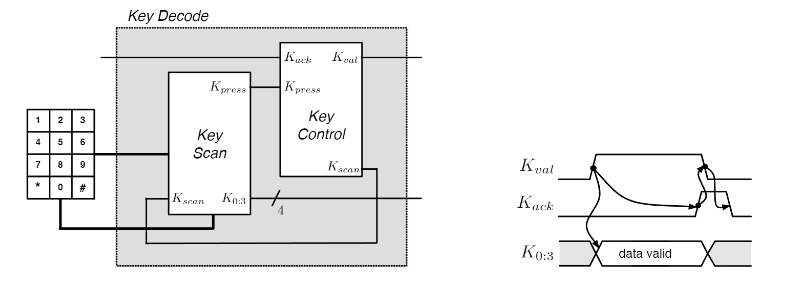
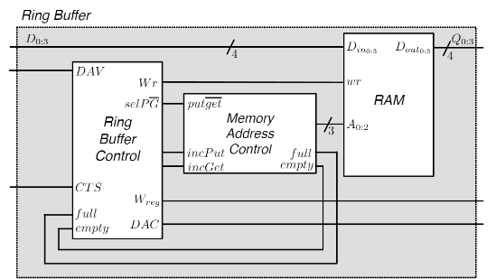
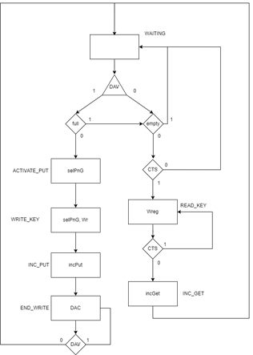
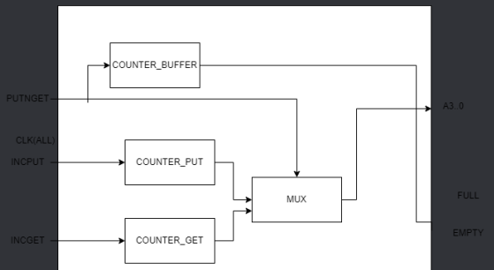
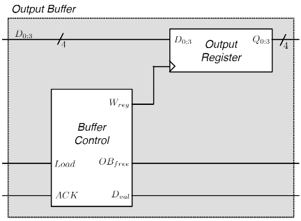
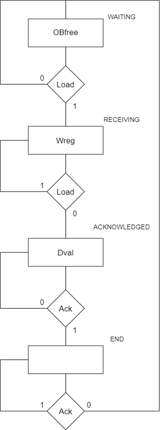

# ___Keyboard Reader___

* ___Key Decode___
* ___Ring Buffer___
* ___Output Buffer___ 

 

---

## ___Key Decode___

* __Teclado 4x3__
* ___Key Scan___
* ___Key Control___

 

---

### ___Key Scan (I)___

* __Teclado 4x3__
* __Contador__ $ \rightarrow $ gerador de códigos de teclas e controlo do ___decoder___ e do ___mux___
* ___Decoder___ $ \rightarrow $ controlo do varrimento (nível coluna)
* ___Mux___ $ \rightarrow $ controlo do varrimento (nível linha)

 

Vantagen de ter 2 __contadores__:
* Maior rapidez de varredura do teclado $ \rightarrow $ o __contador__ apenas tem de contar até 3, em vez de 12 $ \Rightarrow $ __menor probabilidade de perder teclas__

---

### ___Key Control___

 

* __STATE_DETETAR_TECLA__:
    * Informar que se iniciou um novo ciclo de varrimento ($ Kscan $)
    * Verificar se foi premida alguma tecla ($ Kpress $)
    * Se não foi premida nenhuma tecla ativa-se o sinal $ Kscan $ de modo a que o contador se mantenha ativo de forma a permitir a constante deteção de teclas
* __STATE_TECLA_PREMIDA__:
    * Informar que foi premida uma tecla ($ Kval $)
    * Verificar se a tecla premida foi recebida pelo _Ring Buffer_ ($ Kack $)
    * Verificar se a tecla premida foi libertada ($ Kpress $)
* __STATE_ESPERAR_TECLA__:
    * Esperar que a tecla premida seja tratada pelo _Ring Buffer_ ($ Kack $)

---

## ___Ring Buffer___

* ___Ring Buffer Control___
* ___Memory Address Control___ $ \rightarrow $ manipulação de endereços de memória
* ___RAM___

 

---

### ___Ring Buffer Control___

 

* __STATE_WAITING__:
    * Verificar se o _Key Decode_ tem dados para serem armazenados ($ DAV $)
    * Verificar se o ___buffer___ __está cheio__ ( $ full $)
    * Verificar se o ___buffer___ __está vazio__ ($ empty $) $ \rightarrow $ verificar se é possível realizar uma leitura de dados ($ CTS $)
* __STATE_ACTIVATE_PUT__:
    * Informar o _MAC_ que se trata de uma operação de escrita ($ selPnG $)
* __STATE_WRITE_KEY__:
    * Informar a _RAM_ para escrever os dados no endereço respetivo (fornecido pelo _MAC_) ($ selPnG \ e \ Wr $)
* __STATE_INC_PUT__:
    * Atualizar o endereço de escrita do _MAC_ ($ incPut $)
* __STATE_END_WRITE__:
    * Informar o _Key Decode_ que os dados foram aceites ($ DAC $)
    * Verificar se o _Key Decode_ já se apercebeu que os dados foram aceites ($ DAV $)
* __STATE_READ_KEY__:
    * Informar o _Output Buffer_ que os dados estão prontos para serem lidos ($ Wreg $)
    * Verificar se o _Output Buffer_ já recebeu os dados ($ CTS $)
* __STATE_INC_GET__:
    * Atualizar o endereço de leitura do _MAC_ ($ incGet $)

---

### ___Memory Address Control___

* ___3 Contadores___:
    * Contador do endereco de escrita
    * Contador do endereco de leitura
    * Contador de elementos no _buffer_
* ___Mux___ $ \rightarrow $ manipulação de endereços de memória

 

* Endereços:
    * Selecionados por $ put\overline{get} $
    * __Endereço de escrita__ $ \rightarrow $ putIndex
    * __Endereço de leitura__ $ \rightarrow $ getIndex
    * ___Full___ $ \rightarrow $ _buffer_ cheio
    * ___Empty___ $ \rightarrow $ _buffer_ vazio

---

## ___Output Buffer___

* ___Buffer Control___ $ \rightarrow $ controlo da interação com o _buffer_ e a entidade consumidora
* ___Shift Register___ $ \rightarrow $ gestão do código da tecla a ser enviada

 

    
---

### ___Buffer Control___

 

 
* __STATE_WAITING__:
    * Informar o _Ring Buffer_ que está disponível para armazenar dados ($ OBfree $)
    * Verificar se o _Ring Buffer_ quer armazenar dados ($ Load $)
* __STATE_RECEIVING__:
    * Escrever os dados no _Shift Register_ ($ Wreg $)
    * Verificar se o _Ring Buffer_ já acabou de enviar os dados ($ Load $)
* __STATE_ACKNOWLEDGED__:
    * Informar o _Control_ que os dados estão prontos para serem lidos ($ Dval $)
    * Verificar se o _Control_ recebeu os dados ($ ACK $)
* __STATE_END__:
    * Verificar se o _Control_ já leu os dados ($ ACK $)
