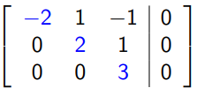
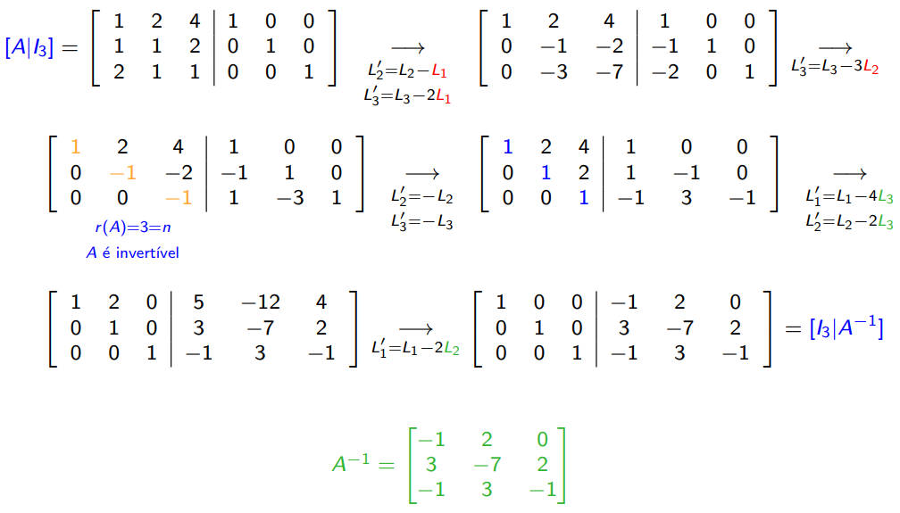

# __Sistemas de Equações Lineares__

Uma equação linear com icógnitas $ x_1, x_2, \dots, x_n $ é uma equação que pode ser escrita na forma:

* __Canónica__:
$$ \begin{cases} a_{11}x_1 + a_{12}x_2 + \dots + a_{1n}x_n = b_1 \\ a_{21}x_1 + a_{22}x_2 + \dots + a_{2n}x_n = b_2 \\ \vdots \\ a_{m1}x_1 + a_{m2}x_2 + \dots + a_{mn}x_n = b_m \\ \end{cases} $$

* __Matricial__:
    * $ AX = B $;
    * $ A $ -> Matriz dos __coeficientes__;
    * $ X $ -> Matriz das __icógnitas__;
    * $ B $ -> Matriz dos __termos independentes__;
    * $ [A|B] $ -> Matriz __ampliada__.

$$ \begin{bmatrix} a_{11} & a_{12} & \dots & a_{1n} \\ a_{21} & a_{22} & \dots & a_{2n} \\ \vdots & \vdots & \ddots & \vdots \\ a_{m1} & a_{m2} & \dots & a_{mn} \end{bmatrix} \begin{bmatrix} x_1 \\ x_2 \\ \vdots \\ x_n \end{bmatrix} = \begin{bmatrix} b_1 \\ b_2 \\ \vdots \\ b_m \end{bmatrix} $$

#

## __Resolução de um SEL__

* __Método de Eliminação de _Gauss___:
    > Método para colocar uma __matriz__ em forma de __escada__ (através de __operações elementares__).
    * ___Pivot___ -> __1º elemento__ não nulo de cada linha;
$$
\begin{bmatrix} a_{11} & a_{12} & \dots & a_{1n} \\ 0 & a_{22} & \dots & a_{2n} \\ \vdots & \vdots & \ddots & \vdots \\ 0 & 0 & \dots & a_{nn} \\ \end{bmatrix} $$

* __Operações Elementares__:
    * __Troca__ de colunas (__troca de icógnitas__) -> $ C_i \leftrightarrow C_j $;
    * __Troca__ de linhas -> $ L_i \leftrightarrow L_j $;
    * __Substituição__ de uma linha pela soma desta com um múltiplo de outra linha -> $ L^{\prime}_i = L_i + kL_j $;
    * __Substituição__ de uma linha por um múltiplo desta linha-> $ L^{\prime}_i = kL_i $.

#

## __Característica e Classificação de um SEL__

* __Característica__ de $ A $ ($ r(A) $) -> número de ___pivots___ da matriz escalonada.

* __Classificação__:
    * __Sistema Impossível (SI)__ -> $ r(A) < r(A|B) $;
    * __Sistema Possível e Determinado (SPD)__ -> $ r(A) = r(A|B) = n $;
    * __Sistema Possível e Indeterminado (SPI)__ -> $ r(A) = r(A|B) < n $.
        * __Grau de Indeterminação ($ GI $)__ -> $ n - r(A), $ sendo $ n $ o __número de icógnitas__.

* __E.g.__:

#

## __Sistemas com Parâmetros__

* Analisar os ___pivot___ da matriz escalonada para os diferentes valores dos parâmetros.

* __E.g.__:

* __E.g.__:

#

## __Sistemas Homogéneos__

* Sistemas __possíveis da forma__ $ AX = 0 $ com $ r(A) = r(A|0) $.

* Têm sempre a __solução nula__ -> $ X = 0 $.

* __SPD__:
    * A __única__ solução é a __solução nula__;
    * __E.g.__:

$ \begin{cases} -2x + y - z = 0 \\ 2y + z = 0 \\ 3z = 0 \end{cases} \Rightarrow \begin{cases} x = 0 \\ y = 0 \\ z = 0 \end{cases} $

$ C.S = \{(0, 0, 0)\} $

* __SPI__:
    * A __solução nula__ é uma das infinitas soluções;
    * __E.g.__:

$ \begin{cases} x - y + 2z = 0 \\ - y + z + t = 0 \\ 0 = 0 \end{cases} \Rightarrow \begin{cases} x = z + t - 2z \\ y = z + t \end{cases} \Rightarrow \begin{cases} x = t - z \\ y = z + t \end{cases} $

$ C.S = \{(t - z, z + t, z, t): z, t \in \mathbb{R}\} $

Para $ z = 0 \land t = 0 \Rightarrow C.S = {(0, 0, 0, 0)} $

#

## __Núcleo de uma Matriz__

__Conjunto das soluções ($N(A)$)__ de um sistema homogéneo.

#

## __Solução Geral de um SP__

* Se $ AX = B $ é um __SP__ e $ s_p $ é uma solução (__particular__) então o __conjunto solução__ é $ s_p + N(A) = \{s_p + n: n \in N(A)\} $.

* __E.g.__:

Determine matrizes $ A_{3×3} $ e $ B_{3×1} $ tais que a soma das linhas de $ A $ seja uma solução (particular) do sistema $ AX = B $ e

$ N(A) =  {(3z, −z, z): y, z \in \mathbb{R}} $

$ \begin{cases} x = 3z \\ y = -z \\ z = z \end{cases} \Rightarrow \begin{cases} x - 3z = 0 \\ y + z = 0 \\ 0 = 0 \end{cases} $

$ A = \begin{bmatrix} 1 & 0 & -3 \\ 0 & 1 & 1 \\ 0 & 0 & 1 \end{bmatrix} $ (e.g.)

$ (-2, 2, 0) $ é solução do sistema $ AX = B $, logo

$ \begin{bmatrix} 1 & 0 & -3 \\ 0 & 1 & 1 \\ 0 & 0 & 1 \end{bmatrix} \begin{bmatrix} -2 \\ 2 \\ 0 \end{bmatrix} = \begin{bmatrix} -2 \\ 2 \\ 0 \end{bmatrix} $

#

## __Interpretação Geométrica dos SEL com 3 Incógnitas__

|__Interseção dos Planos__|__Classificação__|
|---|---|
|Não se intersetam|__SI__|
|1 único ponto|__SPD__|
|1 reta|__SPI__, $ GI = 1 $|
|1 plano|__SPI__, $ GI = 2 $|

* __E.g.__:

$$ \begin{cases} y - z = 0 \\ y + z = 0 \\ z = 0 \end{cases} \Rightarrow \begin{cases} y = z \\ y = -z \\ z = 0 \end{cases} \Rightarrow \begin{cases} y = 0 \\ z = 0 \end{cases} $$

$$ C.S = \{(x, 0, 0)\}: x \in \mathbb{R} $$

#

## __Cálculo da Matriz Inversa__

* Se $ A $ é uma matriz __quadrada__ de ordem $ n $, então $ A $ é __invertível__ se, e só se, $ r(A) = n $.

* __Não Singular__ 
    > $ A $ é __invertível__.
    * $ A^{-1} $ pode ser calculada pela eliminação de _Gauss_ ($ [A|I_n] \rightarrow [I_n|A^{-1}] $).
* __Singular__ -> $ r(A) < n $.

* _E.g._:

Prove que $ A = \begin{bmatrix} 1 & 2  & 4 \\ 1 & 1 & 2 \\ 2 & 1 & 1 \end{bmatrix} $ é invertível e calcule a sua inversa.

