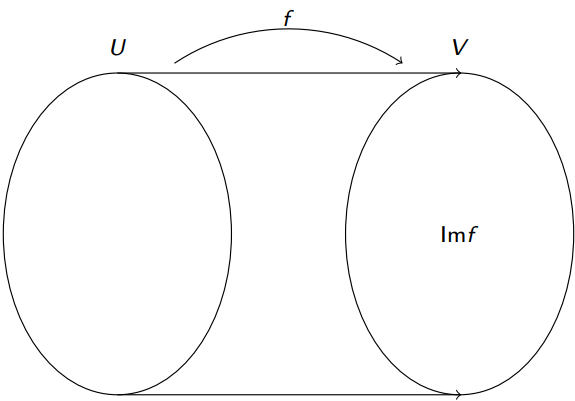

# __Aplicações Lineares__

## __Definição__

> Sejam $ U $ e $ V $ dois espaços vetoriais de tamanho n e m, respetivamente. 

__Uma aplicação ou transformação linear__ $ f: U \rightarrow V $ é uma função que verifica:

* $ f(u + v) = f(u) + f(v), \ \forall u, \ v \in U $;

* $ f(\alpha u) = \alpha f(u), \ \forall \alpha \in \mathbb{R}, \ \forall u \in U $.

* $ f(0_U) = 0_V $.

* $ f(a_1u_1 + a_2u_2 + \dots + a_nu_n) = a_1f(u_1) + a_2f(u_2) + \dots + a_nf(u_n) $.

__A imagem de qualquer vetor de U é combinação linear das imagens de uma base de U__.

## __Expressão Analítica__

Se $ f: \mathbb{R}^n \rightarrow \mathbb{R}^m $ é uma __aplicação linear__ então:

* $ f(x_1, \ x_2, \ \dots, \ x_n) = (a_{11}x_1 + a_{12}x_2 + \dots + a_{1n}x_n, \ a_{21}x_1 + a_{22}x_2 + \dots + a_{2n}x_n, \ \dots, \ a_{m1}x_1 + a_{m2}x_2 + \dots + a_{mn}x_n), \ \forall a_{ij} \in \mathbb{R}, i \in [m], \ j \in [n] $.

## __Imagem/Contradomínio de um Subespaço Vetorial__

> Seja $ f: U \rightarrow V $ uma __aplicação linear__.

Se $ S $ __é um subespaço vetorial__ de $ U $ então a imagem de $ S $:

* $ f(S) = \{ f(u): \ u \in S \} $ __é um subespaço vetorial__ de $ V $.

* $ S = <u_1, \ u_2, \ \dots, \ u_n> \ \Rightarrow f(S) = \ <f(u_1), \ f(u_2), \ \dots, \ f(u_n)> $.

* $ f(S) = Im(f) $.

## __Núcleo__

> Seja $ f: U \rightarrow V $ uma __aplicação linear__.

Núcleo de $ f $ é o subespaço vetorial de $ U $ definido por:

* $ N(f) = \{ u \in U: \ f(u) = 0_V \} $.

## __Sobrejetividade__

Uma __aplicação linear__ $ f: U \rightarrow V $ é __sobrejetiva__ se:

* $ Im(f) = V $.

## __Injetividade__

Uma __aplicação linear__ $ f: U \rightarrow V $ é __sobrejetiva__ se:

* $ N(f) = \{ 0_U \} $.

## __Teorema da Dimensão__

> Seja $ f: U \rightarrow V $ uma __aplicação linear__.

Se $ dim(U) = n $:

* $ dim(Im(f)) + dim(N(f)) = n $.

* $ dim(Im(f)) $ -> __Característica__ de $ f $ ($ c_f $).

* $ dim(N(f)) $ -> __Nulidade__ de $ f $ ($ n_f $).

* $ c_f + n_f = dim(U) $.

## __Morfismos__

Uma __aplicação linear__ $ f: U \rightarrow U $ diz-se um:

* __Homomorfismo__ de $ U $ em $ V $;

* __Monoformismo__ se é __injetiva__;

* __Epimorfismo__ se é __sobrejetiva__;

* __Isomorfismo__ se é __bijetiva__ (injetiva e sobrejetiva).

* __Endomorfismo__ se $ U = V $.

* __Automorfismo__ se é um __endomorfismo__ e __isomorfismo__.