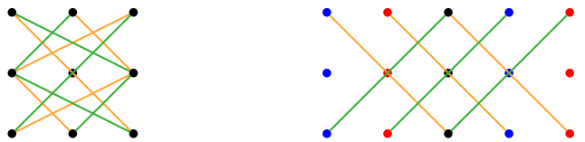

# __Determinantes__

## __Definição__
> $ det(A) $ ou $ |A| $ é um número associado a uma matriz quadrada $ A $.

### __n = 1__
> $ det(A) = a_{11} $
    
### __n = 2__    
> $ n = 2 \Rightarrow det(A) = \begin{vmatrix} a_{11} & a_{12} \\ a_{21} & a_{22} \end{vmatrix} = a_{11}a_{22} - a_{12}a_{21} $
    
* __E.g.__:   

$$ \begin{vmatrix} 2 & -3 \\ 2 & 1 \end{vmatrix} = 2 \cdot 1 - (-3) \cdot 2 = 2 + 6 = 8 $$
    
### __n = 3__
> $ n > 2 \Rightarrow det(A) = (-1)^{1+1}a_{11}det(A_{1|1}) + \dots + (-1)^{1+n}a_{1n}det(A_{1|n}) $, onde $ A_{1|j} $ é a matriz $ A $ sem a linha 1 e a coluna $ j $.

* __E.g.__:

$$ \begin{vmatrix} 2 & 1 & -1 \\ 3 & 2 & -1 \\ -1 & -3 & 4 \end{vmatrix} = 2 \begin{vmatrix} 2 & -1 \\ -3 & 4 \end{vmatrix} - 1 \begin{vmatrix} 3 & -1 \\ -1 & 4 \end{vmatrix} - 1 \begin{vmatrix} 3 & 2 \\ -1 & -3 \end{vmatrix} = $$

$$ 2(2 \cdot 4 - (-1) \cdot (-3)) - 1(3 \cdot 4 - (-1) \cdot (-1)) - 1(3 \cdot (-3) - 2 \cdot (-1)) = $$ 

$$ 2(8 - 3) - 1(12 - 1) - 1(-9 + 2) = 10 - 11 + 7 = 6 $$

## __Regra de Sarrus__

## __Complemento Algébrico__
> $ â_{ij} = (-1)^{i+j}det(A_{i|j}) $

## __Teorema de Laplace__
> __Soma__ dos produtos das entradas de uma qualquer linha/coluna de A pelos respectivos __complementos algébricos__.

* __linha i__ -> $ det(A) = a_{i1}â_{i1} + \dots + a_{in}â_{in} $

* __coluna j__ -> $ det(A) = a_{1j}â_{1j} + \dots + a_{nj}â_{nj} $

* __E.g.__:

$$ A = \begin{bmatrix} 2 & 1 & -3 & -4 \\ -2 & -1 & 1 & 5 \\ 2 & 2 & 2 & 2 \\ 0 & 3 & 0 & -2 \end{bmatrix} $$

$$ det(A) \rightarrow^{L_4} = 3 \begin{vmatrix} 2 & -3 & -3 \\ -2 & 1 & 5 \\ 2 & 2 & 2 \end{vmatrix} + (-2) \begin{vmatrix} 2 & 1 & -3 \\ -2 & -1 & 1 \\ 2 & 2 & 2 \end{vmatrix} = $$

$$ 3(4 - 30 + 16 - 8 - 20 - 12) - 2(4 + 2 + 12 - 6 - 4 + 4) = 3(-34) - 2(4) = -110 $$

## __Propriedades__

* $ \begin{vmatrix} a_{11} & \dots & a_{1n} \\ \vdots & & \vdots \\ \alpha a_{i1} & \dots & \alpha a_{in} \\ \vdots &  & \vdots \\ a_{n1} & \dots & a_{nn} \end{vmatrix} = \alpha \begin{vmatrix} a_{11} & \dots & a_{1n} \\ \vdots & & \vdots \\ a_{i1} & \dots & a_{in} \\ \vdots &  & \vdots \\ a_{n1} & \dots & a_{nn} \end{vmatrix} $

* $ \begin{vmatrix} a_{11} & \dots & a_{1n} \\ \vdots & & \vdots \\ a_{i1} + a^{'}_{i1} & \dots & a_{in} + a^{'}_{in} \\ \vdots &  & \vdots \\ a_{n1} & \dots & a_{nn} \end{vmatrix} = \begin{vmatrix} a_{11} & \dots & a_{1n} \\ \vdots & & \vdots \\ a_{i1} & \dots & a_{in} \\ \vdots &  & \vdots \\ a_{n1} & \dots & a_{nn} \end{vmatrix} + \begin{vmatrix} a_{11} & \dots & a_{1n} \\ \vdots & & \vdots \\ a^{'}_{i1} & \dots & a^{'}_{in} \\ \vdots &  & \vdots \\ a_{n1} & \dots & a_{nn} \end{vmatrix} $

* Se $ A $ tem uma __linha ou coluna nula__, então $ det(A) = 0 $;

* Se $ A $ tem duas __linhas ou colunas iguais ou proporcionais__, então $ det(A) = 0 $;

* Se __trocarmos si duas linhas/colunas__ de $ A $ o valor do $ det(A) $ __muda de sinal__;

* Se a __uma linha/coluna__ de $ A $ __somarmos/subtraírmos um múltiplo de outra linha__ o valor do __determinante não se altera__;

* Se a __uma linha/coluna__ de $ A $ substituirmos com __a multiplicação de um escalar por ela mesma__ o valor do __determinante é multiplicado pelo escalar__;

* Se $ A $ é __triangular inferior/superior__, então $ det(A) = a_{11}.a_{22} \dots .a_{nn} $;

* $ det(A^T) = det(A) $;

* $ det(\alpha A) = \alpha^n det(A) $;

* $ det(AB) = det(A)det(B) = det(BA) $;

* $ det(A^n) = (det(A))^n $;

* Se $ A $ é __invertível__ ($ det(A) \neq 0 $), então $ det(A^{-1}) = \frac{1}{det(A)} $;

## __Matriz Adjunta__