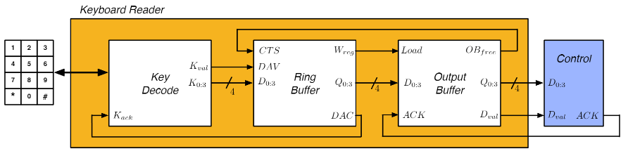
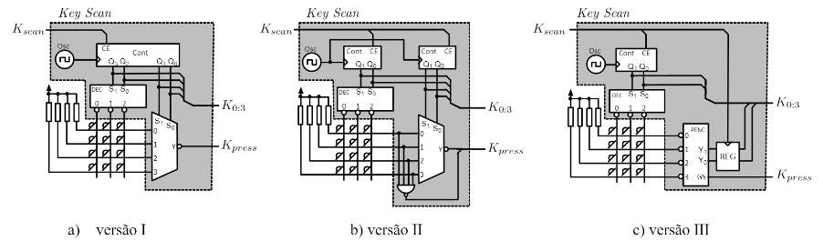
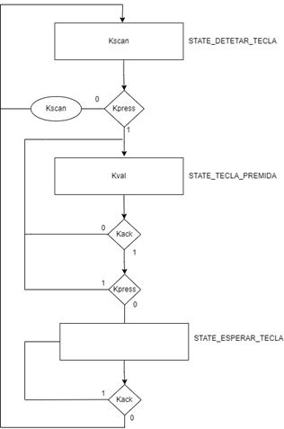

# ___Keyboard Reader___

* ___Key Decode___ $ \rightarrow $ descodificador de teclado
* ___Ring Buffer___ $ \rightarrow $ bloco de armazenamento
* ___Output Buffer___ $ \rightarrow $ bloco de entrega ao consumidor

 

---

## ___Key Decode___

* __Teclado 4x3__
* ___Key Scan___ $ \rightarrow $ varrimento do teclado
* ___Key Control___ $ \rightarrow $ controlo do varrimento e de fluxo

 

* __Detecção de teclas__ $ \rightarrow $ o sinal $ Kval $ é __ativado__ e disponibiliza-se o __código dessa tecla__ no barramento $ K_{0:3} $.
 
* __Varrimento de teclas__: 
    * Ativação do sinal $ Kscan $, que __inicia o ciclo de varrimento__ do teclado.
    * Apenas é iniciado um __novo ciclo de varrimento ao teclado__ quando o sinal $ Kack $ for __ativado__ e a __tecla premida for libertada__.

---

### ___Key Scan (I)___

* __Teclado 4x3__
* __Contador__ $ \rightarrow $ gerador de códigos de teclas e controlo do ___decoder___ e do ___mux___
* ___Decoder___ $ \rightarrow $ controlo do varrimento (nível coluna)
* ___Mux___ $ \rightarrow $ controlo do varrimento (nível linha)

 

Vantagen de ter 2 __contadores__:
* Maior rapidez de varredura do teclado $ \rightarrow $ o __contador__ apenas tem de contar até 3, em vez de 12 $ \Rightarrow $ __menor probabilidade de perder teclas__

---

### ___Key Control___

 

* __STATE_DETETAR_TECLA__:
    * Informar que se iniciou um novo ciclo de varrimento 
    * Se não foi premida nenhuma tecla ativa-se o sinal $ Kscan $ de modo a que o contador se mantenha ativo de forma a permitir a constante deteção de teclas
* __STATE_TECLA_PREMIDA__:
    * Informar que foi premida uma tecla
    * Verificar se a tecla premida foi recebida
    * Verificar se a tecla premida foi libertada
* __STATE_ESPERAR_TECLA__:
    * Esperar que a tecla premida seja tratada

---

## ___Ring Buffer___

* ___Ring Buffer Control___ $ \rightarrow $ controlo do buffer
* ___Memory Address Control___ $ \rightarrow $ manipulação de endereços de memória
* ___RAM___ $ \rightarrow $ armazenamento de teclas

 

Estrutura de dados para armazenamento de teclas com disciplina FIFO e com capacidade de armazenar até 8 palavras (teclas) de 4 bits. 

* __Escrita de dados__: 
    * Ativação do sinal $ DAV $ (_Data Available_) pelo _Key Decode_, indicando que tem __dados para serem armazenados__
    * Logo que tenha disponibilidade para armazenar informação, o _Ring Buffer_ escreve os dados $ D_{0:3} $ em memória.
    * Concluída a escrita em memória ativa o sinal $ DAC $ (_Data Accepted_) para informar o sistema produtor que os dados foram aceites.
        * O sistema produtor mantém o sinal $ DAV $ ativo até que $ DAC $ seja ativado.
        * O _Ring Buffer_ só desativa $ DAC $ depois de $ DAV $ ter sido desativado

* __Entrega de dados__ $ \rightarrow $ o bloco Ring Buffer procede à entrega de dados à entidade consumidora, sempre que esta indique que está disponível para receber, através do sinal _Clear To Send_ ($ CTS $)

---

### ___Ring Buffer Control___

 

---

### ___Memory Address Control___

O endereço de escrita/leitura, selecionado por $ put\overline{get} $ deverá ser definido pelo bloco Memory Address Control (MAC) composto por dois registos, que contêm o endereço de escrita e leitura, designados por putIndex e getIndex respetivamente. 

O MAC suporta assim ações de incPut e incGet, gerando informação se a estrutura de dados está cheia (Full) ou se está vazia (Empty).
