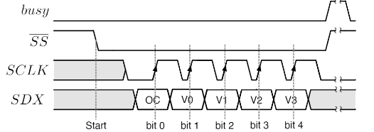
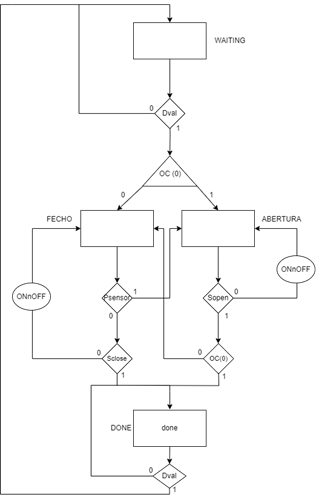

# ___Serial Door Controller___

* ___Serial Receiver___ $ \rightarrow $ receção de tramas do _Control_
* ___LCD Dispatcher___ $ \rightarrow $ envio de tramas para o Door Mechanism

 

---

## ___Serial Receiver___

Implementação igual à do ___Serial LCD Controller___, no entanto, agora sim com o sinal $ busy $.

 

---

### ___Serial Control___

Implementação igual à do ___Serial LCD Controller___.

---

## ___Door Controller___

 

* __STATE_WAITING__:
    * Verificar se recebeu uma trama válida ($ Dval $)
    * Verificar se a trama recebida é de abertura ou fecho ($ OC(0) $)
* __STATE_FECHO__:
    * Verificar se foi detetada uma pessoa ($ Psensor $)
    * Verificar se a porta já fechou ($ Sclose $)
* __STATE_ABERTURA__:
    * Verificar se a porta já abriu ($ Sopen $)
    * Verificar se a trama recebida é de fecho ($ OC(0) $)
* __STATE_DONE__:
    * Verificar se o _Serial Receiver_ já percebeu que o _Door Controller_ já enviou a trama ($ DXval $) 
 
__NOTAS__: 
* ``Numa situação de fecho onde se detetou a passagem de um indivíduo, deve-se permitir de forma automática o encerramento da porta, daí a verificação do OC(0) no estado __STATE_ABERTURA__``
* ``O sinal $ Sclose $ é um sinal que indica que a porta já fechou, ou seja, que o motor já parou de rodar``