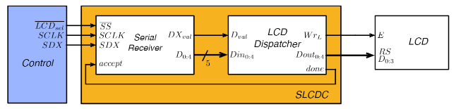

# ___Serial LCD Controller___

* ___Serial Receiver___ $ \rightarrow $ receção de tramas do _Control_
* ___LCD Dispatcher___ $ \rightarrow $ envio de tramas para o LCD

 

---

## ___Serial Receiver___

* ___Serial Control___
* ___Counter___ $ \rightarrow $ conta o número de bits recebidos
* ___Shift Register___

 

 

---

### ___Serial Control___

 

* __STATE_WAITING__:
    * Verificar se existe uma trama a ser recebida ($ EnRx $)
* __STATE_RECEIVING__:
    * Verificar se já foram recebidos os 5 bits da trama ($ eq5 \ e \ EnRx $)
* __STATE_END__:
    * Informar o _Dispatcher_ que a trama está pronta ($ DXval $)
    * Verificar se o _Dispatcher_ recebeu a trama ($ accept $)
* __STATE_WAITING_ACCEPT__:
    * Verificar se o _Dispatcher_ já está pronto para receber uma nova trama ($ accept $)

__NOTA__: ``No Serial LCD Controller não é necessário o sinal $ busy $ pois o _Dispatcher_ não precisa de esperar que o LCD execute os comandos recebidos``

---

## ___LCD Dispatcher___

__NOTA__: ``O _LCD_ processa as tramas recebidas de acordo com os comandos definidos pelo fabricante, __não sendo necessário esperar pela sua execução para libertar o canal de receção série__``

 

* __STATE_WAITING__:
    * Verificar se recebeu uma trama válida ($ Dval $)
* __STATE_TRAMA_RECEBIDA__:
    * Enviar a trama recebida para o LCD ($ WrL $)
* __STATE_DONE__:
    * Verificar se o _Serial Receiver_ já percebeu que o _Dispatcher_ já enviou a trama ($ Dval $) 