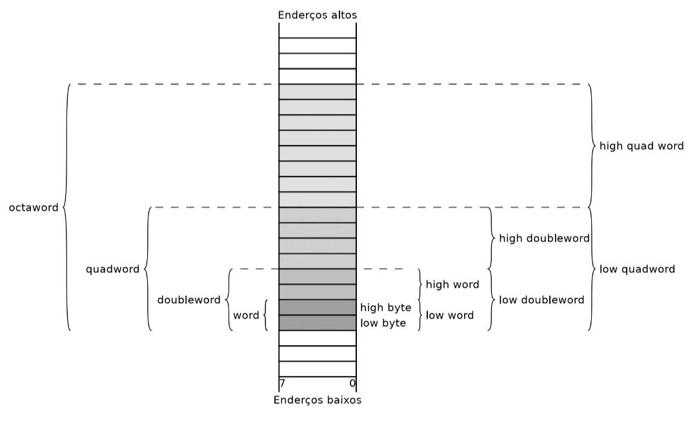
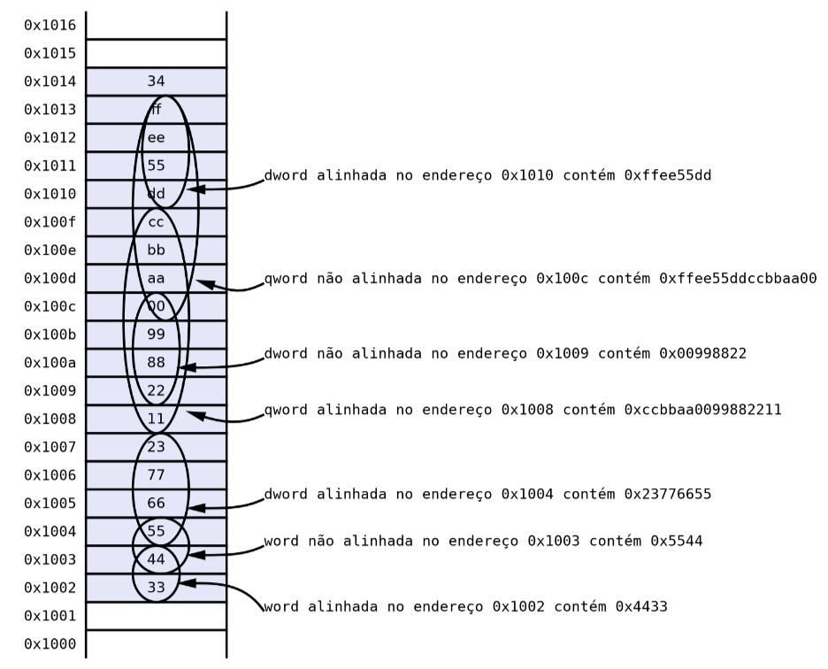

# __Assembly x86-84__

## __Registos__

| 64 bits | 32 bits | 16 bits | 8 bits | Função |
|:-------:|:-------:|:------:|:------:|:------:|
| RAX     | EAX     | AX     | AL/AH  | retorno |
| RBX     | EBX     | BX     | BL/BH  | _callee saved_ |
| RCX     | ECX     | CX     | CL/CH  | 4º argumento |
| RDX     | EDX     | DX     | DL/DH  | 3º argumento |
| RSI     | ESI     | SI     | SIL    | 2º argumento |
| RDI     | EDI     | DI     | DIL    | 1º argumento |
| RBP     | EBP     | BP     | BPL    | _callee saved_ |
| RSP     | ESP     | SP     | SPL    | _stack pointer_ |
| R8      | R8D     | R8W    | R8B    | 5º argumento |
| R9      | R9D     | R9W    | R9B    | 6º argumento |
| R10     | R10D    | R10W   | R10B   | _caller saved_ |
| R11     | R11D    | R11W   | R11B   | _caller saved_ |
| R12     | R12D    | R12W   | R12B   | _callee saved_ |
| R13     | R13D    | R13W   | R13B   | _callee saved_ |
| R14     | R14D    | R14W   | R14B   | _callee saved_ |
| R15     | R15D    | R15W   | R15B   | _callee saved_ |

## ___EFlags___

| Flag | Descrição | Bit |
|:----:|:---------:| :---: |
| CF   | _carry flag_ | 0 |
| PF   | _parity flag_ | 2 |
| AF   | _auxiliary flag_ | 4 |
| ZF   | _zero flag_ | 6 |
| SF   | _sign flag_ | 7 |
| TF   | _trap flag_ | 8 |
| IF   | _interrupt flag_ | 9 |
| DF   | _direction flag_ | 10 |
| OF   | _overflow flag_ | 11 |
| IOPL | _I/O privilege level_ | 12, 13 |
| NT   | _nested task_ | 14 |
| RF   | _resume flag_ | 16 |
| VM   | _virtual 8086 mode_ | 17 |

## __Organização da Memória__

<div align=center> 



</div>

## __Tipos de Dados__

| Declaração C | Declaração Intel | Dimensão (bytes) | Alinhamento |
|:------------:|:----------------:|:----------------:|:-----------:|
| char         | byte             | 1                | 1           |
| short        | word             | 2                | 2           |
| int          | dword            | 4                | 4           |
| unsigned int | dword            | 4                | 4           |
| long int     | qword            | 8                | 8           |
| unsigned long int | qword      | 8                | 8           |
| float        | dword            | 4                | 4           |
| double       | qword            | 8                | 8           |
| pointer (void *) | qword       | 8                | 8           |
| struct       | -                | -                | -           |

Ex.:
<div align=center> 



</div>

## __Sintaxe AT&T__

```
<instrução> <operando>, <destino/operando>

add $100, $rax
```