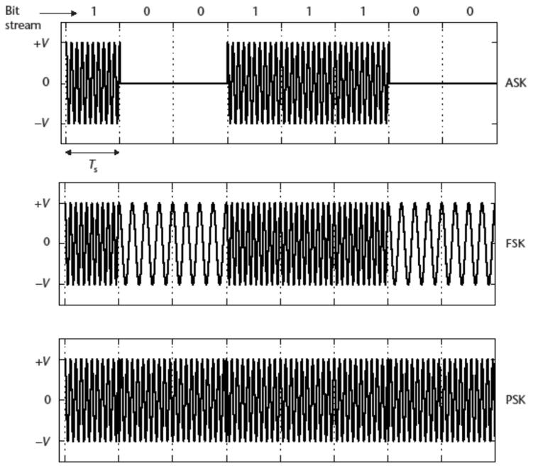
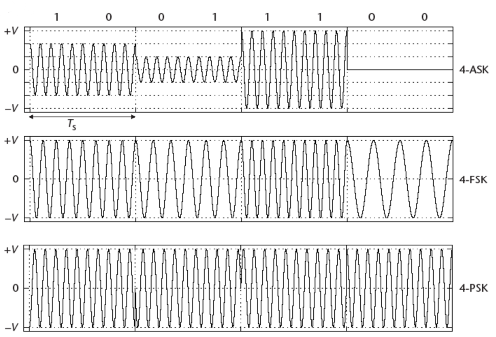
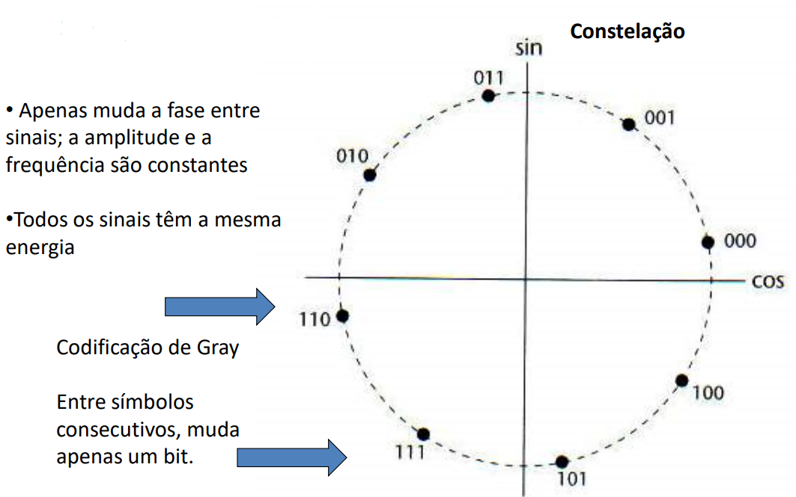
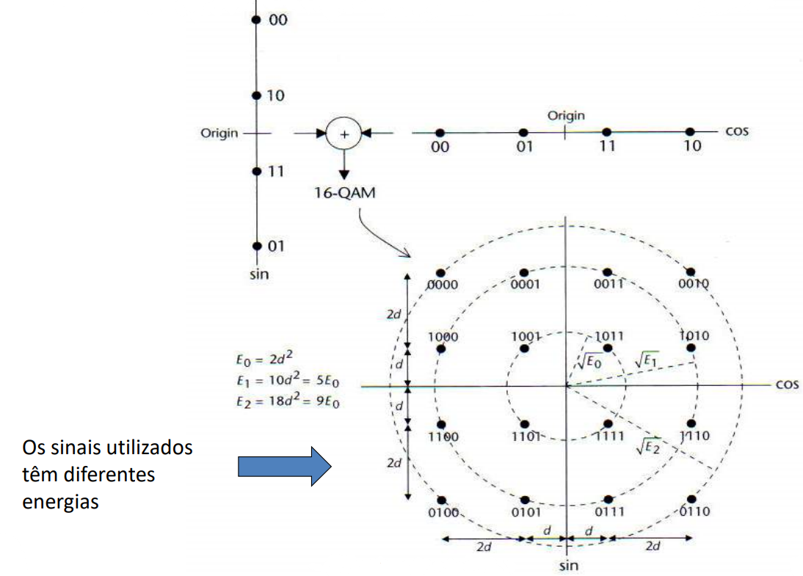
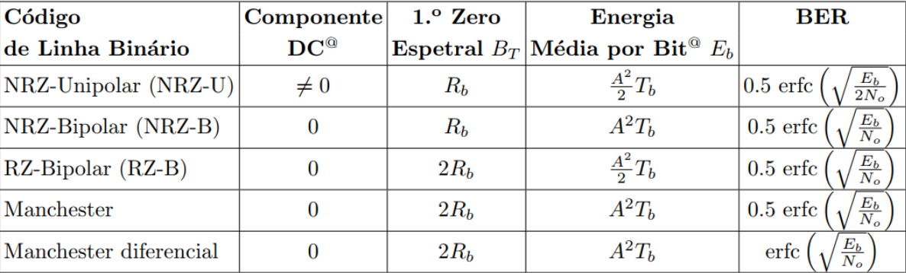
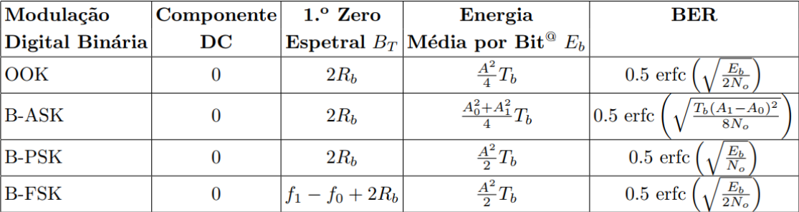
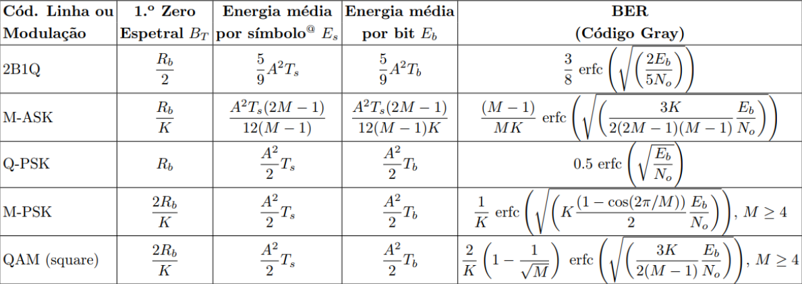
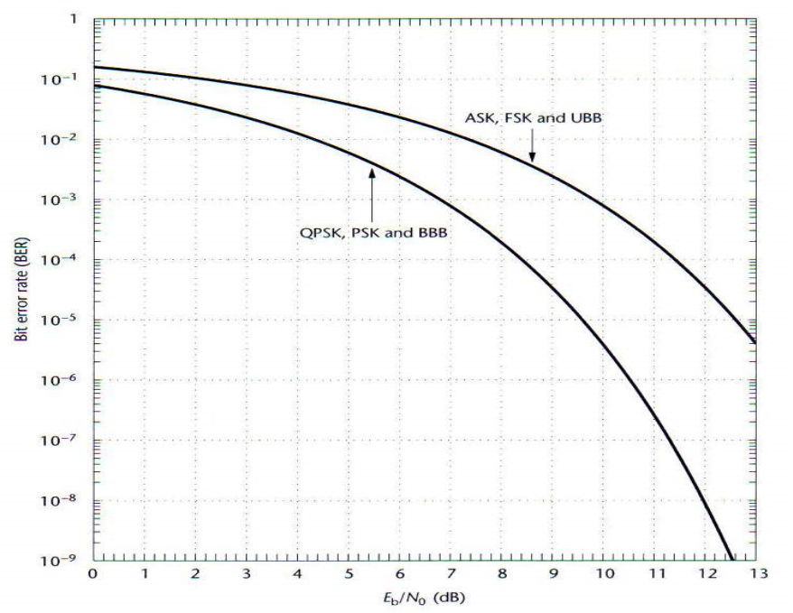
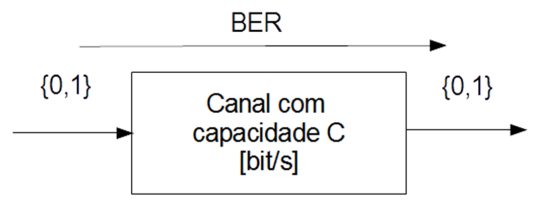

# __Banda Canal - Modulações Digitais__

## __Modulações Digitais__

$ v(t) = A.cost(2.\pi.f_0.t + \phi) $

__Amplitude Shift Keying__ (ASK) $ \rightarrow A $
* __On-Off Keying__ (OOK) $ \rightarrow A $

__Frequency Shift Keying__ (FSK) $ \rightarrow f_0 $

__Phase Shift Keying__ (PSK) $ \rightarrow \phi $

#

## __Modulações Binárias__

 

#

## __Modulações M-árias (M = 4)__

 

#

### __M-PSK__

__Fase__ $ \rightarrow $ depende da __sequência binária__

$ g_i(t) = A_c.cos(2.\pi.f_c.t + \alpha.i + \phi), \ i = 0, 1, ... , M - 1 $

$ \alpha = \frac{2.\pi}{M} $

$ f_c = \frac{n}{2.T_S}, \ n = 1, 2, ... $

__E.g.__:

* Constelação 8-PSK

 

#

### __QAM__

__Fase e Amplitude__ $ \rightarrow $ depende da __sequência binária__

$ g_i(t) = A_i.cos(2.\pi.f_c.t + \phi_i), \ i = 0, 1, ... , M - 1 $

__E.g.__:

* Constelação 16-PSK

 

#

## __BER__

$ BER \rightarrow $ depende da relação __sinal/ruído (SNR)__

SNR $ \rightarrow \frac{Eb}{No} $

$ Eb \rightarrow $ __energia média__ por bit

$ No \rightarrow $ __energia média do ruído__ (__densidade espetral__ do ruído)

$ BER $ aceitável:
* __Voz__ $ \rightarrow 10^{-3} $
* __WLAN__ $ \rightarrow 10^{-5} $
* __Dados__ $ \rightarrow 10^{-6} $

#

### __Códigos de Linha__

 

#

### __Modulações Digitais__

 

 

#

### __Curvas de BER__

Define a __qualidade do QoS__ (_Quality of Service_)

 

$ UBB \rightarrow $ _Unipolar Base Band_ (__NRZU__)

$ BBB \rightarrow $ _Bipolar Base Band_ (__NRZB__)

#

## __Teorema da Codificação de Canal__

$ BER \Rightarrow $ __capacidade__ $ C $ do canal em $ bit/s $

Com $ BER $ __pequeno__ e ritmo $ R \leq C \Rightarrow $ é possível __transmitir informação__

Se $ R > C \Rightarrow $ __não é__ possível __transmitir sem erros__

 

#

### __Capacidade de Canal__

$ C = B.log_2(1 + SNR) $ em $ bit/s $

$ B \rightarrow $ __largura de banda__ do canal