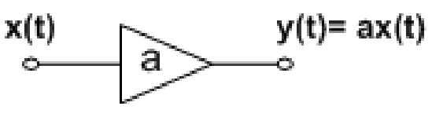
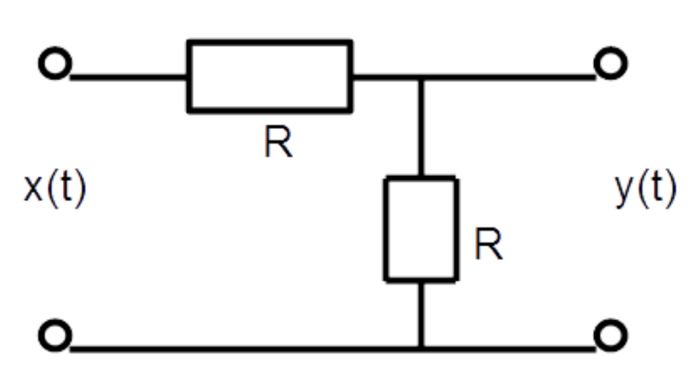
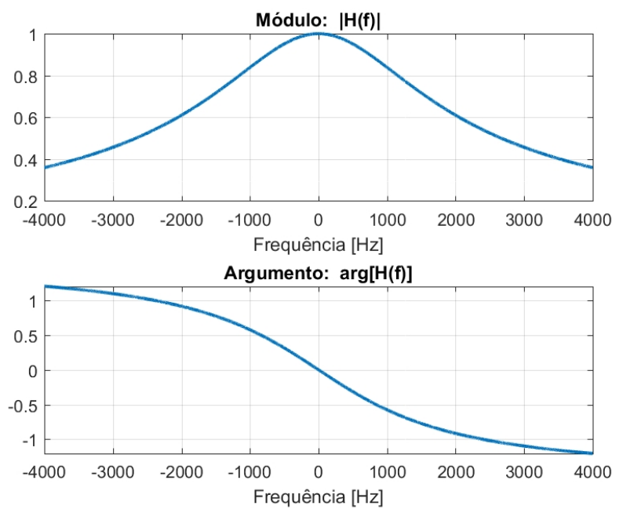
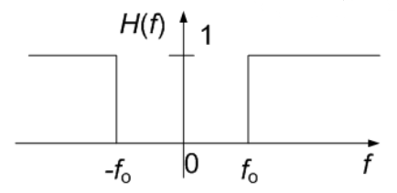
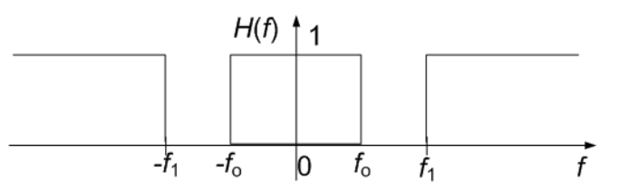
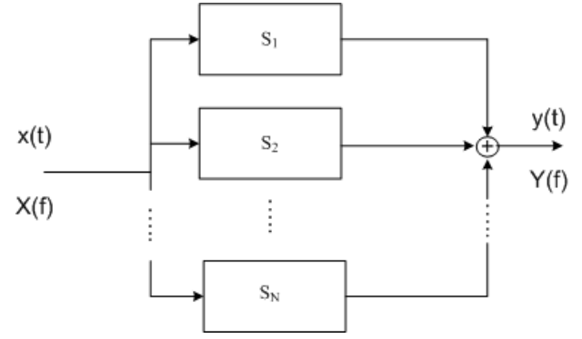

# __Sistemas - Resposta em Frequência__

## __Resposta em frequência__

__Resposta em Frequência__ $ (HF) \rightarrow $ carateriza o comportamento no domínio da frequência

Indica __qual o ganho__ que o sistema __aplica a cada frequência__.

$ Y(f) = X(f).H(f) $

 

#

### __Sistema Amplificador/Atenuador__

 

$ h(t) = a.\delta(t) $

 

$ Y(f) = a.X(f) $

$ H(f) = a $

#

### __Atenuador (divisor de tensão)__

 

$ y(t) = 0,5.x(t) $

$ h(t) = 0,5.\delta(t) $

 

$ Y(f) = 0,5.X(f) $

$ H(f) = 0,5 $

#

### __Circuito RC__

 

$ H(f) = \frac{1}{1 + j.2.\pi.f.R.C} $

$ |H(f)| = \frac{1}{\sqrt{1 + (2.\pi.f.R.C)^2}} $

$ arg[H(f)] = atan(-2.\pi.f.R.C) $

$ h(t) = \frac{1}{RC}.e^{-\frac{t}{RC}}.u(t) $

__E.g__:

$ R = 4,7 \ k\Omega, \ C = 22 \ nF $

 

#

## __Filtragem__

As componentes de frequência que __constam__ de $ X(f) $ e __não constam__ de $ Y(f) $ __são filtradas__ (eliminadas) pelo sistema $ \Rightarrow $ o __tipo de filtragem__ é definido pela __função__ $ H(f) $

#

## __Tipos de Filtragem__

#

### __Filtro Passa-Baixo__

__Ideal__:

 

__Real__:

 

#

### __Filtro Passa-Banda__

__Ideal__:

 

#

### __Filtro Passa-Alto__

__Ideal__:

 

#

### __Filtro Rejeita-Banda__

__Ideal__:

 

#

## __Associação de Sistemas__

#

### __Série ou Cascata__

 

Resposta em frequência equivalente $ \rightarrow H_{eq}(f) = H_1(f).H_2(f)...H_N(f) = \Pi_{k=1}^NH_k(f) $

#

### __Paralelo__

 

Resposta em frequência equivalente $ \rightarrow H_{eq}(f) = H_1(f) + H_2(f) + ... + H_N(f) = \sum_{k=1}^NH_k(f) $