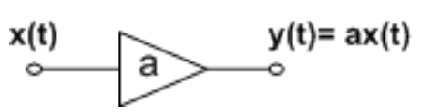
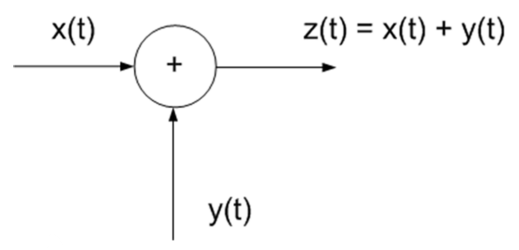
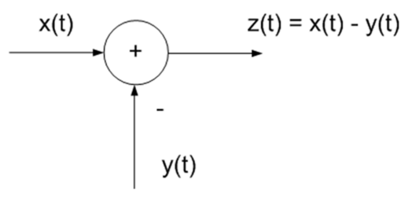
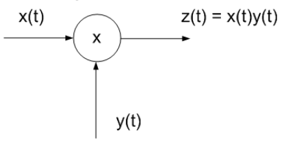
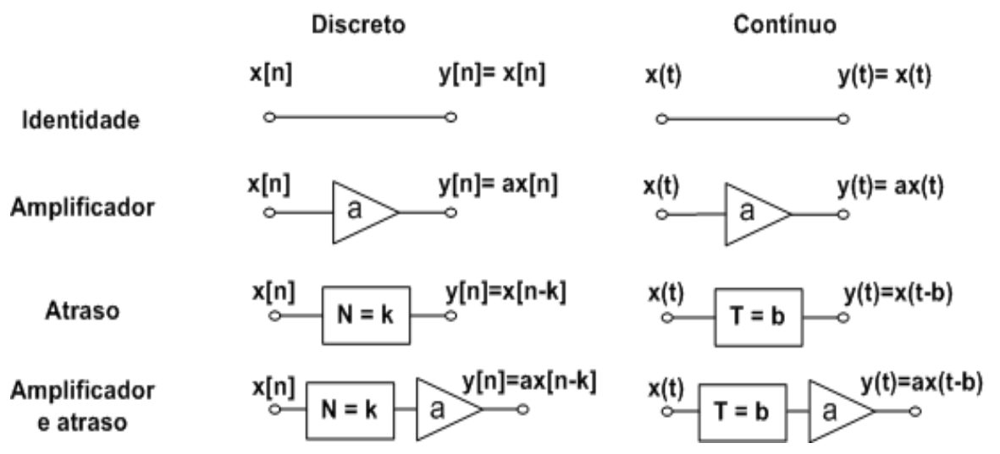

# __Sistemas e Operações__

Sistema $ \rightarrow $ objeto que __manipula um ou mais sinais__
para realizar certa função, __produzindo um novo sinal__

## __Tipos de Operação__

Sobre a __variável dependente (amplitude)__

Sobre a __variável independente (tempo)__

#

### __Amplitude__

#

#### __Amplificação ou Atenuação__
A amplificação/atenuação __modifica a energia (ou potência)__ do sinal.

 

$ a \rightarrow $ __constante de amplificação__ se $ |a| > 1 $

$ a \rightarrow $ __constante de atenuação__ se $ |a| < 1 $

$ E_y = a^2.E_x $

#

#### __Adição__

Mistura de dois sinais.

 

* $ E_z = \int_{-\infty}^{+\infty} x^2(t)dt + \int_{-\infty}^{+\infty} y^2(t)dt + 2\int_{-\infty}^{+\infty} x(t).y(t)dt $

#

#### __Subtração__

Subtrai um conteúdo (sinal) sobre outro conteúdo .

 

* $ E_z = \int_{-\infty}^{+\infty} x^2(t)dt + \int_{-\infty}^{+\infty} y^2(t)dt - 2\int_{-\infty}^{+\infty} x(t).y(t)dt $

#

#### __Multiplicação__

Subtrai um conteúdo (sinal) sobre outro conteúdo .

 

#

### __Tempo__

$ y(t) = x(at - b) $

#

#### __Escalamento__

$ a \rightarrow $ __compressão no tempo__ se $ |a| > 1 $

$ a \rightarrow $ __expansão no tempo__ se $ |a| < 1 $

$ y(t) = x(at) $

Sinais do tipo:
* __Energia__ $ \rightarrow E_y = \frac{1}{|a|}.E_x $

__Não altera__:
* __Potência__ (para sinais do tipo potência) $ \rightarrow P_y = P_x $

#

#### __Deslocamento__

$ y(t) = x(t - b) $

$ b \rightarrow $ __atraso temporal__ se $ b > 0 $

$ b \rightarrow $ __avanço temporal__ se $ b < 0 $

$ y(t) = x(at) $

__Não altera__:
* __Energia__ (para sinais do tipo energia) $ \rightarrow E_y = E_x $
* __Potência__ (para sinais do tipo potência) $ \rightarrow P_y = P_x $

#

### __Operações - Diagramas de Blocos__

 

