# __Processamento Transacional__

## __Transações__

### __O Porquê de Transações?__

 

---

### __Tipos de ações__

* Não protegidas
* Protegidas
* Reais

__Ação atómica__ $ \rightarrow $ quando __executada num determinado nível de
abstração mais elevado__, ou __é executada completamente com sucesso__, (produzindo todos os seus efeitos), ou, então, __não produz quaisquer efeitos__ diretos ou laterais.

---

### __Propriedades ACID__

* Atomicidade
* Consistência
* Isolamento
* Durabilidade.

---

## __Escalonamentos__

Um escalonamento de um __conjunto de transações__ $ (T_1, ... ,T_n) $ é
uma __ordenação__ $ S $ das __operações__ em cada um dos $ T_i $,  tal que __todas as ações__ de cada $ T_i $ aparecem em $ S $ pela __mesma ordem em que ocorrem__ em $ T_i $.

__E.g.__:

 

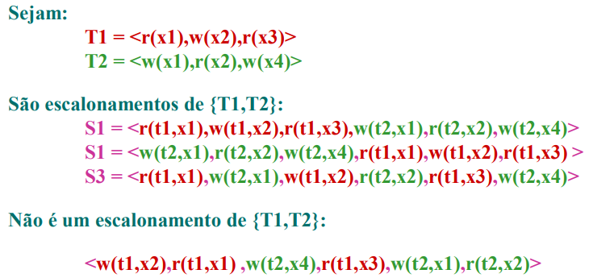

__2 operações__ num escalonamento $ S $ __conflituam__ se verificarem, simultaneamente, as seguintes condições:
* As operações __pertencem__ a $ T_i $ __diferentes__
* Ambas as operações __acedem__ ao __mesmo item de dados__
* Pelo menos __1__ das operações é __w(x)__

---

## __Tipos de Escalonamentos__

### ___Cascadeless___ 
__Nenhuma__ das suas transações __lê um item__ escrito por __outra transação__ ainda __não terminada__ $ \Rightarrow $ não contém ___dirty reads___.

__E.g.__:

 

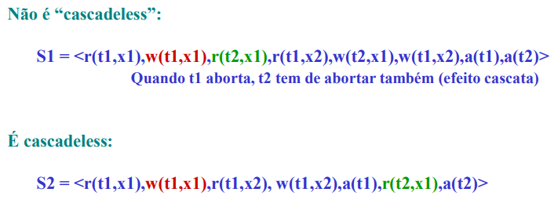

 

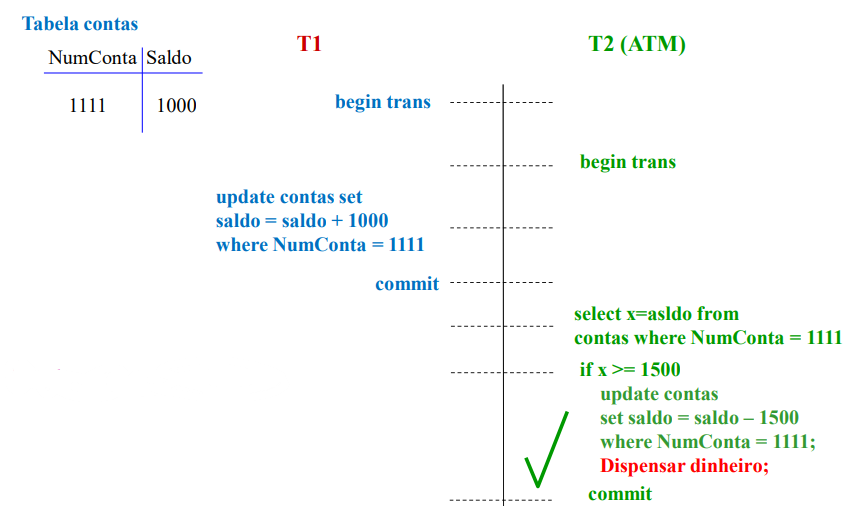

---

### __Recuperável__ 
__Não existe__ nenhuma __transação__ que faça __commit__ tendo __lido um item depois__ de ele ter sido __escrito por outra transação__ ainda __não terminada com commit__.

`NÃO ser RECUPERÁVEL` $ \Rightarrow $ `NÃO ser CASCADELESS` 

__E.g.__:

 

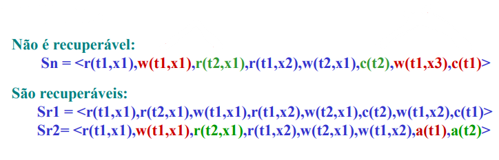

 

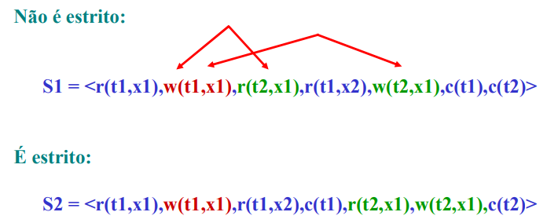

---

### __Estrito__ 
__Nenhuma__ das suas __transações__ __lê nem escreve__ um __item escrito__ por __outra transação__ ainda __não terminada com commit__ $ \Rightarrow $ não contém ___dirty reads___ nem ___dirty writes___.

__E.g.__:

 

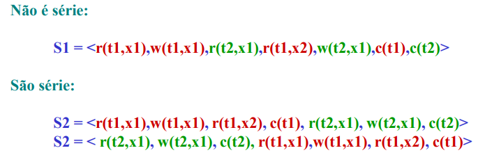

---

### __Série__ 
Para __toda a transação__ $ T $ as __operações__ de $ T $ são __executadas consecutivamente__, sem interposição de operações de outras transações $ \Rightarrow $ __limitam__ a __concorrência__.

`N transações` $ \Rightarrow $ `N! escalonamentos série possíveis` 

__E.g.__:

 

 

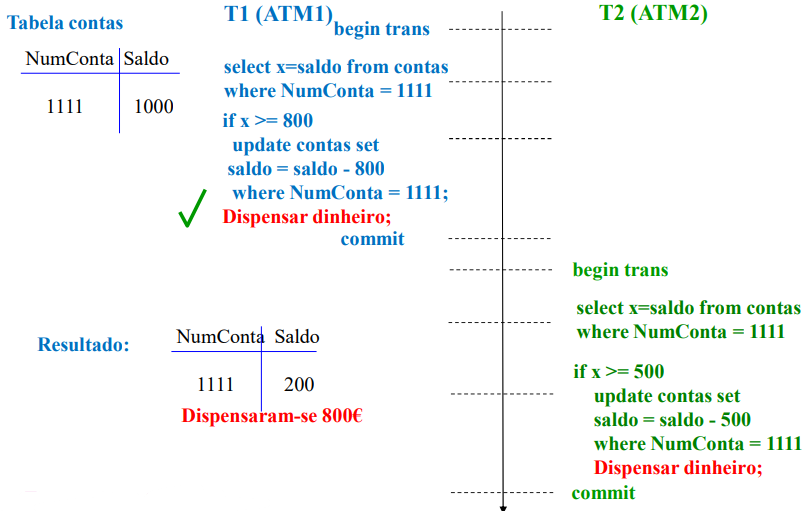

---

### __Equivalentes__ 
A __ordem__ de quaisquer __2 operações conflituantes__ é a __mesma__ nos __2 escalonamentos__.

__E.g.__:

 

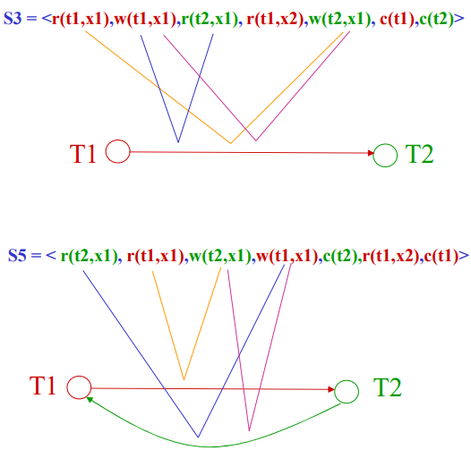

---

### __Serializável__
É __equivalente__ do __ponto de conflito__ a __1 dos escalonamentos série__ possíveis com as transações de $ S $.

__E.g.__:

 

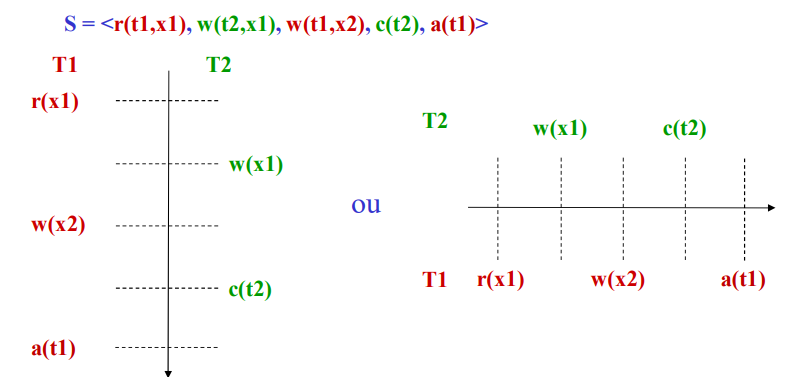

 

---

### __Grafo de Precedências__

Desenhar __1 vértice__ por cada __transação do escalonamento__.

Por cada __par conflituante__ $ a1(T_i,x), a2(T_j,x) $ tal que $ a1 $ __precede__ $ a2 $ desenhar 1 __arco__ de $ T_i $ para $ T_j $.

`Existem CICLOS` $ \Rightarrow $ `NÃO é SERIALIZÁVEL`

__E.g.__:

 

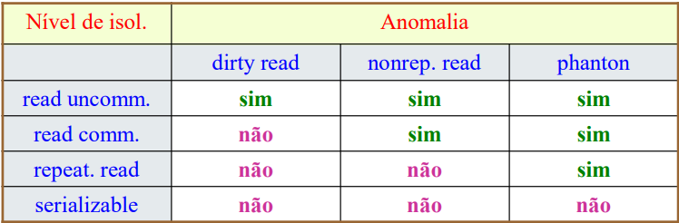

 

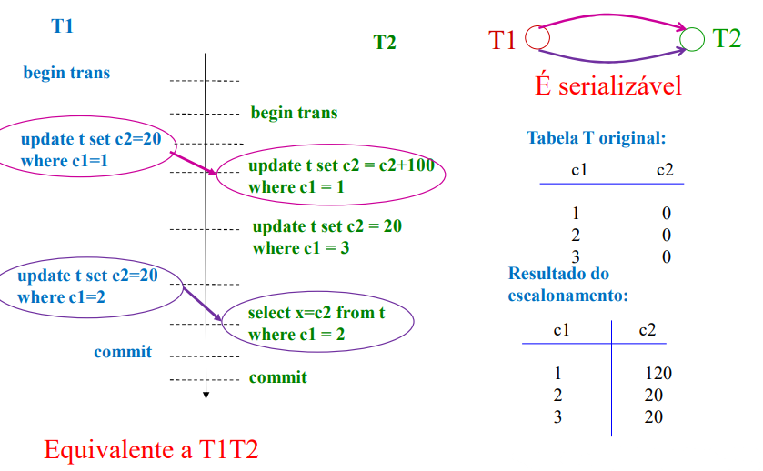

---

### __Linhas de Tempo__
As __ações__ são colocadas nos __tempos__ correspondente às __posições__ que __ocupam no escalonamento__.

__E.g.__:

 

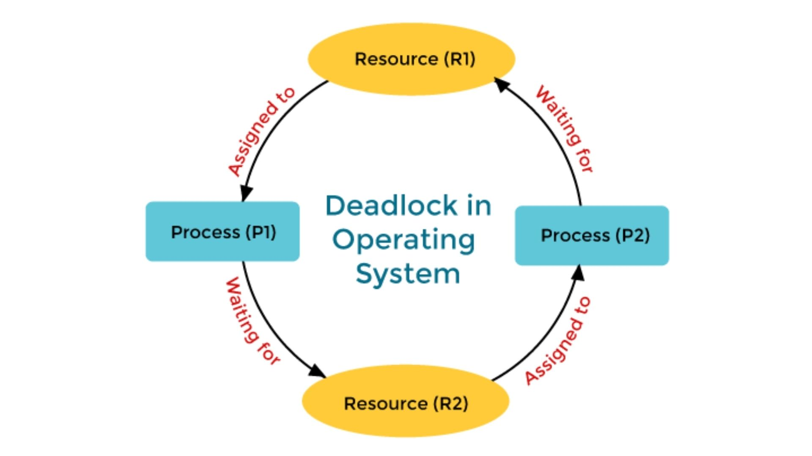

---

## __Anomalias__

### ___Dirty Write (W/W)___

Escalonamentos não __estritos__, ainda que ___cascadeless___.

`É consensual que NÃO deve ocorrer com a norma ISO SQL`

__E.g.__:

 

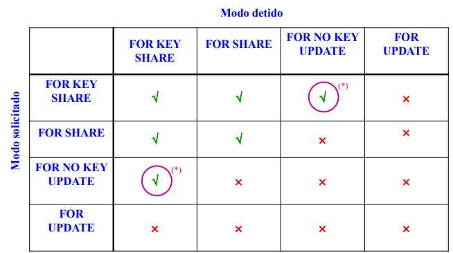

---

### ___Dirty Read (W/R)___

Escalonamentos que __não__ ___cascadeless___.

__E.g.__:

 

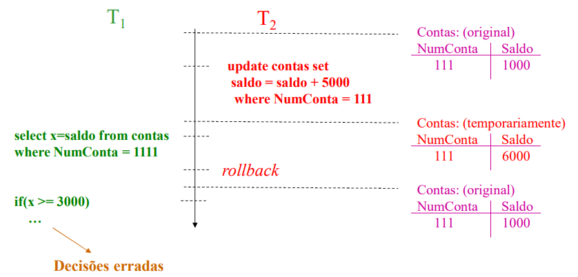

---

### ___Nonrepeatable Read (R/W)___

Escalonamento ___cascadeless___ e __recuperável__ mas __não serializável__.

__E.g.__:

 

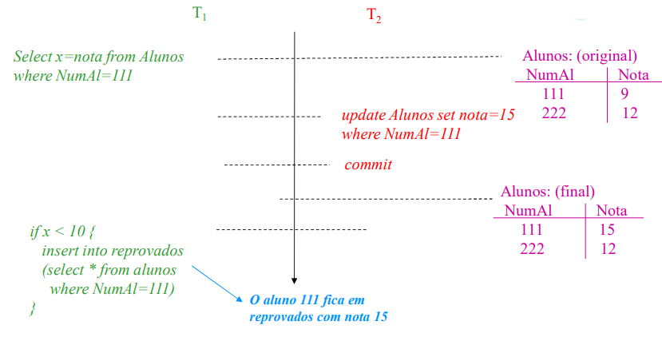

---

### ___Phanton Read (R/W)___

Escalonamento ___cascadeless___ e __recuperável__ mas __não serializável__.

__E.g.__:

 

---

## __Estados__

 

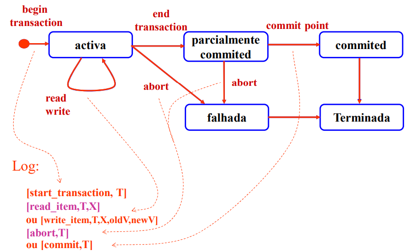

---

### __Activa__ 
Estado após __início__ da __transação__ e __mantém-se__ enquanto se forem __realizando operações de leitura__ e __escrita__ sobre os __dados__.

---

### __Parcialmente__ ___Commited___ 
Estado quando se indica que a __transação__ deve __terminar com sucesso__, onde é garantido que todos os __dados__ são __transferidos__ para __disco__ e só se isso acontecer é que a __transação__ atinge o ___commit point___.

---

### ___Commited___
A transação entra neste estado quando __atinge__ o ___commit point___.

---

### __Falhada__
A transação vem para este estado se for __abortada__ no seu __estado activa__ ou se os __testes realizados__ no __estado parcialmente__ ___commited___ __falharem__.

---

### __Terminada__
A __transação__ deixa de __existir__ no __sistema__.

