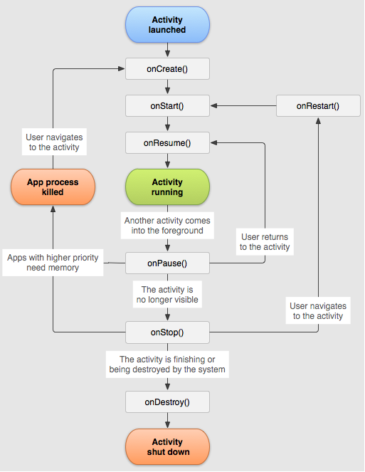
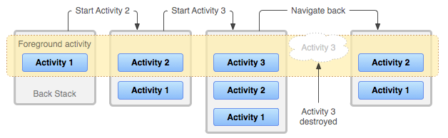

# __Manifesto__

* Indica os __componentes__ (e.g. activities) que constituem a aplicação.
* Indica as __permissões__ necessárias à aplicação.
* Indica o __nome__ completo da __classe derivada de Application__ a ser instanciada.
* Identifica os __requisitos__ para os dispositivos alvo da __aplicação__.
* Incluído no ___APK___ resultante do procedimento de ___build___.

#

# ___Resources___

* __Facilita a adequação__ da aplicação à configuração do dispositivo onde está a ser executada (e.g. __idioma__).

#

# ___Intents___

A activação de uma activity pode ser realizada passando um intent à função ``startActivity``.

## __Implícito__

* Define pelo menos um ___intent-filter___ no manifesto da aplicação de destino.
* Identifica uma __acção__ a ser realizada.

## __Explícito__

* Identifica o __componente de destino__ (e.g com o __nome__ completo da classe do componente de destino)

## __Extras de um__ ___Intent___

* Admite o uso de tipos __primitivos__
* Admite o uso de tipos ___Parcelable___
* Admite o uso de tipos anotados com ___@Parcelize___

A passagem de dados entre __activities__ usando tipos definidos pela aplicação como extras de intents só é possível em extras de intents __explícitos__.

A passagem de dados entre __apps__ usando tipos definidos pela aplicação como extras de intents só é possível em extras de intents __implícitos__.

#

# ___Jetpack Compose___

* __Recomposição__ -> __reconstrução__ da __UI__ de uma __activity__, quando algo dentro de uma função ___@Composable___ é __alterado__ (e.g. ``setContent``).
* __Reconfiguração__ -> __reconstrução__ da __UI__ de uma __activity__, quando algo externo acontece (e.g. __rotação do ecrã__).
* ``remember`` -> sobrevive a __recomposições__ mas não a mudanças de configuração.
* ``rememberSaveable`` -> sobrevive a __recomposições__, __mudanças de configuração__ e caso o __processo da aplicação seja terminado__, também sobrevive.

#

# ___Activity___

Num dispositivo Android, ao ser __mudada a definição global da língua do sistema__ são __destruídas todas as instâncias de Activity existentes__ para que assumam a nova configuração na sua reconstrução.

## ___Lifecycle___
* ``onCreate()`` -> chamada quando a activity é __criada__ (e.g.`` startActivity()``)
* ``onStart()`` -> chamada depois de ``onCreate()`` ou ``onRestart()``, quando a activity fica __visível__ ao utilizador.
* ``onResume()`` -> chamada depois de ``onStart()``, quando a activity __vai começar a interagir__ com o utilizador.
* ``onPause()`` -> chamada quando o utilizador vai __deixar de interagir__ com a activity.
* ``onStop()`` -> chamada quando a activity __não é mais visível__ ao utilizador (e.g. quando o __utilizador seleciona outra__ ___task___)
* ``onDestroy()`` -> chamada antes da activity ser __destruída__ (e.g. quando é pressionado o __botão__ ___back___, o __processo host é terminado__, ou o __ecrã é rodado__).
* ``onRestart()`` -> chamada quando o utilizador __volta a interagir__ com a activity depois de esta ter sido parada.

<div align=center> 



</div>

* ``ATENÇÃO``:
    * Quando é __pressionado o botão__ ___back___, a activity currente é __destruída__ e caso exista, a activity anterior é __reiniciada__.
    * Quando ocorre uma __reconfiguração__, a activity é __destruída__ e __reiniciada__.

## ___repeatOnLifecycle(state: Lifecycle.State)___

* Executa o bloco de código numa nova corrotina quando a activity __está pelo menos no estado indicado__ e __suspende a execução__ até que o Lifecycle seja ___Lifecycle.State.DESTROYED___.
* O bloco será __cancelado e relançado__ consoante o estado do Lifecycle __corresponda ao indicado__.

#

# ___ViewModel___

* __Descartado__ quando a activity é __terminada__ (não destruída).
* Sobrevive a __mudanças de configuração__ (e.g. rotação do ecrã) resultando num __menor ou igual__ número de instâncias de ___ViewModel___ que de ___Activity___.
* Uma instância de ___ViewModel___ pode ser __partilhada__ por __múltiplas activities__.

#

# ___User Task___

A ideia de _user task_ ajuda a __impedir o uso de componentes__ de uma aplicação por outras.

* ___Foreground task___ -> task que o utilizador está a __interagir__.
* ___Background task___ -> task que __não está visível__ ao utilizador, foi __parada__ mas __não destruída__ (__pode ser destruída__ pelo sistema operativo se necessário, e.g. __falta de memória__).

<div align=center> 



</div>

#

# __Modelo__ ___Single-Threaded___ __de__ ___Android___

## __Regras__

* __Não bloquear__ a ___main thread___ (aka ___UI thread___).
* ___Não aceder___ a recursos de UI __fora da__ ___main thread___.

#

# ___Flow___

Não começa a emitir valores até que alguém os começe a coletar.


* ``collect`` -> coleta __todos os valores emitidos__ por um _flow_ (útil quando todos os ___updates___ são __importantes__).
* ``collectLatest`` -> __cancela a coleta de valores emitidos anteriormente__ pelo _flow_ e __coleta os valores mais recentes__ (útil para updates que possam ser _overridden_ sem perdas, como ___updates___ __de bases de dados__).

__E.g.__:

```kotlin
flow {
    emit(1)
    delay(50)
    emit(2)
}.collectLatest { value ->
    println("Collecting $value")
    delay(100) // Emulate work
    println("$value collected")
}

// prints "Collecting 1, Collecting 2, 2 collected"
```

Têm de ser chamados numa __corrotina__ porque são __suspend functions__.

## ___SharedFlow___

Começa a emitir valores assim que é criado.

Emite __todos os valores__ para todos os _consumers_ como um ___BroadcastChannel___.

## ___StateFlow___

Semelhante a um ___SharedFlow___ mas apenas emite o __valor mais recente__ (read-only).

* ``collectAsState``: 
    * Igual a ``collectLatest`` mas retorna o valor do ___flow___ como um ___StateFlow___.
    * É uma função ___@Composable___ e como tal só pode ser usada em funções ___@Composable___.

#

# ___DataStore___

Forma de guardar dados assincronamente, consistentemente e transacionalmente, ultrapassando as limitações do ___SharedPreferences___.

* Os dados são guardados em pares ___key-value___.
* Apenas deve ser __criado uma instância para um dado ficheiro__ no mesmo processo (resultará em ___IllegalStateException___ caso contrário).


#

# ___Cloud Firestore___

* As __funções__ são ___suspend___ __e não bloqueantes__.
* __Não existem operações__ que exponham __diretamente__ ___LiveData ou Flow___.
* A __subscrição a notificações__ de atualizações dos dados retorna uma instância de ___ListenerRegistration___ que pode ser usada para cancelamento da subscrição.
