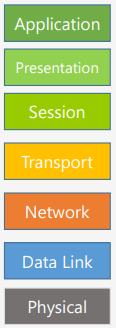
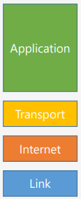
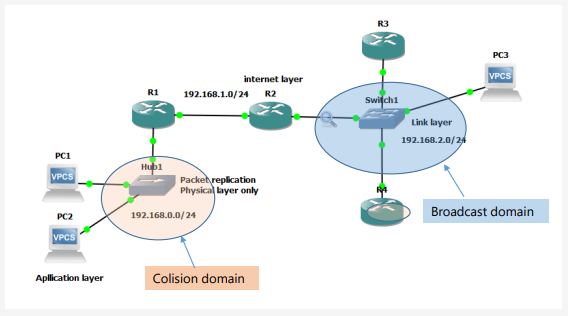
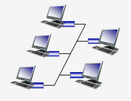
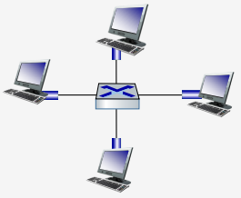

# __Revisões de Redes de Computadores__

## __Modelo OSI vs Modelo TCP/IP__

 

 

### __Aplicação__

> Trabalha com a aplicação em si, como o navegador, e-mail, etc.

* Telnet, FTP, e-mail, etc.

### __Transporte__

> Responsável pela comunicação fim-a-fim, garantindo a entrega dos dados.

* TCP, UDP

### __Rede__

> Responsável pelo tratamento dos pacotes, roteamento, etc.

* IP, ICMP, IGMP

### __Link__

> Responsável pelo hardware, como placas de rede, switches, etc que interagem com a rede.

* Ethernet, Token Ring

### __Física__

> Responsável pela transmissão dos bits.

* Cabos, conectores, etc.

### __Exemplo__

 

## __Topologia do Mundo Físico__

### ___Bus___

> Todos os dispositivos estão ligados a um único cabo.

 

### ___Switched___

> Cada dispositivo está ligado a um switch.

