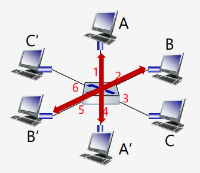

# __Revisões de Redes de Computadores__

## __Modelo OSI vs Modelo TCP/IP__

 

 

### __Aplicação__

> Trabalha com a aplicação em si

* Telnet, FTP, e-mail, etc.

### __Transporte__

> Responsável pela comunicação fim-a-fim, garantindo a entrega dos dados.

* TCP, UDP

### __Rede__

> Responsável pelo tratamento dos pacotes, roteamento, etc.

* IP, ICMP, IGMP

### ___Link___

> Responsável pelo hardware, como placas de rede, switches, etc que interagem com a rede.

* Ethernet, Token Ring

### __Física__

> Responsável pela transmissão dos bits.

* Cabos, conectores, etc.

### __Exemplo__

 

## __Topologia do Mundo Físico__

### ___Bus___

> Todos os dispositivos estão ligados a um único cabo.

 

### ___Switched___

> Cada dispositivo está ligado a um switch.

## __Estrutura de um Frame Ethernet__

## ___Switches___

> Dispositivo da camada  ___link___ que guarda e redireciona frames ethernet.

* Analisa o endereço MAC de destino do frame e o encaminha para a porta correta.

* __Transparente__: O host não sabe que está conectado a um switch.

* Não precisam de configuração.

### __Várias Transmissões Simultâneas__

__A-A' e B-B' podem transmitir simultaneamente, sem colisões.__

__A-A' e B-B' podem transmitir simultaneamente, sem colisões, mas A-A' e C-A' não podem.__

* Os hosts tem uma conexão direta com o switch.

* É utilizado o protocolo CSMA/CD em cada _link_, logo:

    * Não há colisões (full-duplex).

    * Cada _link_ é um __domínio de colisão__.

### __Tabela de Redirecionamento__

* Quando um frame chega, o switch aprende o endereço MAC de origem e a porta a qual ele está conectado, adicionando à tabela (inicialmente vazia).

* __Se o switch já conhece o endereço MAC de destino__, ele redireciona o frame para a porta correta.

* __Se o switch não conhece o endereço MAC de destino__, ele envia o frame para todas as portas (___flooding___), exceto a de origem.

__Exemplo do envio de um frame de A para A'__

## __Rede Institucional__

## __Endereço MAC__

> Identificador único de cada interface de rede.

### __Tipos de Endereços MAC__

* ___Unicast___: Endereço de um host específico de uma LAN.

* ___Broadcast___: Endereço que envia para todos os hosts numa LAN (bits todos a 1).

* ___Multicast___: Endereço que envia para um grupo de hosts numa LAN.

### __Campos do Endereço MAC__

* __I/G__
    * 0: Endereço _unicast_
    * 1: Endereço _multicast_ ou _broadcast_

* __U/L__
    * 0: Endereço _global_ (_vendor assigned_)
    * 1: Endereço local