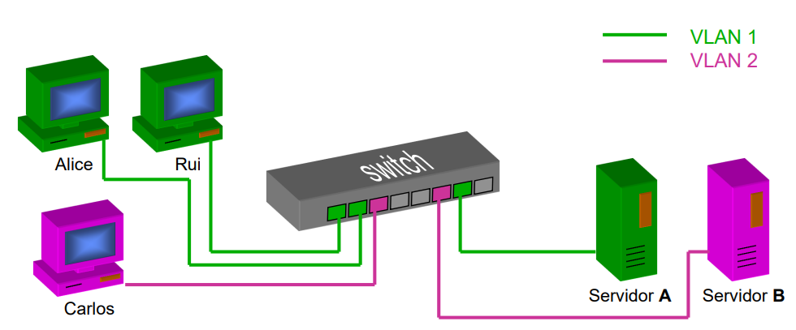
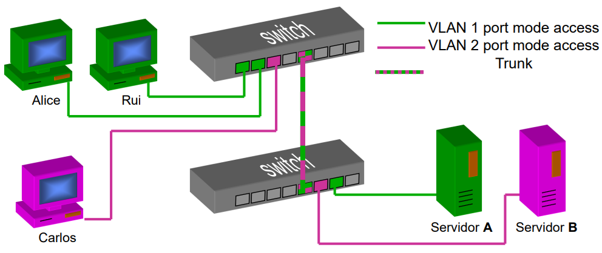
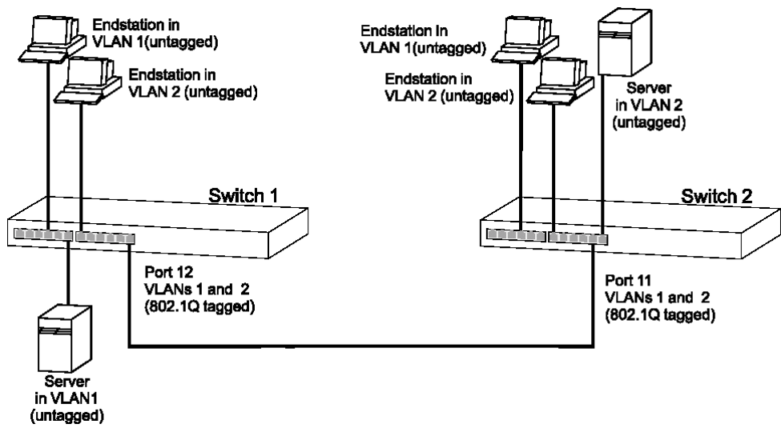
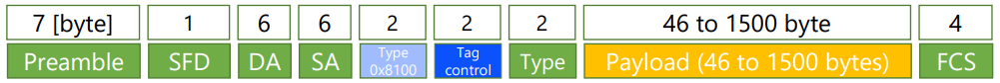
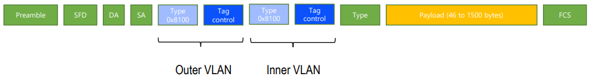
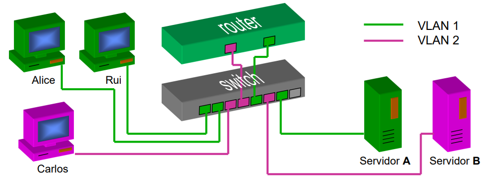
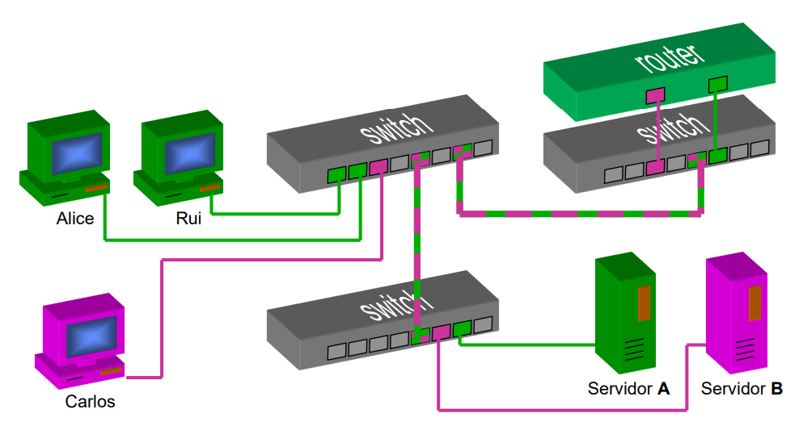
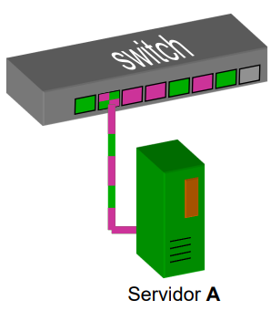
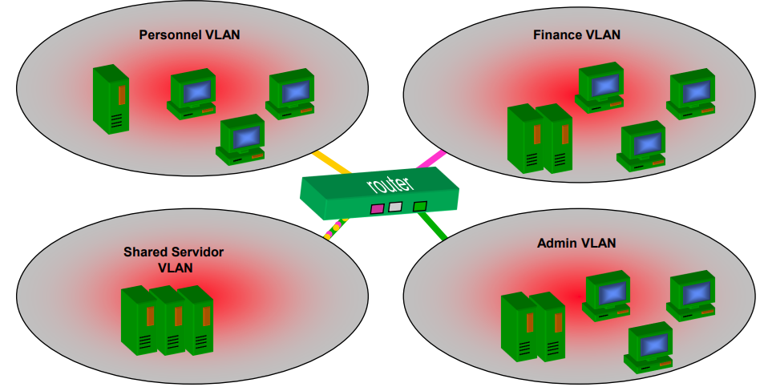
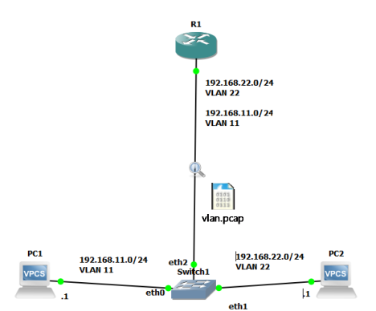

# __VLAN__

## __Objetivo__

* Criação de redes locais virtuais (VLANs) sobre uma rede local física composta por 1 ou mais equipamentos ativos.

* Vários domínos de _broadcast_ num (ou mais) _switch_.

## __Vantagens__

* __Aumenta a segurança da rede__: Evita que um host receba tráfego não destinado a ele.

## __Exemplo de Divisão da Rede com VLAN__

<div align=center>



</div>

## __Implementação Num Só Switch__

* No _switch_, é definido em cada porta o VLAN ID, VLAN a que a porta está associada.

* Simula _switches_ virtais dentro do equipamento físico com as portas de uma VLAN.

* Os _switches_ só encaminham tramas entre 2 portas se elas estiverem na mesma VLAN.

* Os _switches_ só encaminham tramas de _broadcast_ para as portas da mesma VLAN.

## __Implementação Entre Switches__

* A porta de ligação entre _switches_ (___Tag Port___) pertence a várias ou a todas as VLANs.

* A porta de ligação entre _switches_ realiza o ___tagging___ das tramas propagadas:
    * Associa a cada trama o VLAN ID a que pertence.
    * Recalcula o CRC da trama.

* ___Load Balancing___: Possibilidade de ter várias ligações, cada um para um subconjunto das VLANs.

## ___Trunk___

* Ligações entre _switches_ que transportam tramas de várias VLANs.

* As tramas contêm campos adicionais que identificam a VLAN a que pertencem.

* É necessário apenas uma ligação entre _switches_ para transportar todas as VLANs.

#

### __Exemplo__

<div align=center>



</div>

## __Atribuição de VLANs__

```
Port 1: VLAN 1
Port 2: VLAN 2
Port 3: VLAN 3
Port 5: Trunk Link
```

## __Topologia__

<div align=center>



</div>

## __Formato da Trama com _Tag___

<div align=center>



</div>

## ___Stacking___

<div align=center>



</div>

## __Roteamento Com VLANs__

### __1 _Router_ e 1 _Switch___

<div align=center>



</div>

### __1 _Router_ e Vários _Switch___

<div align=center>



</div>

## __Servidores__

* 1 Servidor pode estar ligado apenas a uma VLAN.

* Configuração equivalente a um PC normal.

### __Servidores com Ligações em _Trunk___

* Se a interface de rede e o sistema operativo o suportarem, os servidores podem ser diretamente ligados a uma porta de _trunk_.

* Várias interfaces virtuais, uma por VLAN.

<div align=center>



</div>

### __Exemplo de várias VLANs com Servidores__

<div align=center>



</div>

## __Exemplo de _Routing_ entre VLAN _router on a stick___

<div align=center>



</div>

### __Configuração dos PCs__

```
PC1 - VLAN 11
ip 192.168.11.1/24 192.168.11.254

PC2 - VLAN 22
ip 192.168.22.1/24 192.168.22.254
```

### __Configuração do _Router___

```
enable
conf -> Entrar no modo de configuração

# VLAN 11

interface FastEthernet0/0.11
encapsulation dot1Q 11 -> Serve para identificar a VLAN
ip address 192.168.11.254 255.255.255.0
exit

# VLAN 22

interface FastEthernet0/0.22
encapsulation dot1Q 22
ip address 192.168.22.254 255.255.255.0
exit

# Interface de ligação ao switch

interface FastEthernet0/0
no shutdown

exit

show interfaces b -> Verificar as interfaces
```

### ___Ping_ entre PCs__

```
PC1 -> PC2

ping 192.168.22.1
```

### ___Ping_ entre _Router_ e PCs__

```
Router -> PC1

