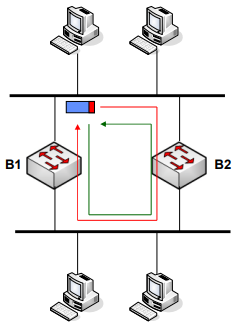
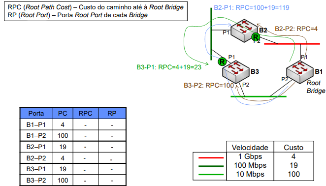

# __Protocolo _Spanning Tree_ (STP)__

## ___Bridge/Switch_ (Revisões)__

### __Trama Ethernet__

### __Modos de Retransmissão__

#### ___Cut-Through___

> Envia logo após o endereço de destino estiver disponível.

#### ___Modified Cut-Through___

> Envia logo após receber 64 bytes (dimensão mínima da trama), garantindo que não houve colisão na trama.

#### ___Store-and-Forward___

> Envia após receber toda a trama e verificar que não tem erros, garantindo que não houve erros nem colisão na trama.

### __Tabela de Retransmissão (FDB)__

* Os endereços aprendidos e colocados na tabela têm uma duração limitada, de forma a garantir que se um terminal mudar de porta, a tabela seja atualizada.

#### __Processo de Retransmissão__

#### __Processo de Aprendizagem__

## __Problemas de Ciclos nas Redes__

### __Tramas de _Broadcast___

> Os ciclos nas redes originam que as tramas de _braodcast_ circulem na rede indefinidamente em ambas as direções.

### __Tramas _Unicast___

> Os ciclos nas redes podem originar que tramas _unicast_ também circulem na rede indefinidamente.

## __Protocolo _Spanning Tree_ (STP)__

> Protocolo que permite eliminar os ciclos nas redes, desativando portas de _switches_ de forma a garantir que não existem ciclos.

### __Objetivo__

> As _bridges_ trocarem informação entre elas para detetarem os ciclos existentes na rede e permitirem configurar uma topologia lógica de rede sem ciclos e em caso de alterações na rede, a topologia é atualizada.

### __Características__

* As mensagens de controlo trocados entre as _bridges_ são enviadas em _broadcast_ e designam-se de _Bridge Protocol Data Units_ (BPDU).

### __Exemplo__

### __Estados das Portas__

#### ___Blocking___

> Descarta as tramas que recebe.

#### ___Listening___

> Construção da topologia ativa.

#### ___Learning___

> Preenchimento da tabela de retransmissão.

#### ___Forwarding___

> Envio / Receção de tramas.

#### ___Disabled___

> Administrativamente desativada.

### __Transições de Estados__

### __Estados _Forward_ e _Blocked___

* As portas que estão no estao _Forward_ ou são _Root Ports_ ou _Designated Ports_.

* As restantes portas estão no estado _Blocking_.

### __BPDU__

#### __Campos da Mensagem__

* ___Message Age___: Incremento correspondente ao número de Bridges por onde passou (na _root bridge_ é 0).

* ___Max Age___: Tempo de armazenamento dos BPDU e caso não seja recebido um update após este tempo, assume-se que houve alteração de topologia.

* ___Hello Time___: Tempo entre cada envio de BPDU.

* ___Forward Delay___: Tempo de cáculo da topologia de rede (em estado _Listening_ e _Learning_).

### __Identificador de _Bridge___

* Identificador de _Bridge_ mais prioritário:
    * A _bridge_ com o menor valor de prioridade.
    * Em caso de empate, a _bridge_ com o menor valor de endereço MAC.

### __Identificador de Porto__

* Identificador de Porto mais prioritário:
    * A porta com o menor valor de propriedade.
    * Em caso de empate, a porta com o menor valor de número de ordem.

### __Custos dos Segmentos__

## __Algoritmo _Spanning Tree___

* É eleita a _root bridge_ tendo em conta o BID mais baixo.

* São eleitas as _root ports_ de cada _bridge_ que não é a _root bridge_.

* São eleitas as _designated ports_ para cada segmento e quando o mesmo switch liga-se ao mesmo segmento, é eleita a porta que envia o BPDU superior.

### __Eleição da _Root Bridge___

* As _bridges_ enviam os BPDUs com o seu BID assumindo-se como _root bridge_ e assim todas as _bridges_ ficam a conhecer os valores de BID das restantes _bridges_.

### __Eleição da _Root Port___

* Cada _bridge_ calcula o seu RPC para cada porta sendo a com menor valor eleita _root port_ e em caso de empate, a porta com o menor valor de BID.

* O RPC é incrementado na _bridge_ de destino.

### __Eleição da _Designated Port___

* Cada segmento tem associado uma _designated port_ de uma _bridge_ ligada a ele.

* O DPC das portas que não são _root ports_ é o valor da entrada RPC da _root port_.

* A _designated port_ de um segmento é a porta com menor custo ligada a esse segmento.

* O custo até à _root bridge_ é do __ponto de vista dos segmentos__ e não das _bridges_.

### __Decisão sobre o "Melhor" BPDU__

> Dados 2 BPDUs

* Se o RBID de um BPDU for menor que o de outro BPDU o valor menor é o melhor.

    * Se os RBIDs forem iguais, __compara-se o RPC__ e o BPDU com o menor valor é o melhor.

        * Se os RPCs forem iguais, __compara-se o BID__ e o BPDU com o menor valor é o melhor.

            * Se os BIDs forem iguais, __compara-se o PID de saída__ e o BPDU com o menor valor é o melhor.

                * Se os PIDs de saída forem iguais, __compara-se o PID de entrada__ e o BPDU com o menor valor é o melhor.

### __Deteção de Mudança na Rede__

* Quando uma _bridge_ deteta uma mudança na rede, envia um BPDU:

    * __Se for _root bridge___, muda a _flag_ _Topology Change_ para 1 (TC-BPDU) e inicia o contador de tempo de mudança de topologia.

    * __Se não for _root bridge_ e a _flag_ _Topology Change_ for 0__, envia um BPDU com a _flag_ _Topology Change_ a 1 pela RP para avisar a _root bridge_.

#### __Exemplo__

* A ligação da B4 à rede quebrou-se.

* Se a B2 detetar a alteração de topologia, envia um TC-BPDU pelo RP.

* As _bridges_ intermédias respondem com _Topology Change Acknowledge_ e enviam o TC-BPDU pela RP.

* Quando a _root bridge_ recebe o TC-BPDU, envia BPDUS de configuração (C-BPDU) para recalcular a topologia ativa.

### __Exemplo de Cálculo do _Spanning Tree___

#

__Eleição da _Root Bridge_ e das _Root Ports___

#

__Eleição das _Designated Ports___

#

__Topologia Final__

