# __Protocolo Rapid Spanning Tree (RSTP)__

## __Problemas do STP__

* Lento a convergir para a topologia ativa.

* Com topologias de VLAN diferentes, o STP ao nível do porto físico não é eficiente.

## ___Protocolo Rapid Spanning Tree Protocol (RSTP)___

### __Características__

* Os BPDUs incluem informação adicional.

* Aproveita o facto das ligações atuais serem __quase__ sempre ponto-a-ponto.

* Suporta _bridges/swtiches_ com mais de 256 portas.

* Suporta _FastSwitching/Forwarding_ em portas nas extremidades na rede.

* Compatibilidade com o STP.

### ___Root Ports___

> Processo de escolha igual ao STP.

### ___Designated Ports___

> Processo de escolha igual ao STP.

### ___Alternate_ e _Backup Ports___

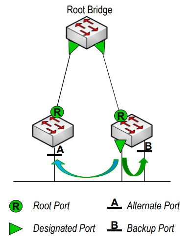

* Ambas as portas correspondem ao estado _blocking_ do STP.

#### ___Alternate Port___

> Porta que oferece um caminho alternativo para a _root bridge_.

* Recebe BPDUs melhores que os seus.

* Se a _designated port_ falhar, a _alternate port_ torna-se _designated_ caso contrário, fica no estado ___discarding___.

#### ___Backup Port___

> Porta que oferece um caminho alternativo para o segmento (presente no mesmo switch).

* Recebe BPDUs melhores que os seus.

* Tem um PID maior que a _designated port_.

* Se não houver mais portas disponíveis, a _backup port_ torna-se _designated_, caso contrário, fica no estado ___discarding___.

### __Transições de Estados__

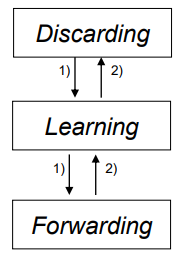

#### __Discarding__

> Corresponde aos estados de _disabled_, _blocking_ e _listening_ do STP.

#### __Learning__

> Igual ao STP.

#### __Forwarding__

> Igual ao STP.

### __Quem gera os BPDUs?__

> Todos os _switches_ geram e enviam um novo BPDU a cada _Hello Time_ de forma a obter informação sobre a topologia, o que permite que o estado _listening_ seja eliminado.

* Se uma _bridge_ não receber 3 BPDUs consecutivos, assume que perdeu a ligação direta com os seus vizinhos (parecido com o _Keep Alive_).

### __BPDU__

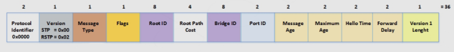

* No caso do RSTP, apenas existe um tipo de BPDU usado quer para a criação da topologia quer para a notificação de alterações (_Topology Change Notification_).

### __Transição Rápida para o Estado _Forwarding___

* Devido a um mecanismo real de ___feedback___ que atua entre _bridges_, é possível confirmar que uma porta pode transitar em segurança para o estado _forwarding_ sem ter de se basear em qualquer temporizador.

* O mecanismo é baseado em portas tipo ___edge___ e ___link___.

### __Portas _Edge_ e Portas _Non-Edge___

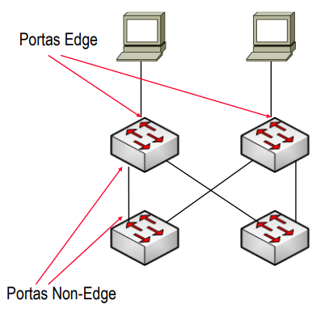

* Nunca terão outros _switches_ ligados a elas.

* Transitam imediatamente para o estado _forwarding_.

* Configuradas para aceitarem o comando _spanning-tree portfast_.

* Se uma porta _edge_ receber um BPDU, passa a ser uma porta _non-edge_.

### ___PortFast___

> Permite que portas de que se sabe à partida que não vão provocar _loops_ possam transitar imediatamente para o estado _forwarding_.

* A porta configurada como _PortFast_ não executa o STP e apenas pode voltar a o fazer se receber um BPDU.

### __Tipos de _Links___

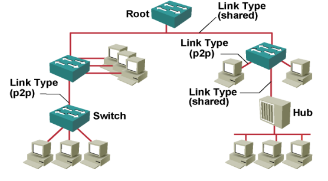

#### __Ponto-a-Ponto__

* A porta opera em modo _full-duplex_.

* Assume-se que a porta está ligada a um único _switch_.

#### ___Shared___

* A porta opera em modo _half-duplex_.

* Assume-se que a porta está ligada a um meio partilhado onde podem existir vários _switches_.

### __BDPUs Inferiores__

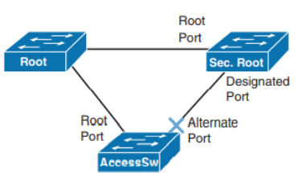

* Quando um _link_ falha na _root bridge_:

    * A _secondary root bridge_ repara que a sua _root port_ falhou e comporta-se como a _root bridge_ enviando BPDUs inferiores.

        * O _access bridge_ repara que está a receber BPDUs inferiores da _secondary root bridge_ original e aceita-os, tornando-se assim _secondary root bridge_ (a sua _alternate port_ passa a ser _designated port_).

            * A _secondary root bridge_ original repara que está a receber BPDUs superiores da _access bridge_ original e aceita-os, parando então de se comportar como _root bridge_ e passa a ser _access bridge_ (a sua _designated port_ passa a ser _root port_).

### __Sequência de Eventos durante _Proposal/Agreement__

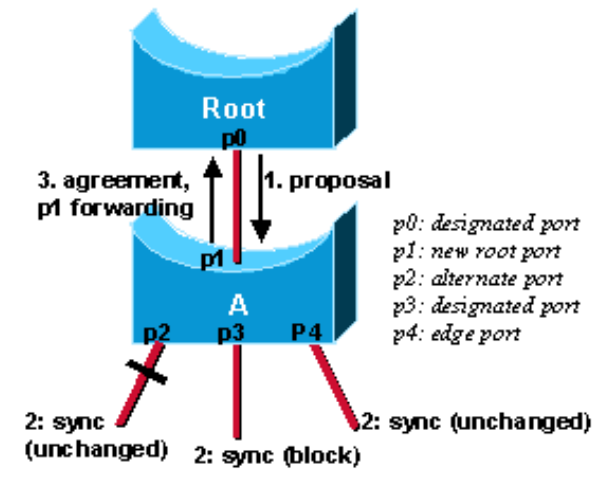

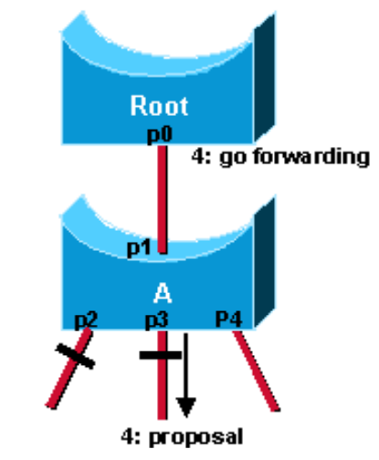

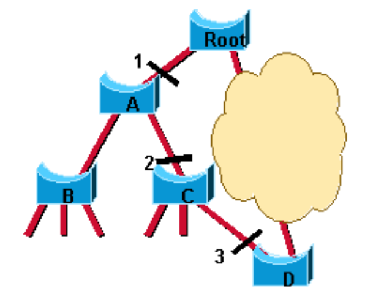

* Quando uma _bridge_ recebe uma mensagem ___proposal___ num dos seus portos, esse porto é selecionado como novo _root port_, logo todos os outros são sincronizados com a nova informação.

* Após confirmar que todos os portos estão sincronizados com a nova informação, envia uma mensagem ___agreement___ para o _designated switch_ correspondente ao seu _root port_.

* As portas não ___root___ e não ___edge___ atuam de modo idêntico para decidir se ficam no estado _forwarding_ ou _blocking_ relativamente aos outros _switches_.

### ___UplinkFast___

> Outra forma de transição imediata para o estado _forwarding_ que quando uma _bridge_ perder a sua _root port_ é capaz de colocar diretamente a sua melhor _alternate port_ no estado _forwarding_, provocando uma alteração na topologia.

### __Propragação da Mudança de Topologia__

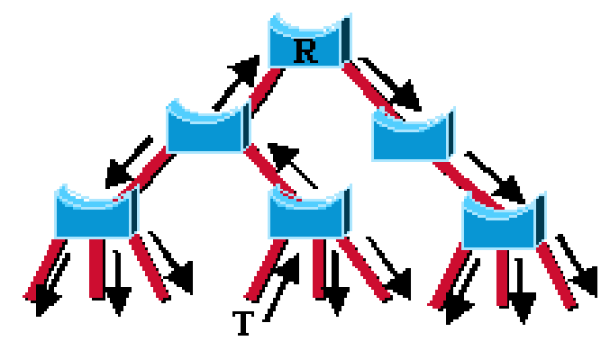

## ___Per VLAN Spanning Tree (PVST)___

> Um STP independente por VLAN.

### __Desvantagens__

* Não tem escalabilidade.

    * Num _switch_ pode haver muitas VLANs.

## __Protocolo _Multiple Spanning Tree (MSTP)___

> Define múltiplos STP cada um associado a um conjunto de VLANs.

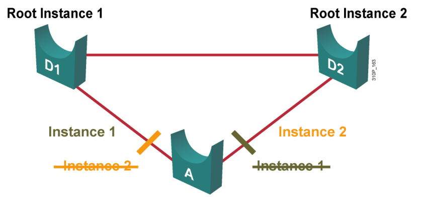

* Em vez de se manter _spanning trees_ independentes para cada VLAN, cada _switch_ mantém apenas 2 _spanning trees_.

### __BID__

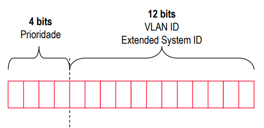

