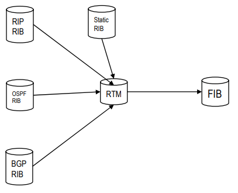
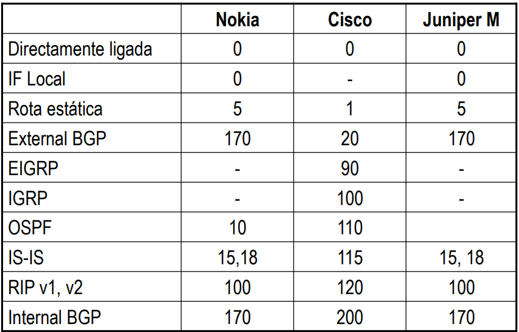

# __Protocolos de Encaminhamento__

## __Tabela de Encaminhamento__

### __Entrada da Tabela de Encaminhamento num _Router___

```
R 10.100.100.1 [120/1] via 192.168.1.5, 00:00:02, Serial4/1:10.20
```

* ``R``: Forma como o caminho foi aprendido.

* ``10.100.100.1``: Endereço de destino.

* ``[120/1]``: Custo (Distância administrativa / métrica) para atingir o endereço de destino.

* ``192.168.1.5``: Endereço para onde enviar o datagrama (próximo salto).

* ``00:00:02``: Há quanto tempo este caminho foi aprendido.

* ``Serial4/1:10.20``: Interface para onde enviar o datagrama.

### __Preferência de Protocolo__

<div align=center>



</div>

* Cada protocolo seleciona a melhor rota para um dado destino e popula a RIB (_Routing Information Base_).

* A melhor rota de cada protocolo é inserida na RTM (_Routing Table Manager_).

* A RTM seleciona a melhor rota de todas as rotas disponíveis para um dado destino e insere na tabela de encaminhamento.

### __Distância Administrativa__

> Medida de confiança que um _Router_ tem em relação a um protocolo de roteamento.

<div align=center>



</div>

### __Exercício__

<div align=center>


</div>

* Interprete cada uma das entradas da tabela de encaminhamento:

    * 1 - Rota _default_ via 10.100.255.254

    * 2 - Para a rede local fazer entrega direta

    * 3 – Para o próprio IP enviar pela interface _loopback_

    * 4 - Para o endereço de broadcast da classe fazer entrega direta

    * 5 – Para a rede _loopback_ enviar via interface de _loopback_

    * 6 - Para a classe D (multicast) fazer entrega direta

    * 7 - Para o endereço _broadcast_ local fazer entrega direta


### __População da Tabela de Encaminhamento__

#### __Diretamente Conectadas__

> Rotas que são diretamente conectadas ao _Router_.

#### __Estáticas__

> Adicionadas manualmente pelo administrador.

#### __Dinâmicas__

> Aprendidas através de protocolos de encaminhamento.

### __Protocolos de Encaminhamento__

#### ___Interior Gateway Protocols (IGP)___

> Usados dentro do mesmo domínio administrativo.

* ___Distance Vector___
    > Usam a contagem de saltos para determinar a melhor rota, fazendo com que não conheçam a topologia da rede, apenas o melhor salto para o destino.

    * RIPv1 e RIPv2 (_Routing Information Protocol_)

* ___Link-State___
    > Usam o custo da rota que representa a largura de banda para selecionar a rota com o menor custo.

    * OSPF (_Open Shortest Path First_)

    * IS-IS (_Intermediate System to Intermediate System_)


#### ___Exterior Gateway Protocols (EGP)___

> Usados entre domínios administrativos diferentes.

* BGP (_Border Gateway Protocol_)