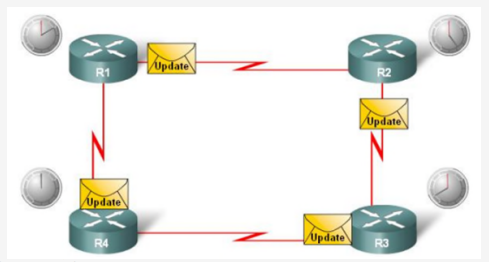
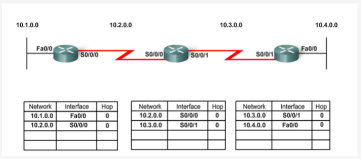
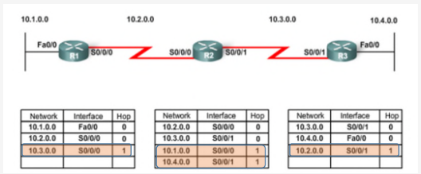
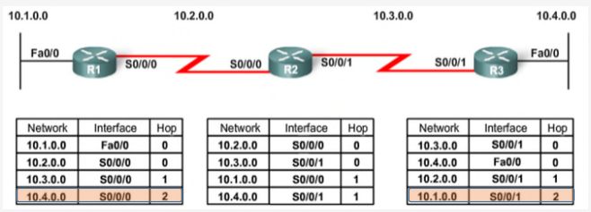
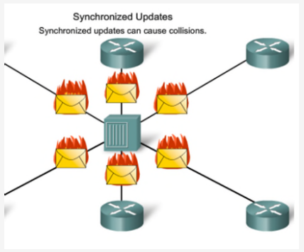
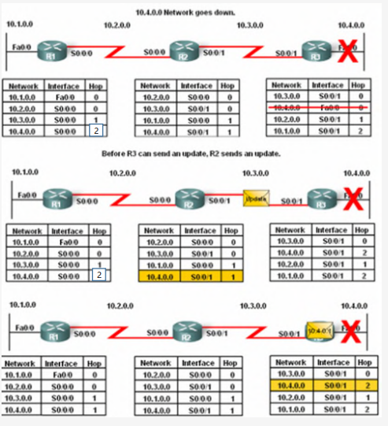
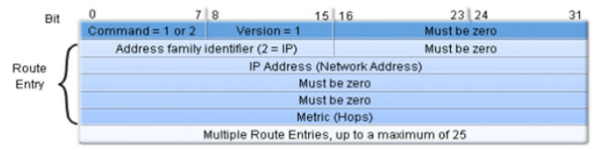
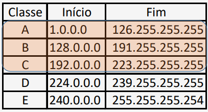
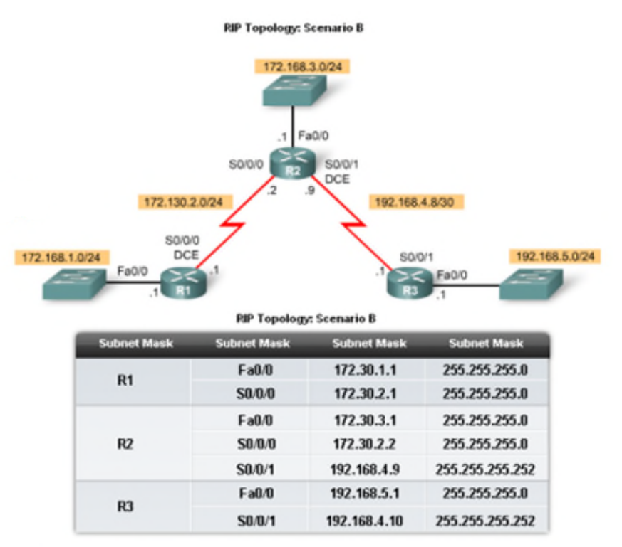

# __Protocolos de Roteamento__

## __Tabela de Roteamento__

### __Entrada da Tabela de _Routing_ num _Router___

```
R 10.100.100.1 [120/1] via 192.168.1.5, 00:00:02, Serial4/1:10.20
```

* ``R``: Forma como o caminho foi aprendido.

* ``10.100.100.1``: Endereço de destino.

* ``[120/1]``: Custo (Distância administrativa / métrica) para atingir o endereço de destino.

* ``192.168.1.5``: Endereço para onde enviar o datagrama (próximo salto).

* ``00:00:02``: Há quanto tempo este caminho foi aprendido.

* ``Serial4/1:10.20``: Interface para onde enviar o datagrama.

### __Preferência de Protocolo__

<div align=center>


</div>

* Cada protocolo seleciona a melhor rota para um dado destino e popula a RIB (_Routing Information Base_).

* A melhor rota de cada protocolo é inserida na RTM (_Routing Table Manager_).

* A RTM seleciona a melhor rota de todas as rotas disponíveis para um dado destino e insere na tabela de _routing_ (FIB - _Forwarding Information Base_).

### __Distância Administrativa__

> Medida de confiança que um _Router_ tem em relação a um protocolo de roteamento.

<div align=center>


</div>

### __Exercício__

<div align=center>


</div>

* Interprete cada uma das entradas da tabela de _routing_:

    * 1 - Rota _default_ via 10.100.255.254

    * 2 - Para a rede local fazer entrega direta

    * 3 – Para o próprio IP enviar pela interface _loopback_

    * 4 - Para o endereço de broadcast da classe fazer entrega direta

    * 5 – Para a rede _loopback_ enviar via interface de _loopback_

    * 6 - Para a classe D (multicast) fazer entrega direta

    * 7 - Para o endereço _broadcast_ local fazer entrega direta


### __Populamento da Tabela de _Routing___

#### __Diretamente Conectadas__

> Rotas que são diretamente conectadas ao _Router_.

#### __Estáticas__

> Adicionadas manualmente pelo administrador.

#### __Dinâmicas__

> Aprendidas através de protocolos de roteamento.

## __Protocolos de _Routing___

### ___Interior Gateway Protocols (IGP)___

> Usados dentro do mesmo domínio administrativo.

#### ___Distance Vector___
> Usam a contagem de saltos para determinar a melhor rota, fazendo com que não conheçam a topologia da rede, apenas o melhor salto para o destino.

* RIPv1 e RIPv2 (_Routing Information Protocol_)

#### ___Link-State___
> Usam o custo da rota que representa a largura de banda para selecionar a rota com o menor custo.

* OSPF (_Open Shortest Path First_)

* IS-IS (_Intermediate System to Intermediate System_)


### ___Exterior Gateway Protocols (EGP)___

> Usados entre domínios administrativos diferentes.

* BGP (_Border Gateway Protocol_)

### __Algoritmo de _Routing___

<div align=center>



</div>

#### __Características__

* Atualizações periódicas (por norma a cada 30 segundos);

* Vizinhos;

* _Braodcast_ de atualizações;

* A tabela de roteamento é incluída em cada atualização.

#### __Vantages__

* Simplicidade de implementação e manutenção;

* Pouco uso de recursos.

#### __Desvantagens__

* Lentidão na convergência;

* Escalabilidade limitada;

* _Routing loops_.

#### __Troca Inicial de Informações de _Routing___

* Redes diretamente conectadas são as primeiras a serem anunciadas e colocadas na tabela de _routing_ de cada _router_.

<div align=center>



</div>

* Os _routers_ continuam a trocar informações de _routing_ até que todas as rotas estejam na tabela de roteamento.

<div align=center>



</div>

* Se não houver novos _updates_, então a Convergência foi alcançada e todos os _routers_ conhecem todas as redes.

<div align=center>



</div>

#### __Atualizações Periódicas__

<div align=center>



</div>

* __Problemas__:

    * Consumo de largura de banda;

    * Colisão de pacotes.

#### ___Routing Loops___

> Situação em que um pacote é continuamente encaminhado entre dois ou mais _routers_ sem nunca chegar ao destino.

<div align=center>



</div>

* __Causas__:

    * Configuração incorreta de rotas estáticas;

    * Configuração incorreta de protocolos de roteamento;

    * Convergência lenta.

* __Problemas__:

    * Consumo de largura de banda excessivo;

    * Consumo de recursos principalmente do CPU;

    * Atraso ou perda na entrega de pacotes.

* __Soluções__:

    * ___Count to Infinity___: Limitar o número de saltos até que uma rota seja considerada inválida;

    * ___Hold Down Timer___: Tempo que um _router_ espera antes de aceitar uma nova rota.

    * ___Split Horizon___: Não enviar atualizações de roteamento para a interface de onde a informação foi recebida.

    * ___Poison Reverse___: Quando uma rota é considerada inválida, o _router_ envia uma atualização com o custo infinito para a interface de onde a informação foi recebida.

### __RIPv1 (_Routing Information Protocol_)__

#### __Características__

* ___Classful___: Não envia máscaras de sub-rede nos updates.

* Protocolo de _distance vector_.

* Rotas com mais de 15 saltos são consideradas inalcançáveis.

* Atualizações a cada 30 segundos em modo _broadcast_.


#### __Formato do Pacote RIP__
> As mensagens RIP são encapsuladas em pacotes UDP e com o porto origem e destino 520.

<div align=center>



</div>

* __Tipos de Mensagens__:

    * ___Request___: Solicitação de atualização de rotas a todos os vizinhos que estejam a correr RIP.

    * ___Response___: Atualização de rotas.

#### ___Classful___

<div align=center>



</div>


#### __Comandos RIP__

* ``router rip``: Entra no modo de configuração do RIP e ativa o protocolo em todas as interfaces.

* ``passive-interface``: Desativa o RIP em uma interface.

* ``version 2``: Ativa o RIP v2.

* ``network``: Define as redes que o RIP deve anunciar.

* ``no auto-summary``: Desativa a sumarização automática.

* ``default-information originate``: Anuncia a rota _default_.

* ``show ip route``: Mostra a tabela de _routing_.

* ``show ip protocols``: Mostra os protocolos de _routing_.

#### __Sumarização Automática__

<div align=center>



</div>

* A rede ``172.30.0.0/16`` é sumarizada em:

    * ``172.30.1.0/24``

    * ``172.30.2.0/24``

    * ``172.30.3.0/24``

* Reduz o tamanho da tabela de _routing_.

* Não suporta redes descontinuadas.

#### ___Routers_ de _Fronteira___

> _Routers_ que automaticamente sumarizam redes externas para a rede interna.

#### __Rota _Default___

<div align=center>


</div>

### __RIPv2__