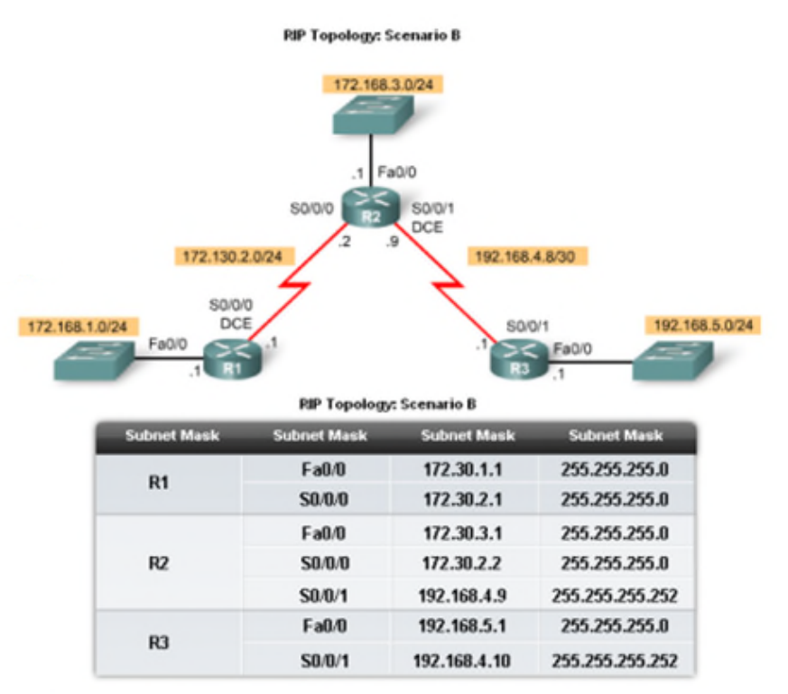
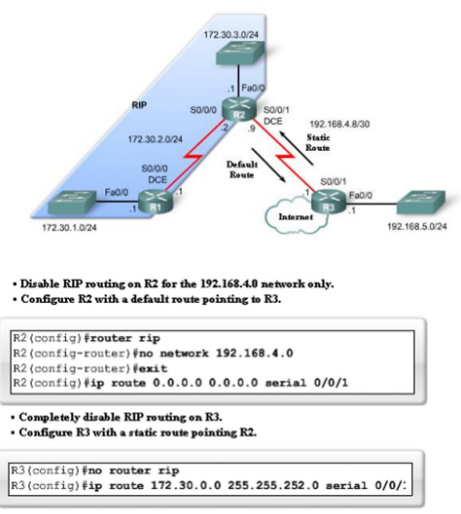
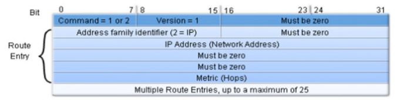
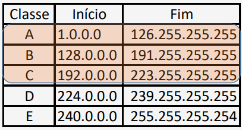
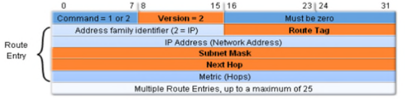
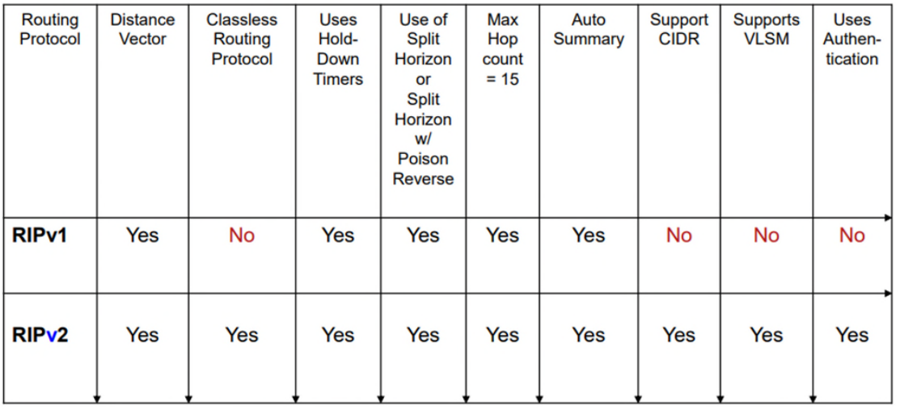

# __RIP (_Routing Information Protocol_)__

## __Tipos de Mensagens__:

### ___Request___
> Solicitação de atualização de rotas a todos os vizinhos que estejam a correr RIP.

### ___Response___
> Atualização de rotas.

## __Sumarização Automática__

* A rede ``172.30.0.0/16`` é sumarizada em:

    * ``172.30.1.0/24``

    * ``172.30.2.0/24``

    * ``172.30.3.0/24``

* Reduz o tamanho da tabela de _routing_.

* Não suporta redes descontinuadas.

## ___Routers_ de _Fronteira___

> _Routers_ que automaticamente sumarizam redes externas para a rede interna.

## __Rota _Default___

## __Comandos RIP__

* ``router rip``: Entra no modo de configuração do RIP e ativa o protocolo em todas as interfaces.

* ``passive-interface``: Desativa o RIP em uma interface.

* ``version 2``: Ativa o RIP v2.

* ``network``: Define as redes que o RIP deve anunciar.

* ``no auto-summary``: Desativa a sumarização automática.

* ``default-information originate``: Anuncia a rota _default_.

* ``show ip route``: Mostra a tabela de _routing_.

* ``show ip protocols``: Mostra os protocolos de _routing_.

## __RIPv1__

### __Características__

* ___Classful___: Não envia máscaras de sub-rede nos updates.

* Protocolo de _distance vector_.

* Rotas com mais de 15 saltos são consideradas inalcançáveis.

* Atualizações a cada 30 segundos em modo _broadcast_.

### __Formato do Pacote RIPv1__
> As mensagens RIP são encapsuladas em pacotes UDP e com o porto origem e destino 520.

### ___Classful___

## __RIPv2__

### __Características__

* ___Classless___: Envia máscaras de sub-rede nas atualizações.

* O endereço do próximo salto é incluído nas atualizações.

* As atualizações são enviados para o endereço multicast ``224.0.0.9``.

* Suporta autenticação.

### __Formato do Pacote RIPv2__

## __Semelhanças entre RIPv1 e RIPv2__

* Uso de _timers_ para previnir _loops_.

* Uso do _split horizon_ ou _split horizon with poison reverse_.

* Uso de _triggered updates_.

* Maxímo de 15 saltos.

## __Diferenças entre RIPv1 e RIPv2__

