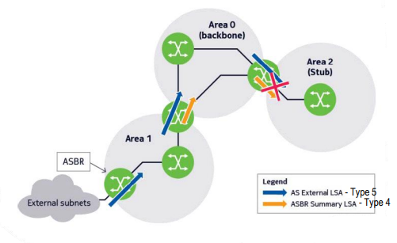

# __OSPF__

## __Objetivo__

> Criar um IGP dinâmico e "aberto" que possa ser implementado e usado por todos.

#
#

## __Vantangens__

* Maior escalabilidade;

* Melhor controlo sobre o _routing_;

* Menos tráfego de "sinalização";

* Calcula melhores rotas;

* Sem limites de saltos;

* Suporta _classless routing_;

* Convergência rápida;

* Não cria loops;

* Mais rápido a reagir a mudanças de topologia;

* Melhor balanceamento de carga;

* Definição lógica de áreas (_divide and conquer_);

* Marcação de rotas externas;

* Autenticação.

#
#

## __Algoritmo de _Link-State Routing___

* Cada _router_ contrói um "mapa" com a topologia da área, para tal trocam mensagens LSU (___link state update___) de cada um para todos os outros anunciando __a quem estão ligados__ usando sempre que possível ___multicast___.

* Cada _router_ calcula, utilizando o algoritmo de SPF (___Dijsktra___), __o caminho mais curto dele para todos os outros _routers_ da área__.

* A tabela de _routing_ inclui a __informação resultante do cálculo__ e ainda a __informação proveniente dos _routers_ que fazem fronteira com outras áreas__.

* Os _routers_ vigiam-se constantemente enviando mensagens ___Hello___ para verificarem se os outros continuam "vivos" e caso contrário __avisam os restantes _routers_ da área__ e __recalculam os melhores caminhos__.

#
#

## __Escalabilidade__

Conhecimento de todas as rotas implica:

* Grande capacidade de memória;

* Troca de informação sobre todas as rotas;

* Troca de informação entre todos os routers.

``A complexidade computacional cresce linearmente com a dimensão da rede``

__Soluções:__

* Dividir a rede em hierarquias para reduzir complexidade;

* Utilizar algoritmos de encaminhamento diferentes para cada situação.

#
#

## __Hierarquias__

#
#

## ___Autonomous Systems___

> Grupo de _routers_ que trocam informação de _routing_ entre eles através de um protocolo de _routing_ comum.

* Constituído por grupos de redes (áreas)

* Conjunto de blocos CIDR agregados.

* Mantém uma única e consistente política de _routing_.

* Pode coincidir com um domínio, mas um domínio pode ter vários AS.

* Geralmente operam sob a mesma administração.

* Um ou mais ASBR usam um protocolo IGP para interligar todas as redes internas ao AS.

* A divisão em áreas tem a vantagem da __topologia de cada área ser escondida das restantes áreas do AS__, da eventual instabilidade de uma área não afectar as restantes e permite ainda que os _routers_ envolvidos necessitem de menos memória, dado que sendo áreas mais pequenas o número de _routers_ e de redes em cada uma é menor e as rotas para as outras áreas são sumarizadas.

#
#

## __Áreas__

* Só as máquinas de uma área é que trocam mensagens de descrição de base de dados entre si e têm o conhecimento da topologia dessa área.

* A topologia resultante forma uma árvore com 2 níveis em que a raíz é a área 0 (_backbone_) e as folhas (segundo nível) as restantes áreas, evitando _loops_ entre áreas.

* Limitam o número ligações que podem mudar de estado provocando novo cálculo dos melhores caminhos nos routers.

### __Area ID__

> Número de 32 bits que identifica a área.

#

### __Área de _Backbone___

> Interliga todas as outras áreas dentro de um AS.

* Se houver problemas na área 0, todas as redes do AS sofrem.

* __Principal função:__ Eliminar os problemas do algoritmo de vectores de distância, nomeadamente ___loops___.

* Todas as rotas __inter-área__ são distribuídas pela AB (área de _backbone_).

* Todas as áreas têm ligações directas à área 0:
    * Caso não exista uma ligação física directa entre uma área e a área 0, uma ligação virtual é estabelecida através de uma (única) outra área com ligação directa ao _backbone_.

#
#

## __Tipos de _Routers___

### ___Internal Router___

> Apenas ligações com _routers_ da mesma área.

#

### ___Area Border Router___

> Liga uma Área X ao _Backbone_ (Área 0).

* Responsável pela troca de informações de _routing_ entre áreas.

* Cada ABR numa área sumariza para a área o custo para todas as redes externas à área 

* Depois de ser calculada a árvore SPF para a área, os caminhos para os destinos inter-área (exteriores à área) são calculados examinando os sumários dos ABR

#### __Fluxo de LSA__

* __Área X -> Área 0__:
    
    * Gera LSA tipo 3 com informação dos LSA tipo 1 e 2 da área X.

    * Gera LSA tipo 4 por cada LSA tipo 5 dum ASBR local.

    * Propaga os LSA tipo 5.

* __Área 0 -> Área X__:

    * Gera LSA tipo 3 com informação dos LSA tipo 1 e 2 da área X.

    * Gera LSA tipo 4 por cada LSA tipo 5 dum ASBR local.

    * Propaga os LSA tipo 5.

    * Propaga os LSA tipo 4 gerados por ABR de outras áreas.

    * Propaga os LSA tipo 3 gerados por ABR de outras áreas.

#

### ___Autonomous System Border Router___

> Tem ligações a _routers_ de outros AS.

* Também pode executar outros protocolos de _routing_.

* Redistribui RIP no OSPF e vice-versa.

#

### ___Backbone Router___

> Tem pelo menos uma interface que executa o OSPF na área 0.

#
#

## ___Router ID___

> Número de 32 bits que identifica um _router_ OSPF dentro de um AS.

Pode ser obtido por esta ordem:

1. Configurado __manualmente__.

2. Obtido a partir dos endereços IP das interfaces _loopback_.

3. Obtido a partir dos endereços IP das interfaces físicas.

#
#

## __Interface _Loopback___

* Só serão ativadas ou desativadas administrativamente pelo que o _router ID_ se manterá estável.

* São anunciadas nos _router-LSA_ como caminhos simples para máquinas (_single host routes_), cujo endereço IP é o da __interface__.

#
#

## __Encaminhamento Hierárquico__

### __Encaminhamento Intra-Área__

* Cada router tem toda a informação necessária para construir a sua tabela de _routing_. 

* A tabela de _routing_ é construída a partir da ___link state database___ (“mapa da rede”) da respectiva área. 

* O _router_ utiliza o algoritmo de _Dijkstra_ para calcular a árvore dos caminhos mais curtos até aos vários destinos dentro da área.

#

### __Encaminhamento Inter-Área__

* Os ABR das várias áreas trocam através do _backbone_ a informação necessária para que se possa aceder a todas as redes do AS. 

* A informação trocada pelos ABR é do tipo ___distance-vector___.

#

### __Encaminhamento Inter-AS__

* Os ASBR anunciam as rotas para as redes exteriores ao AS e aprendem as rotas para as redes exteriores ao AS.

* Usa-se o protocolo _BGP_.

* A informação trocada pelos ABR é do tipo ___distance-vector___.

#
#

## ___Router_ Inter-AS__

> Recebe e filtra anúncios de rotas de _routers_ vizinhos diretamente ligados.

* Seleciona a "melhor" rota.

* Evita anúncios de rotas aos _neighboring routers_.

#
#

## ___Neighboring Routers___

> _Routers_ que têm interfaces numa rede comum (comunicam a nível 3 directamente). 

* Se dois routers podem comunicar directamente entre si então __podem estabelecer relações de vizinhança__.

* A relação de vizinhança é estabelecida e mantida pelo __protocolo _Hello___

#
#

## __Vizinhanças__

2 _routers_ só serão vizinhos se estiverem de acordo nos seguintes pontos:

* Identificação da área (area-id).

* Autenticação (authentication).

* Intervalos de _Hello_ e de _Dead_ (intervalo máximo sem mensagens de Hello).

* _Stub area flag_

#
#

## __Adjacências__

> Relação estabelecida entre dois _neighboring routers_ com o objectivo de trocar informação de _routing_ (sincronizar as _link state database_). 

* As _link state database_ entre _routers_ adjacentes tendem a ser iguais se estes pertencerem à mesma área. 

* Nem todos os _neighboring routers_ são adjacentes.

* __Deve ser estabelecida com um vizinho sempre__ que:

    * O tipo da rede for __ponto-a-ponto__, __ponto-a-multiponto__ ou uma ligação __virtual__.

    * O _router_ for __DR__ ou __BDR__.

    * O _router_ vizinho for __DR__ ou __BDR__.

#
#

## __Tipos de Rede__

### __Redes Ponto-a-Ponto__

* Não tem DR nem BDR.

#

### __Redes de _Broadcast Multiple Access___

* Partilham o mesmo canal de comunicação.

* Utiliza _multicast_ e são eleitos DR e BDR.

### __Redes de _Non-Broadcast Multiple Access___

* O canal de comunicação é dedicado.

* São eleitos DR e BDR.

### __Redes de Ponto-Multiponto__

* Não tem DR nem BDR.

#
#

## ___Designated Router___

* Cada rede BMA ou NBMA que tenha pelo menos dois _routers_ elege um ___designated router___.

* Os ___designated routers___ geram network-LSA (tipo 2) das redes BMA e NBMA.

* Todos os _neighboring routers_ são adjacentes do _designated router_ e do _backup designated router_ da rede.

* __Redes ponto-a-ponto__ têm adjacências entre os _routers_ mas __não têm _designated routers___.

### __Vantagens__

* Redução de adjacências.

* Reduça de tráfego relacionado com OSPF.

## ___Link State Advertisements___

> Informação trocada entre os _routers_ de cada área com o objetivo de criarem as suas ___link state databases___ e as tabelas de ___routing___.

* Numa área, as ___link state databases___ dos vários _routers_ são iguais entre si mas são diferentes das de outras áreas.

### ___Type 1 - Router LSA___

> O _router_ descreve as redes a que está ligado e respectivos custos.

* Propragado apenas dentro da área.

* Usados pelo algoritmo ___Djikstra___.

### ___Type 2 - Network LSA___

> O DR de uma rede _Multiple Access_ descreve os _routers_ ligados a uma dada rede.

* Propagado apenas dentro da área.

* Usados pelo algoritmo ___Djikstra___.

### ___Type 3 - Summary LSA___

> Enviados pelos ABR de cada área para descrever as redes desta.

### ___Type 4 - AS Summary LSA___

> O ABR descreve a localização dos ASBR.

### ___Type 5 - AS External LSA___

> O ASBR descreve o sumário de destinos diferentes exteriores para os quais é ___gateway___.

#
#

## __Ligações Virtuais__

> Permitem a ligação entre uma área e a área 0 através de outra área intermédia como se estivessem ligados através de uma ligação ponto-a-ponto.

* Podem ser configuradas ligações virtuais entre quaisquer 2 ABR que tenham interfaces numa área que não seja o _backbone_.

#
#

## ___Link State Database___

> Coleção dos ___Router LSA___, ___Network LSA___, ___Summary LSA___ e ___AS External LSA___ com origem na área e apenas pode ser propagada dentro da área onde têm origem.

* As _link state databases_ dos vários _routers_ de uma __área são iguais entre si__ mas são diferentes das de outras áreas.

#
#

## __Balanceamento de Tráfego__

``O OSPF suporta caminhos com custos e tipos iguais``

#
#

## __Aprendizagem da Tabela de _Routing___

1. Cada _router_ testa as suas ligações periódicamente (10 s) com outros _neighboring routers_ a que está ligado (protocolo Hello).

2. Cada _router_ reconstrói a sua ___link state database___ periódicamente (cada 30 m), através da sincronização com as ___link state database___ dos _routers_ adjacentes (__protocolo__ ___Exchange___).
    * __Descrição da LSD__: Mensagens de ___Database Description___.
    
    * __Solicitação das ligações desconhecidas__ (diferença): Mensagens de ___Link State Request___.

    * __Envio da informação sobre as ligações desconhecidas__: Mensagens de ___Link State Update___
    

3. Cada _router_ calcula o melhor caminho para cada destino utilizando o algoritmo SPF.

4. Inclui na tabela de _routing_ os melhores caminhos calculados.

5. Anuncia as eventuais alterações que detecte nas ligações (__protocolo__ ___flooding___).
    * __Envio de Informação__: Mensagens de ___Link State Update___

    * __Confirmação de Receção__: Mensagens de ___Link State Acknowledge___

#
#

## __Áreas _Stub___

> Área que se encontra no ramo final da árvore da rede do AS.

* ABR __não injeta LSA tipo 5__ na área.

* ABR __injeta automaticamente uma rota__ por omissão na área como sendo __LSA tipo 3__.

* Não pode conter ASBR.

* Não pode ser atravessada por _Virtual Links_.

#
#

## __Área _Totally Stubby___

* ABR não injeta LSA tipo 3, 4 e 5 na área.

* Não pode conter ASBR.

* Não pode ser atravessada por _Virtual Links_.

#
#

## __Área _Not-So-Stubby___

* ABR não injeta LSA tipo 5 na área mas sim LSA tipo 7.

* ABR __injeta automaticamente uma rota__ por omissão na área como sendo __LSA tipo 3__.

* Pode conter ASBR.

* ABR propaga LSA tipo 5 com rotas dos seus ASBR para outras áreas.

### __Fluxo de LSAs no ABR__

#### __NSSA -> Backbone__

* Gera LSA tipo 3 com informação dos LSA tipo 1 e 2 locais.

* Gera LSA tipo 4 por cada LSA tipo 7 dum ASBR local.

* Converte LSA tipo 7 em LSA tipo 5.

#

#### __Backbone -> NSSA__

* Gera LSA tipo 3 com informação dos LSA tipo 1 e 2 locais.

* Filtra LSA tipo 4 e 5.

* Gera LSA tipo 3 com a rota por omissão para representar os LSA tipo 4 e 5 gerados por ASBRs externos.

* Propaga LSA tipo 3 gerados por ABRs de outras áreas.

#
#

## __Comunicação entre _Routers_ OSPF__

* As mensagens são enviadas em _multicast_ para o endereço:

    * ``224.0.0.5``: Todos os _routers_ OSPF.

    * ``224.0.0.6``: Todos os _routers_ DR OSPF.

#
#

## __Autenticação das Mensagens OSPF__

* Troca de informação autenticada para evitar ataques.

### __Tipos de Autenticação__

* __None__: Sem autenticação.

* __Simple Password__: Autenticação por password.

* __MD5__: Autenticação por MD5 (hash da password).