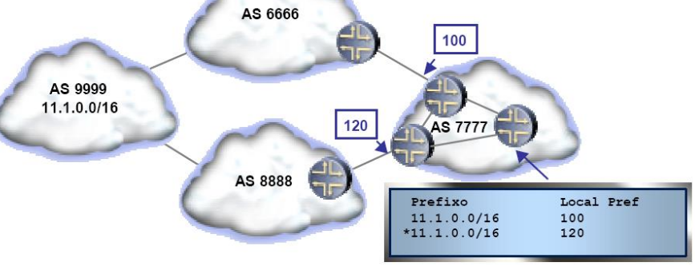

# __BGP__

## __Características__

* Suporta CIDR, transporte de rotas IPv6 e IP _multicast_.

* Permite a agregação de rotas de forma a reduzir a informação de _routing_.

* Não impõe restrições à topologia de rede.

* Assume que o _routing_ dentro de cada AS não é da sua responsabilidade.

* Permite interligar os AS internamente com diferentes protocolos de _routing_.

#
#

## __BGPv4__

> Protocolo do tipo _path vector_.

* São anunicados caminhos completos (uma lista de AS)
    * E.g.: A rede 171.64/16 pode ser alcançada através do caminho AS1 -> AS5 -> AS13.

* Ciclos nos caminhos são detetados localmente e ignorados.

* Políticas locais escolhem o caminho preferido entre os possíveis.

* Quando uma ligação/_router_ falha, o caminho é retirado (___withdraw___).

#
#

## __Políticas de Routing__

> Conjunto de Regras que restringem o _routing_ de forma a cumprir regras do administrador do AS.

* São configuradas nos _routers_, restrigindo ou permitindo anúncios de rotas ou fazendo a edição de caminhos.

#
#

## __Endereçamento e Identificação de um AS__

### __CIDR__

> _Classless Inter-Domain Routing_.

### __ASN__

* 16 bits.

* Atribuídos por _registrars_ (ICANN).

* Números privados: 64512-65535.

    * 65535 é reservado para uso especial.

* __Apenas os AS não _Stub___ necessitam de um ASN.

### __Interligações de Inter-AS__

#### __Tipos de AS__

* __Trânsito__.

* ___Stub___.

* ___Multi-homed___.

#
#

## __Relações entre AS__

### __Fornecedor__

> Anunciar todas as rotas aprendidas através de outros AS.

### __Cliente__

> Anunciar todas as rotas que estão sobre o seu domínio (redes do AS).

* Importa todas as rotas (__nem sempre é o caso__).

### ___Peers___

> Anunciar apenas rotas de todos os clientes de ISP1.

* Importar apenas rotas dos clientes do ISP2 as quais são definidas de comum acordo.

#
#

## __Encaminhamento _Path-Vector___

* Cada AS mantém uma tabela dos melhores caminhos conhecidos.

* Sofre de problemas de lentidão na convergência como protocolos de _vector distance_.

### __Exemplo__

* Anúncio de $ B \rightarrow E $ para um dado destino (p.e. n1), permite a $ E $ encaminhar pacotes via $ B $ para todas as redes desse destino (n1 e n2).

#
#

## __iBGP vs. eBGP__

> Sessões BGP são estabelecidas entre _peers_ (__BGP _Speakers___): _Routers_ capazes de "falar" BGP.

* __eBGP__ (externo): _Peers_ de AS diferentes para distribuir rotas entre _routers_ de AS distintos.

* __iBGP__ (interno): _Peers_ dentro do mesmo AS para distribuir rotas (exteriores) dentro do AS.

#
#

## __iBGP__

* Tipicamente é implementado em ___full-mesh___: Todos os _peers_ interligados entre si.

* A análise do caminho (``AS_PATH``) não permite eliminar ciclos internos.

* Um ___router_ BGP não encaminha via iBGP__ rotas aprendidas através de outros _peers_ iBGP.

### ___Full-Mesh___

* Adiciona sobrecarga de processamento.

### ___Route Reflector___

* Um _peer_ iBGP anuncia uma rota aprendida iBGP para outro _peer_ iBGP.

* Novos atributos foram criados para evitar _loops_.

### ___Confederações___

* Divide um AS em vários sub-AS.

* Os sub-AS não são visíveis fora do AS.

* É usado _full-mesh_ dentro de cada sub-AS.

#
#

## __Conceitos BGP__

### ___Router_ de Fronteira__

> _Router_ com ligação a 1 ou mais AS.

### __Tráfego Local__

> Tráfego com origem ou terminação no AS em causa.

### __Tráfego de Trânsito__

> Tráfego que não se inicia ou termina no AS em causa, i.e., atravessa o AS.

#
#

## __Anúncios de Rotas__

> O BGP anuncia aos seus vizinhos todos os caminhos (rotas) para se alcançar um determinado destino.

Quando o anúncio de uma rota propragada através de um AS, o número do AS que se atravessa é adicionado à lista de AS que o anúncio já atravessou.

### __Agregação de Rotas__

> Forma de reduzir o número de rotas anunciadas.

* Deve ser feita sempre que:

    * Os prefixos agregados __têm o mesmo caminho antes do ponto de agregação__.

    * Os prefixos agregados __têm caminhos de comprimento igual__ (AS3).

* Um AS pode decidir:

    * Agregar rotas apenas quando as exportar.

    * Manter diferentes entradas no seu domínio.

#### __Exemplo__

#
#

## __RIB - _Routing Information Base___

### __Adj-RIB-In__

> Contém informação de encaminhamento não processada que não foi anunciada ao _router_ local pelos seus _peers_.

### __Adj-RIB-Out__

> Contém informação das rotas a serem anunciadas a peers específicos através de mensagens ``UPDATE``.

### __Loc-RIB__

> Contém as rotas que foram selecionadas pelo processo de decisão de rotas do _router_ local.

#
#

## __Tabela de Encaminhamento__

### __Redistribuição de Rotas__

> Rotas aprendidas por BGP são passadas ao IGP (e.g. OSPF) mas __não muito usado na prática__ visto que cria um número excessivo de rotas nos _routers_ internos do AS.

### __Injeção__

* Todos os _routers_ correm iBGP além do protocolo IGP.

* Rotas aprendidas pelo BGP são reescritas na tabela de encaminhamento dos routers.

* ___Recursive table lookup___ é efectuado em todos os routers.

* Usa-se __confederação__ e __reflexão__ para minimizar o número de ligações.

#
#

## __Funcionamento do BGP__

1. Receção de __rotas__ por _peers_ BGP através de __anúncios BGP__.

2. Políticas de __entrada__.

3. Processo de decisão de __rotas__.

4. As rotas escolhidas pelo processo de decisão vão para uma __base de dados do BGP__ e para a __tabela de encaminhamento__ do _router_ em questão.

5. Políticas de __saída__.

#
#

## __Mensagens BGP__

* Trocadas através do protocolo TCP.

* É anunciada uma descrição de todo o percurso (_path-vector_).

### __Cabeçalho Comum__

* ``Marker``: Usado para sincronização e autenticação.

* ``Type``: 1 - ``OPEN``, 2 - ``UPDATE``, 3 - ``NOTIFICATION``, 4 - ``KEEPALIVE``.

### ``OPEN``

> Abre uma ligação TCP para um _peer_ e autentica o emissor.

* ``My AS``: AS de origem.

* ``Hold Time``: Tempo entre mensagens ``KEEPALIVE`` ou ``UPDATE``.

### ``UPDATE``

> Anuncia novo caminho (ou retira o antigo).

* ``Unfeasible Routes Length``: Número de rotas retiradas.

* ``Withdrawn Routes``: Endereços das redes a serem retiradas.

* ``Total Path Attributes Length``: Tamanho do campo de ``Path Attributes``.

* ``Path Attributes``: Atributos do caminho (e.g. ``AS_PATH``).

* ``Network Layer Reachability Information``: Endereços das redes a serem anunciadas.

### ``KEEPALIVE``

> Mantêm a ligação aberta na ausência de mensagens de ``UPDATE`` e serve também como __ACK__ ao pedido de ``OPEN``

* Geralmente enviadas periodicamente ($\frac{Hold Time}{3}$).

### ``NOTIFICATION``

> Reporta erros nas mensagens anteriores e serve também para fechar a ligação.

#
#

## __Máquinas de Estados de uma Sessão BGP__

* Para que a ligação BGP seja inicializada cada _peer_ deve enviar um ``OPEN`` e receber um ``KEEPALIVE`` (caso ocorra um erro a mensagem ``NOTIFICATION`` pode ser enviada a descrever o problema e a ligação termina).

### __Sessão BGP__

> Ligação TCP entre 2 _peers_ BGP em que o estado da ligação é monitorizado regularmente.

#
#

## __Rotas__

> Campos enviados nas mensagens BGP.

### __Formato__

#### __Destino__

> Prefixo (Endereço da rede + Máscara).

#### __Atributos__

* ``ORIGIN``: Indica como a rota foi aprendida.
    * _IGP_.

    * _EGP_.

    * _Incomplete_: A rota foi aprendida por outro meio que não BGP ou então é desconhecida.

* ``NEXT_HOP``: Endereço IP do _router_ que se encontra no próximo salto para o destino.

* ``LOCAL_PREF``: Indica a preferência local de uma rota.

    * Atribuído pelo __BR__ quando recebe a rota por __eBGP__.

    * O _router_ local escolhe por onde __enviar o tráfego__.

    * O valor mais alto é o mais preferido.

* ``MULTI_EXIT_DISC (MED)``: Indica a preferência de saída para um AS.

    * Atribuído pelos __BRs__ e enviado como sugestão a um __AS externo__ para dar preferência a um
dos caminhos entre dois AS.

    * O _router_ local escolhe por onde __receber o tráfego__.

    * O valor mais baixo é o mais preferido.

* ``ATOMIC_AGGREGATE``: Indica que a rota não pode ser desagregada.

    * Caso tome o valor ``1``, foi usado uma rota menos específica para anunciar a rota.

* ``AGGREGATOR``: AS que agregou a rota.

* ``AS_PATH``: Lista de todos os números de AS atravessados por uma rota no contexto de troca de informação de encaminhamento.

* ``WEIGHT`` (Apenas Cisco): Indica a preferência de uma rota.

    * O valor mais alto é o mais preferido.

#
#

## __Atributos BGP__

### ___Well-Known Mandatory___

> Os mais importantes e devem ser incluídos ao anunciar a rota para serem processados por cada _router_ BGP que os receba.

### ___Well-Known Discretionary___

> Devem ser reconhecidos e processados pelo _router_ BGP mas podem ou não ser incluídos ao anunciar a rota.

### ___Optional Transitive___

> Podem ou não ser reconhecidos por um _router_ BGP mas devem ser incluídos no anúncio para outros _routers_ BGP.

### ___Optional Non-Transitive___

> Atributos opcionais que podem ou não ser reconhecidos por um _router_ BGP mas não são anunciados a outros _routers_ BGP.

#
#

## __Atributo _Community___

> Fornece uma forma de agrupar destinos em _communities_ para as quais as decisões de encaminhamento (tais como aceitação, preferência, e redistribuição) podem ser aplicadas.

* Tipo: ___Optional Transitive___.

* Um grupo de prefixos que partilham uma certa propriedade são marcados com a mesma _community_.

* Decisões de encaminhamento podem estar baseadas no atributo community da rota

* Facilita e simplifica o controle das informações de rotas

* Para um atributo _community_ ser enviado para um vizinho, tem de se usar o comando ``neighbor send-community``.

### ___Communities_ Predefinidas__

#### __NO_EXPORT__

> Enviado por eBGP por um AS, transmitido por iBGP pelo AS que o
recebe, não é reenviado.

#

• internet—Advertise this route to the Internet community. All BGP-speaking networking
devices belong to this community.
• local-as—Do not send this route outside the local autonomous system.
• gshut—Community of routes gracefully shut down. 

#### __NO_ADVERTISE__

> Não é anunciado a nenhum _peer_.

#

#### __INTERNET__

> Anunciado a todos os _peers_ BGP.

#

#### __LOCAL_AS__

> Apenas anunciado para as sub-redes do AS.

#
#

## __Algoritmo de Decisão de Rotas (_Routers_ Cisco)__

1. Prefere o caminho __com o maior peso__ (atributo ``WEIGHT``).

2. Prefere o caminho __com a maior preferência local__ (atributo ``LOCAL_PREF``).

3. Prefere o caminho que __foi originado pelo BGP a correr no _router_ local__ (originado por comando network ou aggregate BGP).

4. Prefere o caminho __mais curto__ (atributo ``AS_path`` mais curto).

5. Prefere o caminho __com a origem mais baixa__ (atributo ``ORIGIN``, em que IGP < EGP <
_incomplete_)

6. Prefere o caminho __com o atributo ``MED`` mais baixo__.

7. Prefere o caminho __externo (eBGP)__ em detrimento do caminho __interno (iBGP)__

8. Prefere o caminho __com a métrica IGP mais baixa para o next-hop do BGP__.

9. Prefere a rota que é recebida do _router_ BGP com __o _router_ ID mais baixo__.

10. Prefere a rota que é recebida do __endereço IP mais baixo__.

#
#

## __Exemplo de Configuração BGP__

* Usar ``LOCAL_PREF`` para escolher o caminho preferido:

* Usar ``AS_PATH`` para escolher o caminho preferido:

* Usar ``NO_EXPORT`` para não anunciar a rota a outros AS:

