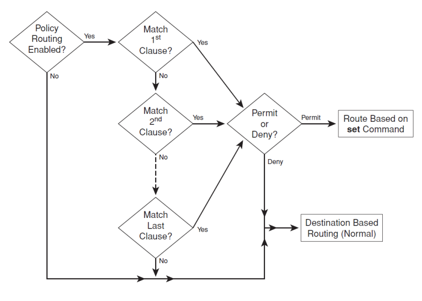
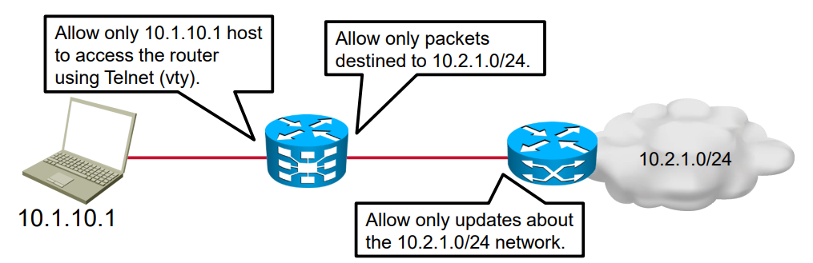
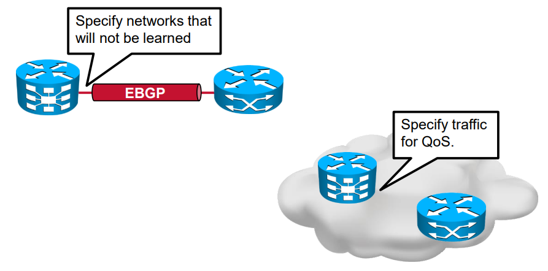
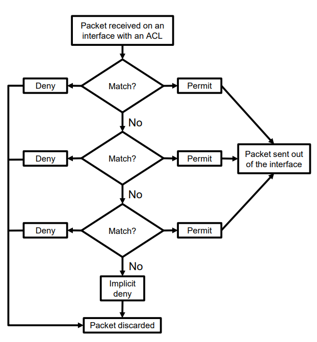
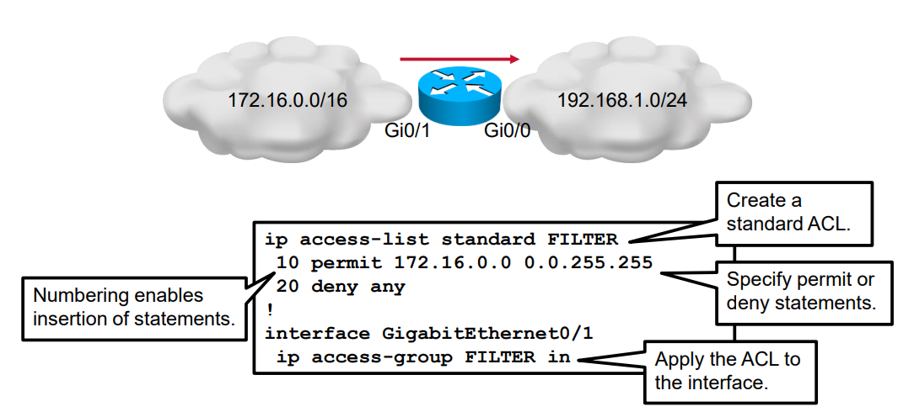
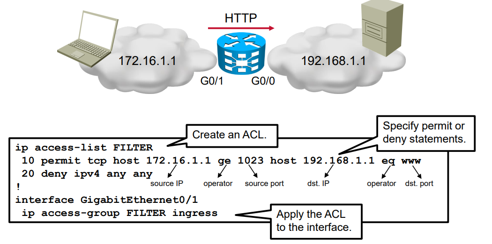

# __Routing com base em Políticas (PBR)__

<div align=center>



</div>

## __Uso de ___Access Control Lists___ (ACLs)__

### __Filtragem__

> Permite ou nega tráfego IP filtrando so pacotes que navegam pela interface do _router_ numa direção específica.

<div align=center>



</div>

* Controla o acesso vty.

* Sem ACls, todos os pacotes são permitidos a atravessar a interface do _router_.

#### __Configuração__

1. Criar uma ACL e especificar as instruções.

2. Aplicar a ACL a uma interface ou linha VTY.

#

### __Classificação__

> Identifica tráfego para tratamento especial.

<div align=center>



</div>

#### __Configuração__

1. Criar uma ACL e especificar as instruções.

2. Referenciar a ACL num NAT, route-map ou policy-map.

#

### __Operação__

<div align=center>



</div>

* As ACLs são consultadas de __forma hierárquica__ (de cima para baixo):

* A primeira correspondência executa a ação (permitir/negar) e __para o processamento__.

* Existe uma __regra implícita de "negar tudo"__ no final de cada ACL.

#### __Exemplo__

```bash
ip access-list 1 permit 193.136.1.0 0.0.255.255
ip access-list 1 deny 193.136.2.0 0.0.255.255
ip access-list 1 permit host 193.136.3.10
```

#
#

## __Máscara de _Wildcard___

* ACLs utilizam uma máscara _wildcard_ para especificar __quais bits de um endereço IP devem ser verificados__:

    * 0 na máscara _wildcard_: verifica o bit correspondente.

    * 1 na máscara _wildcard_: ignora o bit correspondente.

### __Casos Especiais__

* Máscara 0.0.0.0: verifica todos os bits.

* Máscara 255.255.255.255: ignora todos os bits.

#
#

## __Tipos de ACLs__

### __ACL _Standard___

> Verifica apenas o endereço de origem.

* Usada raramente.

#### __Exemplo__

* Permitir apenas a comunicação da rede 172.16.0.0/16 com outras redes:

<div align=center>



</div>

#

### __ACL Extendida__

> Verifica endereço de origem, destino, protocolo de camada 4 e portas de origem/destino (TCP/UDP).

#### __Exemplo__

* Permitir que apenas o host 172.16.1.1 comunique com o servidor 192.168.1.1 via HTTP.

* Apenas portas de origem maiores que 1023 podem ser usadas pelo host.

<div align=center>



</div>

#
#

## __Identificação de ACLs__

### __ACL Numeradas__

* 1-99 e 1300-1999 (_Standard_).

* 100-199 e 2000-2699 (Extendida).

#

### __ACL Nomeadas__:

* Usam nomes descritivos (recomendado).

#
#

## __Diretrizes de uma ACL__

* Uma ACL _standard_ ou extendida indica o que pode ser filtrado.

* Apenas uma ACL por interface, protocolo e direção é permitida.

* Declarações específicas devem estar no topo da ACL enquanto que declarações gerais, no final.

Devido ao "negar tudo" implícito, uma ACL necessita de pelo menos uma instrução _permit_.

### __Recomendações de Localização__

* Coloque ACLs extendidas perto da origem.

* Coloque ACLs _standard_ perto do destino.

#
#
## __Exemplo PBR__

