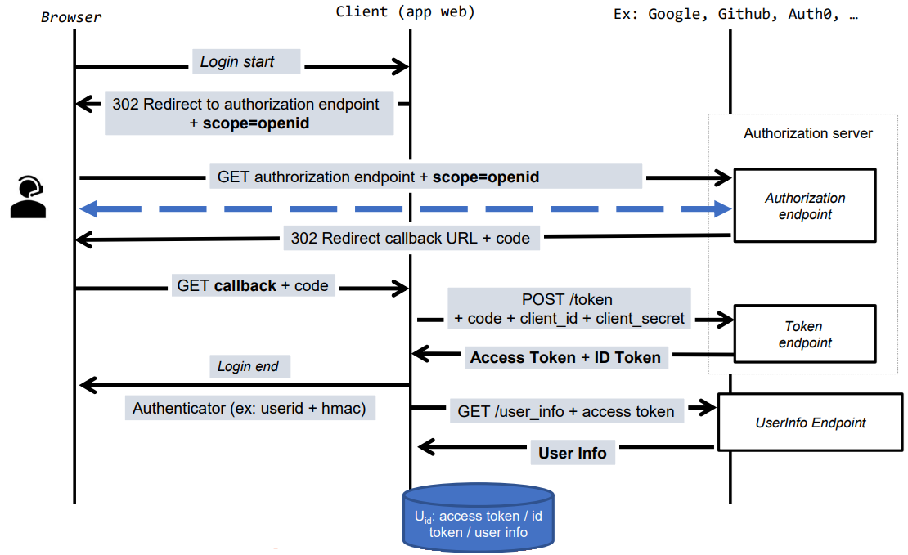
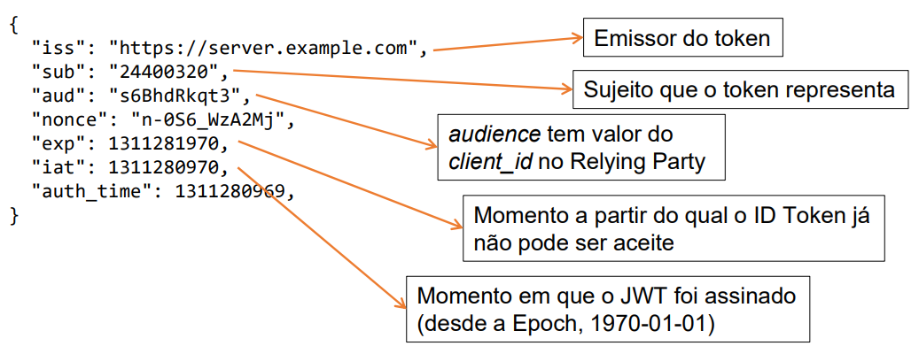
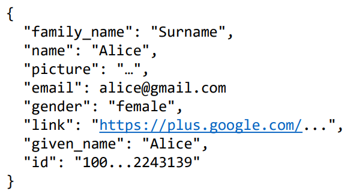
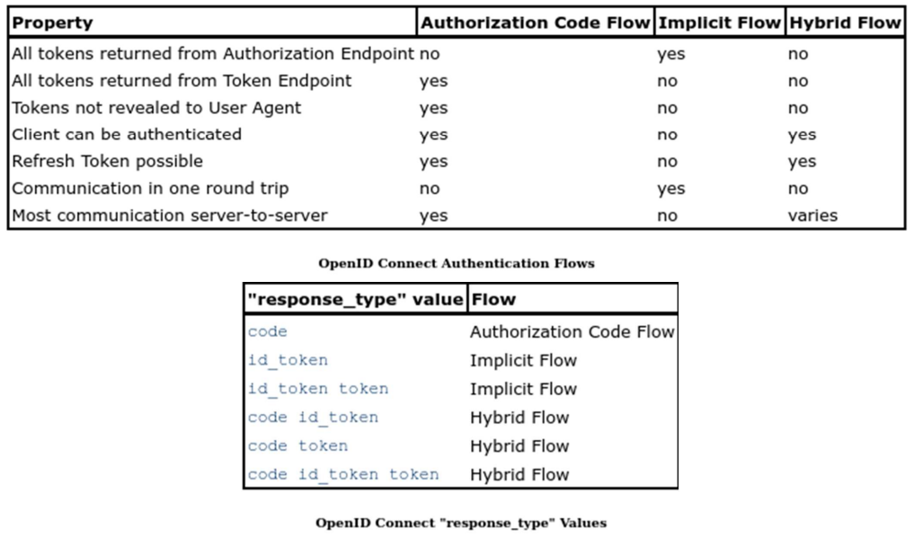
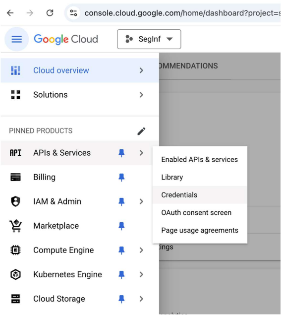
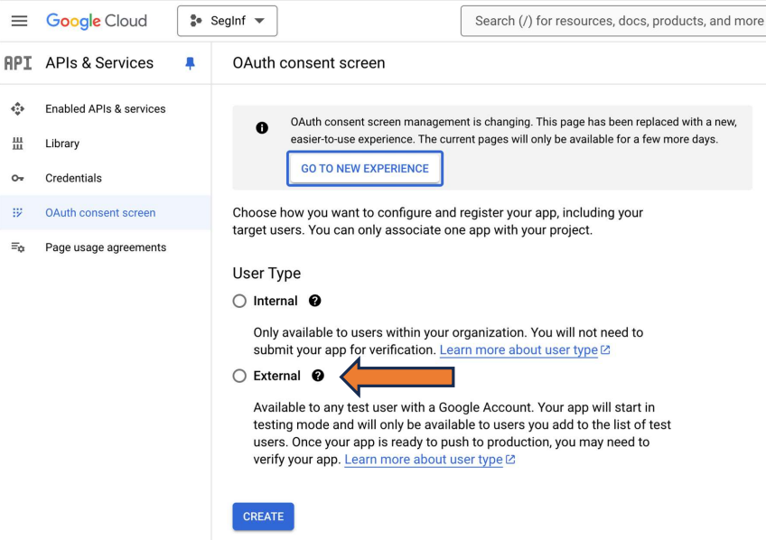
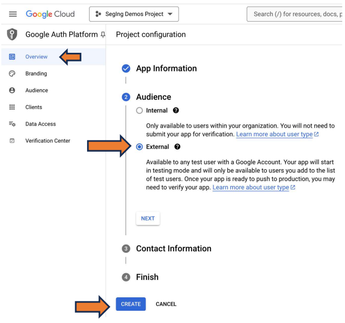
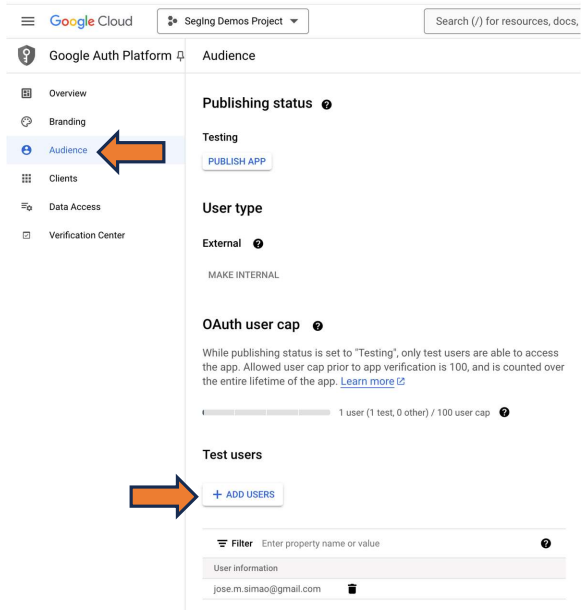
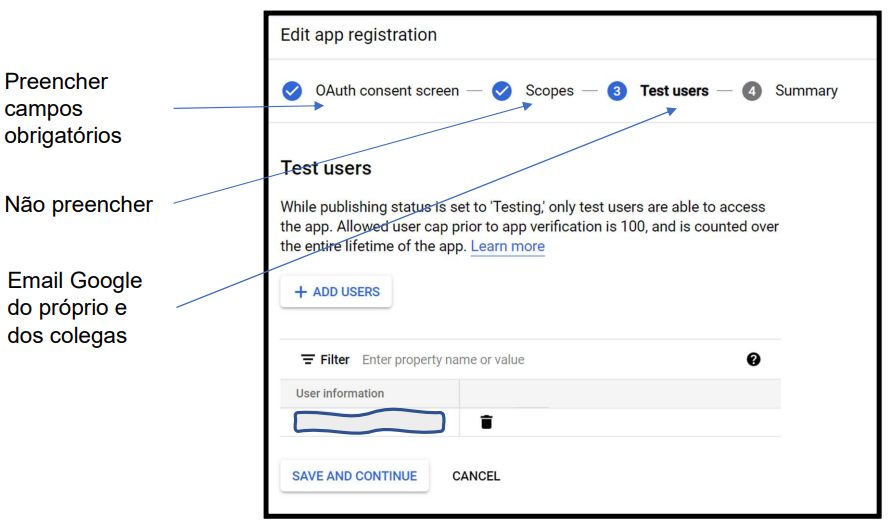
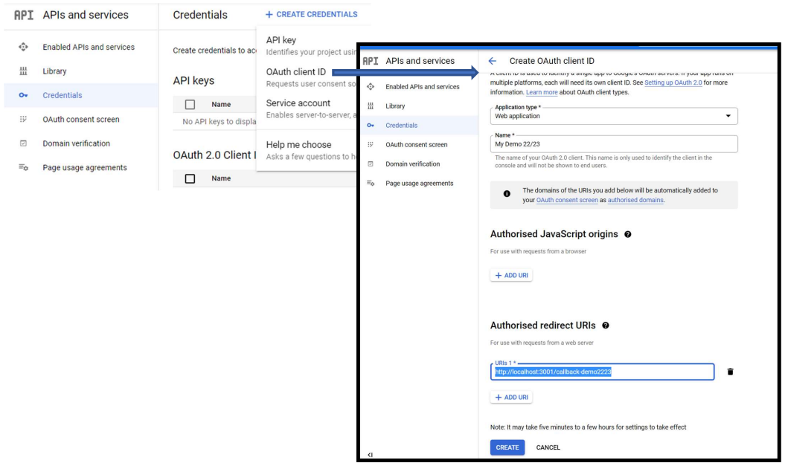

# __OpenID Connect__

<div align=center>



</div>

## __Participantes__

### ___End User___

* Utilizador humano que pretende aceder a um serviço na aplicação cliente.

* A aplicação cliente apenas fornece o serviço a __utilizadores autenticados__.

### ___Relying Party___

* Aplicação cliente que fornece o serviço.

* Delega no fornecedor de identidade a autenticação do utilizador.

### ___Identity Provider___

* Guarda registo do utilizador e da sua informação de autenticação.

* Guarda registo de aplicações cliente que pretendam autenticar utilizadores.

#
#
## __ID Token__

> Conjunto de asserções sobre um utilizador autenticado.

* _JSON WEB TOKEN_ assinado pelo fornecedor de identidade.

<div align=center>



</div>

#
#
## ___UserInfo___

> _Endpoint_ que devolve a informação sobre um utilizador autenticado.

* Representada em _JSON_ ou _JWT_ caso seja cifrada/assinada.

### __Exemplo__

* _UserInfo Endpoint_: `https://www.googleapis.com/oauth2/v3/userinfo`

<div align=center>



</div>

## __Fluxos e Respostas__

<div align=center>



</div>

#
#

## __Obtenção de Credenciais__

* O registo de novos ___RP___ e obtenção das credenciais pelo ___RP___ (```client_id``` e ```client_secret```) depende do fornecedor de identidade.

* No caso da ___Google___ o processo é feito através do _Google Cloud Platform_.~

<div align=center>







</div>

### __Utilizadores Externos__

* Os endereços de email dos utilizadores que podem usar o ___RP___ e por consequentemente o ___authorization server___ têm de ser explicitamente indicados.

<div align=center>



</div>

### ___Client ID e Client Secret___

<div align=center>





</div>