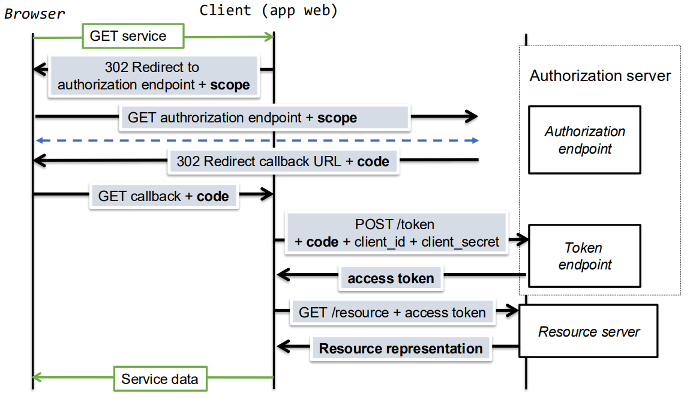

# __OAuth 2.0__

## __Objetivo__

> Delegar autorização a um conjunto de recursos temporariamente.

#
#

## __Roles__

### __Proprietário do Recurso__

> _Resource Owner_.

* Uma entidade capaz de conceder acesso a um recurso protegido.

* Quando o proprietário de recurso é uma pessoa, é referenciado como um _end-user_.

#

### __Servidor de Recursos__

> _Resource Server_.

* O servidor que hospeda recursos protegidos, capaz de aceitar e responder a pedidos de recursos protegidos usando _access tokens_.

#

### __Cliente__

> _Client_.

* Uma aplicação que requisita recursos protegidos através do proprietário do recurso e com a sua autorização.

#

### __Servidor de Autorização__

> _Authorization Server_.

* O servidor que emite _access tokens_ ao cliente depois de autenticar com sucesso o proprietário de recurso e obter autorização

#
#

## __Aplicações Cliente__

* Os clientes tem de se registar no servidor de autorização sendo-lhes atribuído um ___client_id___ e um ___client_secret___.

### __Tipos de Clientes__

#### __Confidencial__

> Capacidade de manter o ___client_secret___ confidencial.

* Exemplo: Aplicações Web.

#

#### __Público__

> Não é capaz de manter o ___client_secret___ confidencial.

* Exemplo: Aplicações Javascript.

#
#

## __Registo de Clientes__

* Apenas clientes registados podem aceder a recursos controlados pelo servidor de autorização.

* A forma como o registo é feito depende do fornecedor.

### __GitHub__

<div align=center>


</div>

#

### __Google__

<div align=center>


</div>

#
#

## __Acesso a Recursos Protegidos__

### ___Access Token___

> Representa uma credencial de acesso.

* Emitido pelo servidor de autorização e validado pelo servidor de recursos.

    * Ambos os servidores precisam de saber a estrutura do _token_.

* Obtido através de um pedido ```POST``` para o _token endpoint_.

* Os clientes acedem aos recursos protegidos indicando um _access token_.

* O servidor de recursos usa-o para aplicar políticas de acesso.

* São strings opacas para os clientes.

#

### ___Client Credentials Grant Flow___

> Autorização é dada somente com base nas __credenciais do cliente__ (_client_id_ e _client_secret_), ou seja, não está envolvido nenhum utilizador.

<div align=center>


</div>

#

### ___Resource Owner Password Credential Grant Flow___

> Autorização é dada com base na __password do utilizador__.

* A aplicação cliente não precisa de persistir a _password_.

* Deve apenas ser usado quando há um nível elevado de confiança entre o dono de recursos e a aplicação cliente.

<div align=center>


</div>

#

### ___Authorization Code Grant Flow___

> Código de autorização é obtido pelo dono dos recursos e entregue ao cliente para que este obtenha o _access_token_.

* A _password_ do dono dos recursos não é visível para o cliente.

* Não define forma do dono de recursos se autenticar e dar consenso para o cliente aceder ao recurso.

<div align=center>


</div>

#
#

## ___Scopes___

> Representam o tipo de autorização que está a ser pedido a um determinado recurso.

* Cada _scope_ é um _string_.

* Cada pedido de autorização contém zero ou mais _scopes_.

### __Exemplo__

* ___Google Tasks___: https://www.googleapis.com/auth/tasks

```
GET /authorize?
response_type=code&
client_id=s6BhdRkqt3&
state=xyz&
redirect_uri=https%3A%2F%2Fclient%2Eexample%2Ecom%2Fcb&
scope=https%3A%2F%2Fwww.googleapis.com%2Fauth%2Ftasks
HTTP/1.1 Host: server.example.com
```
#
#

## ___Front Channel___

> Designa o canal de comunicação _Client_ <-> _Authorization endpoint_, via redirecção do _user-agent_.

* Em caso de erro a resposta tem sempre de ser entregue via _redirect_.

* O _client_secret_ nunca passa pelo _front channel_.

* Usando o parâmetro ```state```, o cliente estabelece uma relação entre o pedido e a resposta.

#
#

## ___Back Channel___

> Termo usado para designar o canal de comunicação _Client_ <-> _Token endpoint_

* Usa mensagem ``POST HTTP`` e os respetivos códigos de erro ``HTTP``.

* _HTTP Basic authentication_ com username (_client_id_) e _password_
(_client_secret_).

#
#

## __Exemplo Front Channel e Back Channel com Authorization Code Grant Flow__

<div align=center>



</div>

#
#

## __Ameaças e Recomendações__

### __Premissas Gerais__

* Atacante tem acesso total à rede entre o utilizador e servidor de autorização.

* Atacante não tem acesso à rede entre servidor de autorização e servidor de Recursos.

*  O cliente e o servidor de autorização podem fazer conluio (combinação de interesses para prejudicar terceiros).

#

### __Servidor de autorização__

* Rotação de _refresh tokens_ para que em caso de perda fiquem inválidos.

* Validação do _redirect_uri_ para evitar falsos clientes.

#

### __Cliente__

* Não armazenar credenciais no código ou em recursos da aplicação.

* Guardar credenciais (_client secret_) em local seguro.

* Ligar o parâmetro _state_ ao _user-agent_ que fez o pedido.