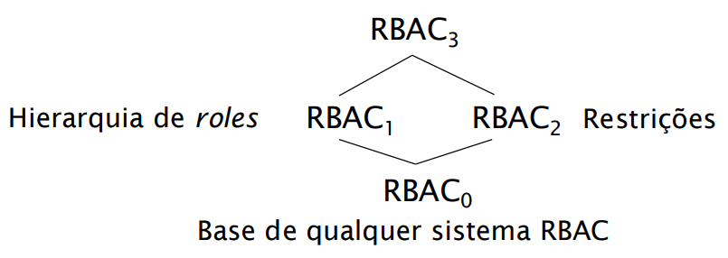
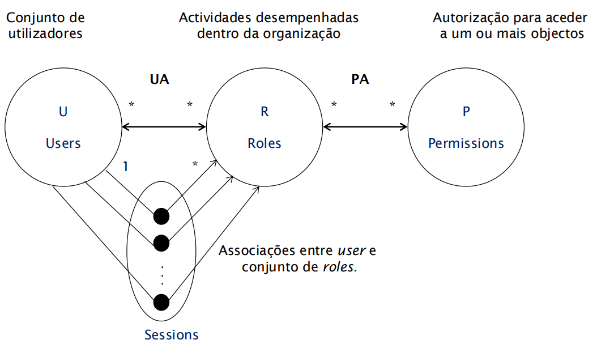
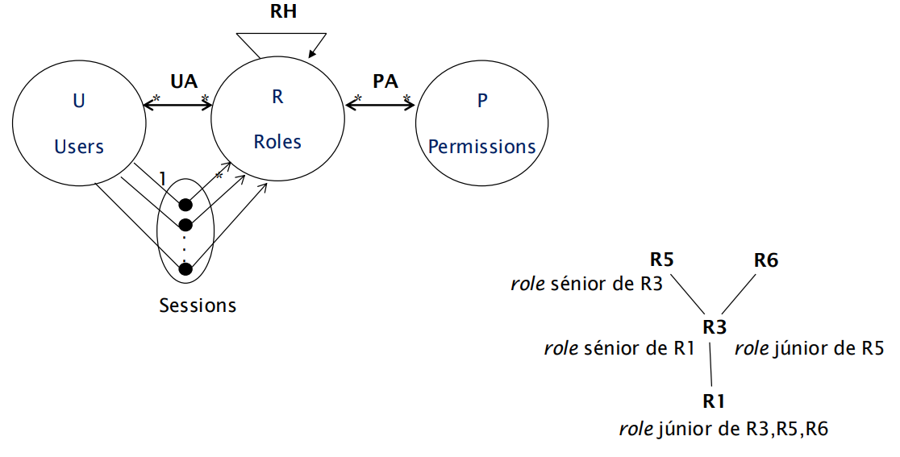
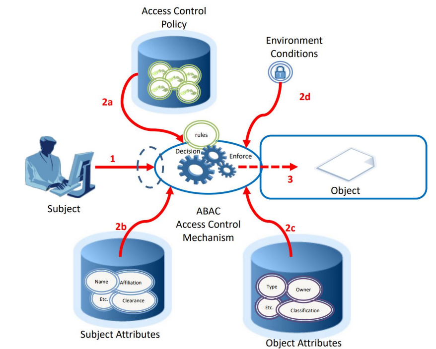
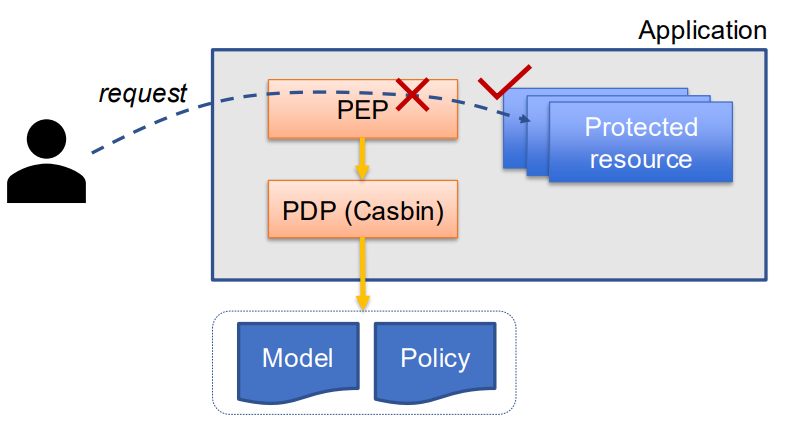
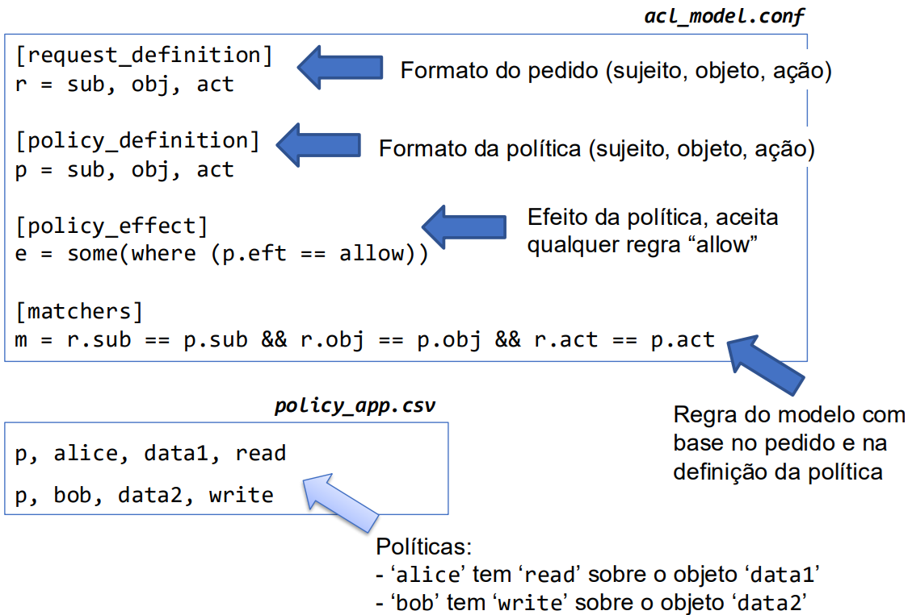
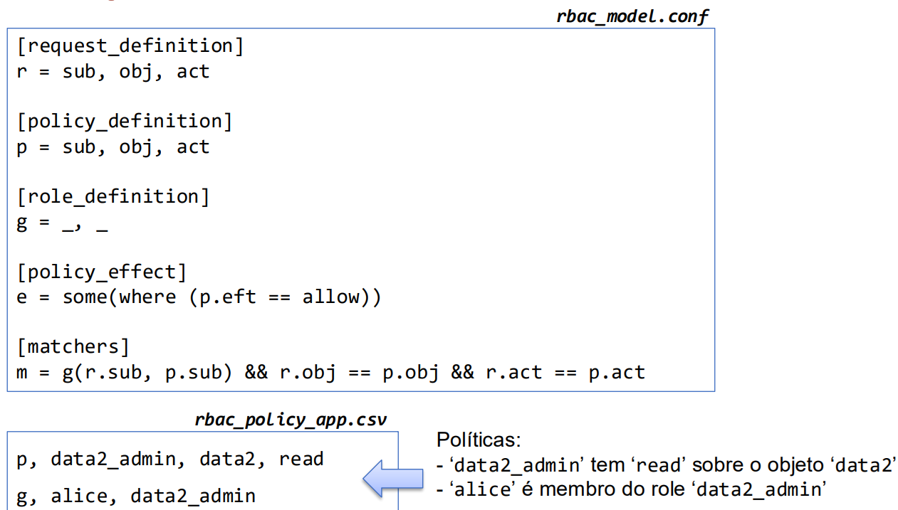

# __Modelos e Políticas para Controlo de Acessos__

## __Monitor de Referências__

### __Propriedades do PEP__

* Não deve ser possível __alterá-lo__.

* Não deve ser possível __contorná-lo__.

* __Deve ser pequeno__ e estar confinado ao núcleo de segurança do sistema por forma a facilitar a verificação da sua correção.

#
#

## __Elementos do Sistema de Controlo de Acessos__

* PEP depende dos __mecanismos de seguranç__.

* PDP depende das __políticas de segurança__ e do __modelo de segurança__.

### __Modelo de Segurança__

> Formalização da forma de aplicação das políticas de segurança.

### __Política de Segurança__

> Define as regras de controlo de acessos.

### __Mecanismos de Segurança__

> Funções de baixo nível que dão suporte à implementação de modelos e políticas de segurança.

#
#

## __Modelo Matriz de Acessos__

* $ S \rightarrow $ sujeitos.

* $ O \rightarrow $ objetos.

* $ A \rightarrow $ operações.

* $ M_{SO} \rightarrow $ matriz de operações.

    * $ M_{SO}[s][o] \rightarrow $ permissões do sujeito $ s $ sobre o objeto $ o $.

### __Tabela de Autorização__

#

### ___Capabilities___

* As permissões são guardadas junto dos sujeitos.

* A __capacidade__ (_capability_) de cada sujeito corresponde à sua __linha__ na matriz.

#### __Vantagens__

* Facilidade na obtenção das permissões associadas a um sujeito.

* Em ambientes distribuídos __elimina a necessidade de múltiplas autenticações__.

#### __Desvantagens__

* Para obter lista de acessos a objetos obriga a __pesquisar todas as capacidades__.

* Possibilidade de __cópia__ e uso __fraudulento__.

#

### ___Access Control Lists___

* As permissões são guardadas junto dos objetos.

* A __ACL__ de cada objeto corresponde à sua __coluna__ na matriz.

#### __Vantagens__

* Facilidade na obtenção das permissões associadas a um objeto.

* Ao eliminar um objeto elimina-se __todas as permissões a ele associadas__.

#### __Desvantagens__

* Para saber todas as permissões de um sujeito é necessário __pesquisar todas as ACLs__.

#
#

## __Permissões para Grupos__

* Os grupos funcionam como uma __camada intermédia__ na definição de controlos de acesso.

* As permissões podem ser associadas a grupos ou individualmente aos sujeitos.

* A __verificação de controlo de acesso__ passa a ser feita também em __função do sujeito ser membro ou não de um grupo__.

* É possível usar __permissões negativas__ para um __determinado sujeito dentro de um grupo__.

### __Exemplo - Windows__

* Após _login_ é atribuído ao utilizador um _access token_.

    * Em cada _access token_ estão presentes _security identifiers_ (SID) com a identificação do utilizador e dos grupos a que pertence.

* Após a criação de um objeto (recurso) é lhe associado um _security descriptor_ com:

    * O SID do seu done.

    * _Discretionary Access Control List_ (DACL).

    * _System Access Control List_ (SACL) com a política do sistema para auditar o acesso ao objeto e o "nível de integridade" do mesmo.

* Uma ACL é uma lista de _Access Control Entry_ (ACE) com:

    * O SID do sujeito ou grupo.

    * Permissões ou negações.

    * Ações.

#
#

## __Controlo de Acessos através de DACL__

> Para determinar se o acesso é autorizado ou não, a DACL é percorrida até __à negação de uma das ações__ ou __permissão de todas as ações requeridas__.

* À cabeça ficam as ACE que __negam acesso__.

#
#

## __RBAC__

* Nas organizações, as permissões estão tipicamente associadas a _roles_ e não a pessoas.

* As permissões associadas a _roles_ mudam com menos frequência do que as associações entre utilizadores e _roles_.

### __Família de Modelos RBAC__

### __RBAC_0__

* $ UA $ (___User Assigment___): Relação de __muitos para muitos__ entre _users_ e _roles_.

* $ PA $ (___Permission Assigment___): Relação de __muitos para muitos__ entre _roles_ e _permissions_.

* $ user: S \rightarrow U $: Função que associa cada sessão a um utilizador (__constante ao longo da sessão__).

* $ roles: S \rightarrow 2^R $: Função que associa cada sessão a um conjunto de _roles_.

#

### __RBAC_1__

> Introduz o conceito de hierarquia de _roles_.

* O utilizador escolhe qual o ___role_ que quer ativar__, herdando os _roles_ júnior desse.

* As permissões são as diretamente associadas ao _role_ do utilizador mais as dos _roles_ júnior.

* $ RH $ (___Role Hierarchy___): Relação de __dominância__ entre _roles_.

#

### __RBAC_2__

> Introduz o conceito de restrições, mecanismo para impor regras de organização.

* As restrições podem ser aplicadas às relações $ UA $ e $ PA $ e às funções $ user $ e $ roles $.

* Têm a forma de predicados que retornam "__aceite__" ou "__não aceite__".

#### __Exemplos de Restrições__

* Separação de deveres.
    * Estático: relação $ UA $.

    * Dinâmico: função $ roles $.

* Cardinalidade.

* Pré-requisitos.

#

### __RBAC_3__

> Combina os conceitos de RBAC_1 e RBAC_2.

#

### __Limitações__

#### __Explosão de _Roles___

> As particularidades dos utilizadores dão origem a papéis com apenas alguns membros, contribuindo para o aumento de papéis.

#### __Efeitos Indesejados da Herança de _Roles___

> Estruturar e gerir as hierarquias de papéis requer uma compreensão da herança de permissões para evitar efeitos colaterais inesperados que resultem em sub ou excesso de permissões.

#### __Falta de Interoperabilidade__

> O significado das funções em termos de terminologia e permissões deve ser partilhado entre diferentes departamentos, sucursais ou parceiros de negócios ( chegar a um consenso pode não ser trivial).

#### __Rigidez__

> Uma empresa pode não saber quais as permissões que os utilizadores devem ter até que a necessidade surja, especialmente em situações de emergência.

#
#

## __ABAC__

#
#

## __Biblioteca Casbin__

* Biblioteca para integração de controlo de acessos em aplicações.

* Suporta vários modelos de controlo de acessos.

* Modelos e políticas definidos em ficheiros de configuração externos à aplicação.

### __Exemplo ACL__

### __Exemplo RBAC__

