# __Esquemas Simétricos__

## __Mecanismos Criptográficos__

### __Primitivas__

> Operações matemáticas, usadas como blocos construtores na realização de esquemas.

E.g.: DES, RSA.

### __Esquemas__

> Combinação de primitivas e métodos adicionais para a realização de tarefas criptográficas como a cifra e a assinatura digital.

E.g.: DES-CBC-PKCS5Padding, RSA-OAEP-MGF1-SHA1.

### __Protocolos__

> Sequências de operações, a realizar por 2 ou mais entidades, envolvendo esquemas e primitivas, com o propósito de dotar uma aplicação com características seguras.

E.g.: TLS, TLS-RSA-WITH-DES-CBC-SHA.

## __Características da Criptografia Simétrica__

* Processo de proteção e desproteção usando a mesma chave.

* Chaves são normalmente usadas durante pouco tempo.

* Chaves estabelecidads após um processo de negociação entre quem cifra e quem decifra.

## __Cifra Simétrica__

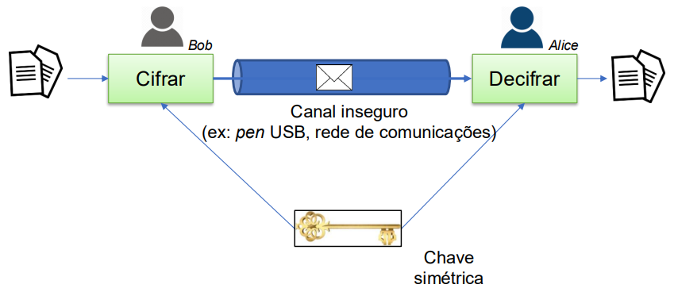

### __Esquema__

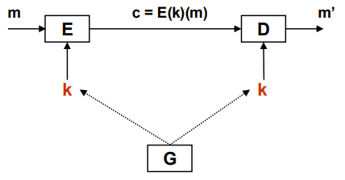

* $ G $: Função __probabilística__ de geração de chaves.
    * $ G: \ \to K $

* $ E $: Função __probabilística__ de cifra.
    * $ E: \ \to \{0, 1\}^* \ \to \{0, 1\}^* $

* $ D $: Função __determinística__ de decifra.
    * $ D: \ \to K \ \to \{0, 1\}^* \ \to \{0, 1\}^* $

### __Propriedades__

* __Correção__: $ \forall \ m \in \{0, 1\}^*, \ \forall \ k \in K, \ D(k, \ E(k, \ m)) = m $

* __Segurança__: É __computacionalmente infazível__ obter $ m $ a partir de c sem conhecer $ k $.

* __Simétrico__: Utilização da mesma chave para cifrar e decifrar.

* Apenas garante a __confidencialidade__.

* $ m $ e $ c $ são sequências de bits com dimensão variável.

### __Exemplos__

* DES-CBC-PKCS5Padding.

### __Primitivas__

#### __Exemplos__

* AES, DES, Blowfish, etc.

#### __Cifra em Bloco__

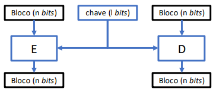

* $ E: \ \to \{0, 1\}^l \ \to \{0, 1\}^n \ \to \{0, 1\}^n $

* $ D: \ \to \{0, 1\}^l \ \to \{0, 1\}^n \ \to \{0, 1\}^n $

* A dimensão do __bloco__ é $ n $ bits.

* A dimensão da __chave__ é $ l $ bits.

#### __Características gerais__

* A dimensão $ n $ do bloco deve ser __suficientemente elevada__ para __impossibilitar ataques baseados na estaística do texto em claro__.

* A dimensão $ l $ da chave deve ser suficientemente elevada para __impossibilitar ataques de pesquisa exaustiva__.

## __Modos de Operação__

### __Considerações__

* Padrões no texto em claro não deverão ser evidentes no texto cifrado.

* A eficiência do método usado não deverá ser muito inferior à eficiência da primitiva de cifra em bloco usada.

* A dimensão do texto cifrado deve ser aproximadamente igual à dimensão do texto em claro.

* Em algumas aplicações é importante que a decifra seja capaz de recuperar de erros, adições e remoções de bits ocorridos no texto cifrado.

* __Acesso aleatório__: Capacidade de decifrar e alterar apenas parte do criptograma.

### ___Eletronic-Codebook (ECB)___

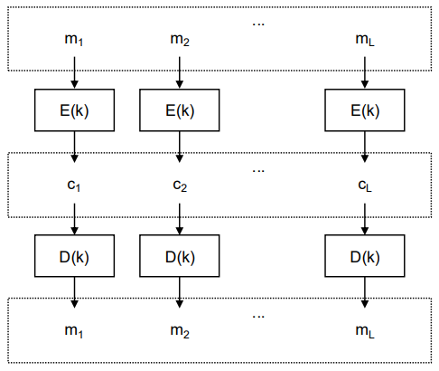

* Blocos de texto em claro iguais, cifrados com a mesma chave, implicam blocos de texto cifrado iguais.

* A __cifra__ é realizada de __forma independente de bloco para bloco__.

* A ocorrência de erros num bloco de texto cifrado __afecta apenas a decifra desse bloco__.

* Permite o acesso aleatório para decrifra e "recifra" de múltiplos blocos.

### ___Cipher-Block Chaining (CBC)___

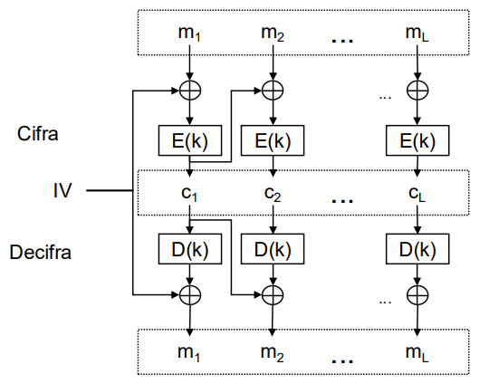

* Sob a mesma chave e sob o mesmo vetor de iniciação $( IV )$, 2 mensagens iguais implicam criptogramas iguais.

* A __cifra__ de um bloco de texto em claro __afeta a cifra dos blocos seguintes__.

* A ocorrência de erros num bloco de texto $ c_j $ cifrado afeta a decifra do próprio bloco e a do bloco seguinte $ c_{j+1} $, assim como a decifra do bloco $ c_{j+1} $ terá erros nas mesmas posições que o bloco $ c_j $.

* A reordenação dos blocos de texto ecifrado __afeta a decifra__.

* É relativamente fácil __manipular um determinado bloco de texto em claro__.

#### __Boas Práticas Sobre o Vetor de Iniciação__

* Deve ser armazenado/transmitido em claro.

* Não se deve repetir.

* Não deve ser previsível.

### ___Padding___

> Adição de bits ao texto em claro para que a dimensão da mensagem seja múltipla da dimensão do bloco.

## __Modos de Operação em _Stream___

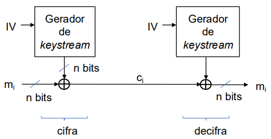

### ___Counter (CTR)___

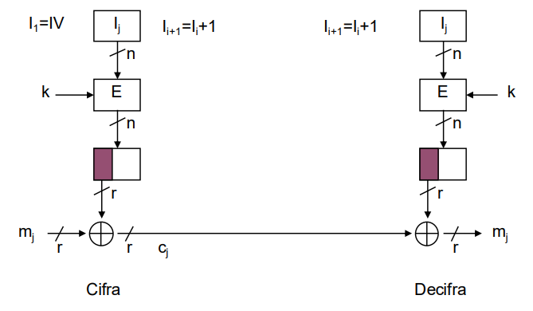

* Sob a mesma chave e sob o mesmo $ IV $, 2 mensagens iguais implicam criptogramas iguais.

* A ocorrência de erros num bloco de texto cifrado $ c_j $ afeta apenas a decifra desse bloco, assim como o bloco $ m_j $ resultante da decifra do bloco $ c_j $ terá erros nas mesmas posições que o bloco $ c_j $.

* Permite Acesso aleatório para a decifra e "recifra" de bits.

* É relativamente fácil manipular um determinado bloco de texto em claro.

## __Autenticação de Mensagens__

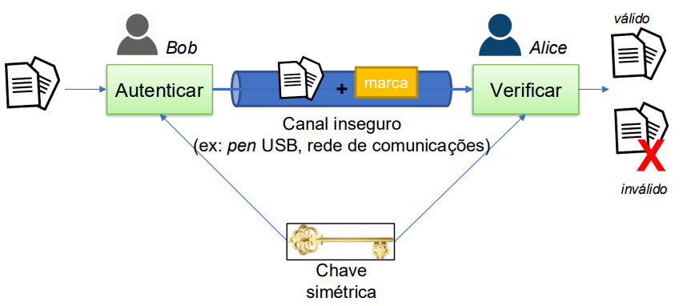

### __Esquema__

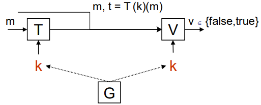

* $ G $: Função __probabilística__ de geração de chaves.
    * $ G: \ \to K $

* $ T $: Função __probabilística__ de geração de marcas.
    * $ T: \ \to K \ \to \{0, 1\}^* \ \to \ Tags $

* $ V $: Função __determinística__ de verificação de marcas.
    * $ V: \ \to K \ \to \ (Tags \times \{0, 1\}^*) \ \to \{true, \ false\} $

#### __Esquema para o Algoritmo de Verificação__

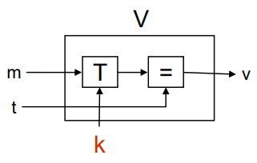

### __Propriedades__

* __Correção__: $ \forall \ m \in \{0, 1\}^*, \ \forall \ k \in K, \ V(k, \ T(k, \ m), \ m) = true $

* __Segurança__: Sem o conhecimento de $ k $ é computacionalmente infazível:
    * __Falsificação seletiva__: Dado $ m $, encontrar $ t $ tal que $ V(k, \ t, \ m) = true $.
    * __Falsificação existencial__: Encontrar $ m $ e $ t $ tal que $ V(k, \ t, \ m) = true $.

* __Simétrico__: Utilização da mesma chave para gerar e verificar a marca.

* Apenas garante a __autenticidade__.

* $ m $ é uma sequência de bits com dimensão variável.

* $ t $ tem tipicamente dimensão fixa.

* __Códigos detetores e corretores de erros não servem__ para esquemas de MAC (___Message Authentication Code___).

### __Exemplos__

* HMAC-SHA1.

## __Cifra Autenticada__

> Combinação de uma cifra simétrica e de uma autenticação de mensagens para garantir a confidencialidade e a autenticidade simultaneamente.

### ___Encrypt-then-MAC___

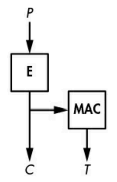

* $ E (k_1, \ M) \ || \ T (k_2, \ E (k_1, \ M)) $

* A __marca__ indica se __houve alteração ou não do criptograma__.

### ___MAC-then-Encrypt___

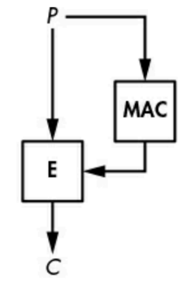

* $ E (k_1, \ M \ || \ T (k_2, \ M)) $

* A marca é gerada sobre a mensagem e é __posteriormente tudo cifrado__.

### __Outros Exemplos__

* ___Galois Counter Mode (GCM)___.

* ___Offset Codebook Mode (OCB)___.

* ___Counter with CBC-MAC (CCM)___.
