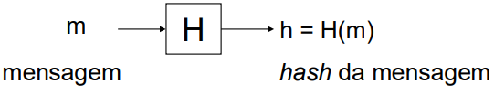
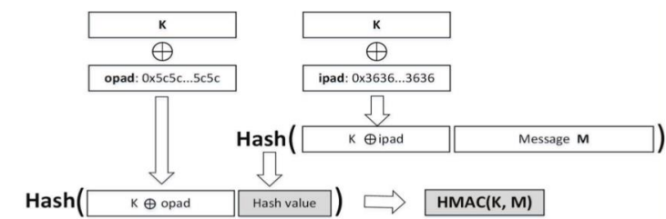

# __Funções de _Hash___

* $ H: \ \to \{0, 1\}^* \ \to \{0, 1\}^n $, onde $ n $ é o tamanho do hash.

* __Entrada__: Sequências binárias de dimensão finita.

* __Saída__: Sequências binárias de dimensão $ n $.

## __Propriedades__

* __Segurança__

    * É __computacionalmente fácil__ obter $ H(x) $ a partir de $ x $.
    * É __computacionalmente difícil__, dado $ x $, encontrar $ x' \neq x $ tal que $ H(x) = H(x') $.
        * __Segunda Pré-Imagem__
    * É __computacionalmente difícil__ encontrar $ x, x' $ com $ x \neq x' $ tal que $ H(x) = H(x') $.
        * __Colisão__

* O _hash_ de $ m $ serve como representante ("impressão digital") de $ m $.

* Baseia-se em operações booleanas e aritméticas sobre palavras de pequena dimensão.

## __Exemplos de Dimensão__

* MD5 ($ n = 128 $ bits)

* SHA-1 ($ n = 160 $ bits)

* SHA-256 ($ n = 256 $ bits)

## __Exemplos de Aplicação__

* Garantia de integridade de dados.

* Derivação de chaves a partir de _passwords_.

* Algoritmos de MAC.

* Assinatura digital (esquema assimétrico).

* Diversos protocolos criptográficos.

## __Funções de _Hash_ com Chave__

> Conjunto de algoritmos MAC para usar com diferentes funções de _hash_, conhecidos como ___HMAC___.

