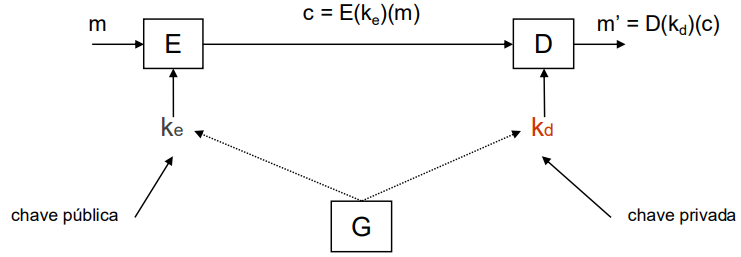

# __Esquemas Assimétricos__

* Custo computacional significativamente maior do que os esquemas simétricos.

## __Cifra Assimétrica__

### __Esquema__

* $ G $: Função __probabilística__ de geração de pares de chaves
    * $ G: \ \to KeyPairs, \ KeyPairs \subseteq \ PublicKeys \times \ PrivateKeys $

* $ E $: Função __probabilística__ de cifra.
    * $ E: PublicKeys \ \to PlainTexts \ \to \ CiphersTexts $

* $ D $: Função __determinística__ de decifra.
    * $ D: PrivateKeys \ \to CiphersTexts \ \to \ PlainTexts $

### __Propriedades__

* __Correção__: $ \forall \ m \in M, \ \forall \ (k_e, \ k_d) \in KeyPairs, \ D(k_d, \ E(k_e, \ m)) = m $

* __Segurança__: É __computacionalmente infazível__ obter $ m $ a partir de c sem conhecer $ k_d $.

* __Assimétrico__: Utilização de chaves distintas para cifrar e decifrar.

* __Plaintexts__ e __CiphersTexts__ são sequências de bits com dimensão variável e menor do que o limite definido pelo esquema.

* Apenas garante a __confidencialidade__.

### __Utilização__

* Cifrar uma chave simétrica (transporte de chaves).

* Assinatura digital.

### __Arquitetura Interna__

* __Formatação__: Serve adequar a entrada de __PlainTexts__ à entrada da primitiva (cifra).

## __Primitiva RSA__

> Sejam $ P $ e $ Q $ dois números primos distintos e $ N = P \times Q $.

> Sejam $ E $ e $ D $ tal que $ E \times D  \ (mod \ (P - 1) \times (Q - 1)) = 1 $.

A __fatorização de números primos__ é o problema que suporta a primitiva RSA.

### __Par de Chaves__

* __Chave Pública__: $ (E, N) $

* __Chave Privada__: $ (D, N) $

### __Operações__

* __Operação Pública__ (utilizada na cifra): $ C = M^E \ (mod \ N) $

* __Operação Privada__ (utilizada na decifra): $ M = C^D \ (mod \ N) $

## __Esquema Hibrido__

## __Assinatura Digital__

* Cada interveniente tem 1 par de chaves por cada identidade digital.

* __Processo de assinatura__ usa a __chave privada__.

* __Processo de verificação__ usa a __chave pública__.

* Par de chaves usadas durante um largo período de tempo.

* __Chave pública é divulgada__ através de certificados digitais.

### __Esquema__

* $ G $: Função __probabilística__ de geração de pares de chaves
    * $ G: \ \to KeyPairs, \ KeyPairs \subseteq \ PublicKeys \times \ PrivateKeys $

* $ S $: Função __probabilística__ de assinatura.
    * $ S: PublicKeys \ \to \{0, 1\}^* \ \to \ Signatures $

* $ V $: Função __determinística__ de verificação.
    * $ V: PrivateKeys \ \to (Signatures \times \{0, 1\}^*) \ \to \ \{true, false\} $

### __Propriedades__

* __Correção__: $ \forall \ m \in \{0, 1\}^*, \ \forall \ (k_s, \ k_v) \in KeyPairs, \ V(k_v, \ (S(k_s, \ m), \ m)) = true $

* __Segurança__: Sem o conhecimento de $ k_s $ ($ k_v $ é conhecido) é computacionalmente infazível:
    * __Falsificação seletiva__: Dado $ m $, encontrar $ s $ tal que $ V(k_v, \ s, \ m) = true $.
    * __Falsificação existencial__: Encontrar $ m $ e $ s $ tal que $ V(k_v, \ s, \ m) = true $.

* __Assimétrico__: Utilização de chaves distintas para assinar e verificar.

* Uma assinatura tem tipicamente dimensão fixa (160, 1024, 2048 bits).

* $ m $ é uma sequência de bits com dimensão variável.

### __Arquitetura Interna__

