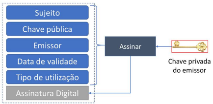
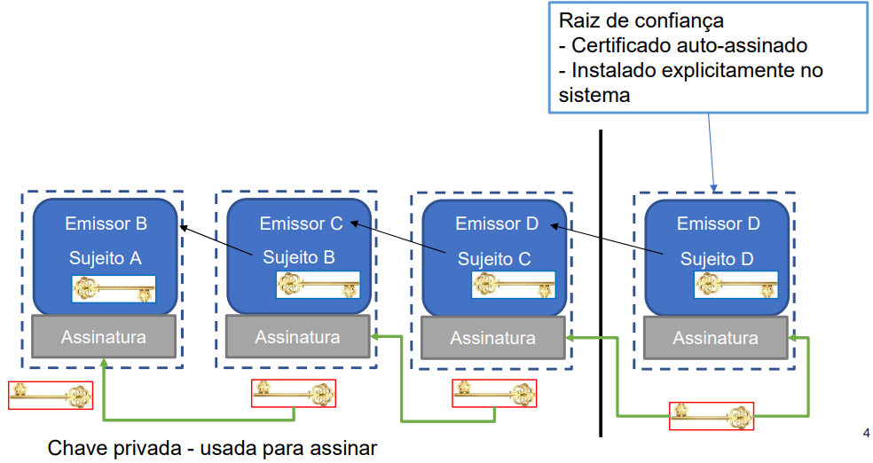

# __Infraestruturas de Chave Pública__

## __Certificados X.509__

<div align=center>



</div>

### __Emissor__

> Autoridade de Certificação (AC).

### __Conteúdo__

> Associação entre uma chave pública e um nome (identidade).

### __Outros Atributos__

* Período de validade.

* Usos das chaves.

* Extensões.

* ...

### __Assinatura do Emissor__

> Assinatura digital realizada com a chave de assinatura __privada__ do emissor.

## __Verificação da Cadeia de Certificação__

> Para verificar a assinatura de um certificado, é preciso a chave pública do seu emissor.

<div align=center>



</div>

### __Caminho de Certificação__

#### __Recursão__

> Obter chave pública $ \Rightarrow $ Verificar assinatura $ \Rightarrow $ Obter chave pública do emissor

#### __Condição de Paragem__

> Certificado auto-assinado (__Raiz de Confiança__).

## __Certificados e Chaves Privadas__

* Os certificados guardam apenas a chave pública.

* A chave privada fica "associada" ao certificado em armazenamento próprio.

## __Extensões__

> Forma de acrescentar informação não considerada na norma base.

### __Constituição__

* Identificador da extensão.

* Valor da extensão.

* _Flag critical_: Se verdadeira, a extensão não pode ser ignorada.

### __Perfil__

> Conjunto de extensões e respetiva semântica, usados num domínio de aplicação.

#### __Exemplo__

* PKIK (_Public Key Infrastructure Keying_).

## __Perfil PKIX__

* ___Authority Key Identifier___: Identificador da chave do emissor.

* ___Subject Key Identifier___: Identificador da chave do sujeito.

* ___Key Usage___: Usos permitidos para o par de chaves.

* ___Alternative Name___: Outros nomes do sujeito (email, IP, etc.).

* ___Policy Identifiers___: Identificadores de políticas.

* ___Basic Constraints___: Restrições ao uso do certificado.

* ___Name Constraints___: Restrições ao espaço de nomes do certificado.

* ___Policy Constraints___: Restrições de políticas.

* ___Extended Key Usage___: Usos permitidos para o par de chaves (mais detalhado).

* ___CRL Distribution Points___: Pontos de distribuição das listas de revogação.

## __Certificados e PKIX na JCA__

### __Classes ``Certificate`` e ``CertificateFactory``__

#### __``Certificate``__

> Classe para a representação abstrata de certificados.

#### __``X509Certificate``__

> Estende a classe ``Certificate`` e representa certificados X.509.

#### __``CertificateFactory``__

> _Engine class_ para a criação de certificados ou cadeias de certificados com base na sua representação codificada, tipicamente em _stream_.

#### ``X509Extension``

> Interface com métodos de acesso a todas as extensões de um certificado X.509.

##### __Exemplo__

* Obter Certificado X.509 a partir de ficheiro 'certificado.cer' na diretoria local

    ```java
    // Instancia uma factory de certificados X.509
    CertificateFactory factory = CertificateFactory.getInstance("X.509");
    
    // Obtém o certificado a partir do ficheiro .cer
    FileInputStream fis = new FileInputStream("certificado.cer");X509Certificate cert = (X509Certificate)
    
    factory.generateCertificate(fis);
    
    fis.close();
    
    System.out.println("Subject: " + cert.getSubjectX500Principal());
    System.out.println("Issuer: " + cert.getIssuerX500Principal());
    
    PublicKey pk = cert.getPublicKey();
    
    System.out.println("Public key: " + pk);
    System.out.println("Signature Algorithm: " + cert.getSigAlgName());
    System.out.println("Signature: " + cert.getSignature());
    System.out.println("Not After: " + cert.getNotAfter());
    System.out.println("Not Before: " + cert.getNotBefore());
    ```

### ___Key Stores___

> Armazenamento de chaves e certificados.

#### __Tipos de Entrada__

* Chaves privadas e certificados associados (incluindo a cadeia).

* Chaves simétricas.

* Certificados representando raízes de confiança.

#### __Proteção__

> Baseada em _passwords_.

* Integridade de todo o repositório: uma _password_ por repositório.

* Confidencialidade das entradas contendo chaves privadas ou secretas: uma _password_ por entrada do repositório.

#### __Formatos de Ficheiro__

* JKS (_Java KeyStore_).

* JCEKS (_Java Cryptography Extension KeyStore_).

* PKCS12 (_Public Key Cryptography Standard_).

#### __Entradas__

> Cada entrada tem associado um _alias_ do tipo ``String``.

* ``PrivateKeyEntry``: Chaves privadas e certificados associados.

* ``SecretKeyEntry``: Chaves simétricas.

* ``TrustedCertificateEntry``: Certificados de raízes de confiança.

#### __Classe ``KeyStore``__

* ``void load(InputStream is, char[] password)``: Carrega o _keystore_ a partir de um _stream_.

* ``void load(LoadStoreParameter)``: Carrega o _keystore_ a partir de um parâmetro.

* ``void store(OutputStream os, char[] password)``: Guarda o _keystore_ num _stream_.

* ``void store(LoadStoreParameter)``: Guarda o _keystore_ num parâmetro.

* ``Enumeration<String> aliases()``: Devolve os _aliases_ das entradas do _keystore_.

* ``Entry getEntry(String alias, ProtectionParameter)``: Devolve a entrada associada a um _alias_.

* ``void setEntry(String alias, Entry, ProtectionParameters)``: Define uma entrada associada a um _alias_.

* ``boolean isXxxEntry(String alias)``: Verifica se a entrada associada a um _alias_ é do tipo _xxx_.

* ``Key getKey(String alias, char[] password)``: Devolve a chave associada a um _alias_.

#### __Exemplo__

* Obter chaves a partir do ficheiro keystore.pfx na diretoria local:

    ```java
    KeyStore ks = KeyStore.getInstance("PKCS12");
    
    ks.load(
        new FileInputStream("keystore.pfx"),
        "changeit".toCharArray() // password do ficheiro
    );
    
    // Pode haver mais de uma entrada no ficheiro
    Enumeration<String> entries = ks.aliases();
    
    while(entries.hasMoreElements()) {
        String alias = entries.nextElement();
        X509Certificate cert = (X509Certificate) ks.getCertificate(alias);
        
        PublicKey publicKey = cert.getPublicKey();
        PrivateKey privateKey = (PrivateKey) ks.getKey(alias, "changeit".toCharArray());
        
        System.out.println("Alias: " + alias);
        System.out.println(privateKey);
        System.out.println(publicKey);
    }
    ```

### __Construção e Validação de Cadeias de Certificação__

#### __``CertPathValidator``__

> _Engine class_ para a __validação__ de cadeias de certificação.

#### __``CertPathBuilder``__

> _Engine class_ para a __construção__ de cadeias de certificação.

#### __Exemplo__

* Criação de uma cadeia de certificação a partir de uma lista de certificados:

    ```java	
    // Gerar lista de certificados da cadeia, na ordem folha --> raiz
    ArrayList<X509Certificate> certList = new ArrayList<>();
    
    // Adicionar os certificados
    certList.add(0, obtemCertificado("Alice_1.cer");
    certList.add(1, obtemCertificado("CA1_int.cer");
    certList.add(2, obtemCertificado("CA1.cer");
    
    // Gerar o caminho de certificação a partir da lista de certificados
    CertificateFactory factory = CertificateFactory.getInstance("X.509");
    CertPath certPath = factory.generateCertPath(certList);
    
    // Também é necessário um conjunto de trust anchors (ou obter de um keystore)
    Set<TrustAnchor> trustAnchorSet = new HashSet<>();
    
    // Neste exemplo, adicionar apenas o certificado raiz pois há apenas um
    
    trustAnchorSet.add(new TrustAnchor("CA1.cer", null));
    
    // Criar os parâmetros do PKIX (CertPathParameters) a partir dos trust anchors
    
    PKIXParameters params = new PKIXParameters(trustAnchorSet);
    ```

#

* Validação da cadeia de certificação:

    ```java
    // Neste exemplo, desabilitar a revogação pois não há esta lista
    params.setRevocationEnabled(false);
    
    // Obter objeto para validar o caminho de certificação PKIX
    CertPathValidator certPathValidator=CertPathValidator.getInstance("PKIX");
    
    try {
        // Validar o caminho de certificação
        certPathValidator.validate(certPath, params);
        
        System.out.println("Certificate successfully validated!");
    } catch (
        CertPathValidatorException |
        InvalidAlgorithmParameterException e
    ) {
        System.out.println("Certificate is not valid!");
        System.out.println(e);
    }
    ```

### __Parametrização__

* Conjunto de raízes de confiança.

* ``CertStore``: Define os certificados que podem constituir a cadeia.

* ``CertSelector``: Define os requisitos para o certificado final.

#### __Exemplo__

* Validar o certificado x509 referido por ``certificate``:

    ```java
    // Criar certStore com todos os possíveis caminhos de certificação
    CertStore certStore = CertStore.getInstance("Collection", new CollectionCertStoreParameters(certCollection));
    
    // Criar certSelector que indica que 'certificate' será validado
    X509CertSelector certSelector = new X509CertSelector();
    certSelector.setCertificate(certificate);
    
    // Associa o trustAnchorSet, certSelector e certStore aos parâmetros para construção
    PKIXBuilderParameters params = new PKIXBuilderParameters(trustAnchorSet, certSelector);
    
    params.addCertStore(certStore);

    // Desabilita a revogação
    params.setRevocationEnabled(false);
    
    try {
        // Constrói o caminho de certificação de acordo com params
        CertPathBuilder certPathBuilder = CertPathBuilder.getInstance("PKIX");CertPathBuilderResult certPathBuilderResult = certPathBuilder.build(params);
        
        // Obtém o caminho de certificação em si, e então valida-o
        CertPath certPath = certPathBuilderResult.getCertPath();
        CertPathValidator certPathValidator=CertPathValidator.getInstance("PKIX");
        
        certPathValidator.validate(certPath, params);
        System.out.println("Certificate successfully validated");
    } catch (
        CertPathValidatorException | 
        InvalidAlgorithmParameterException|CertPathBuilderException e
    ) {
        System.out.println(e);
    }
    ```