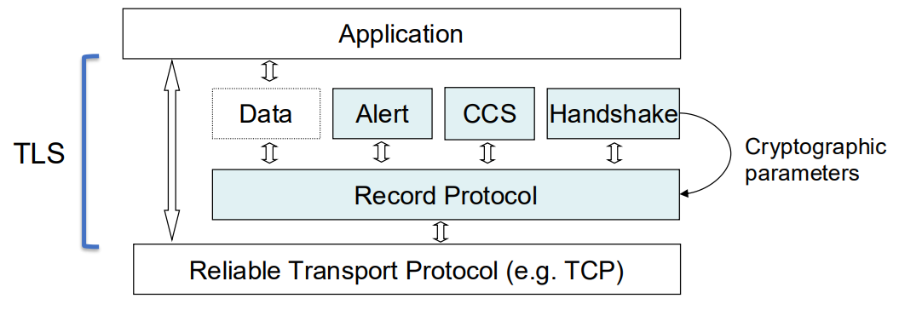
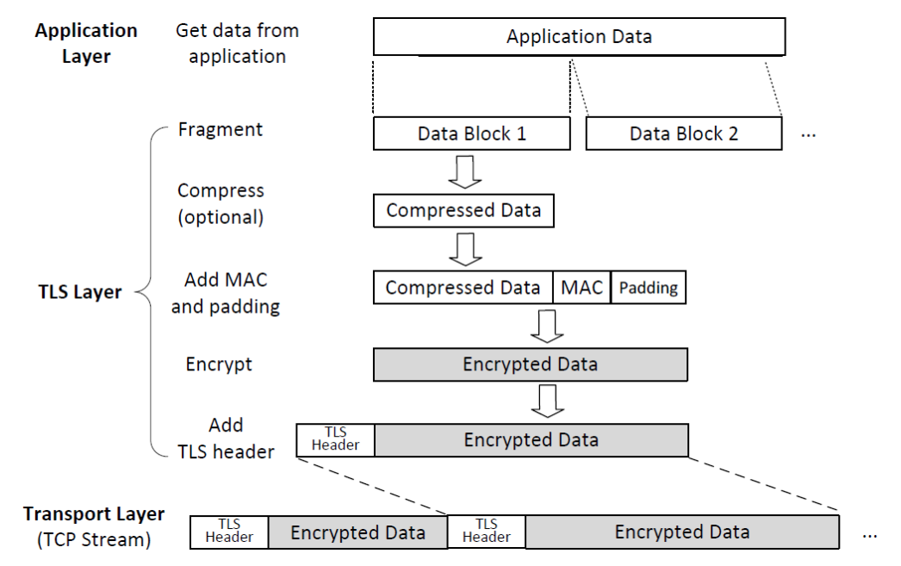
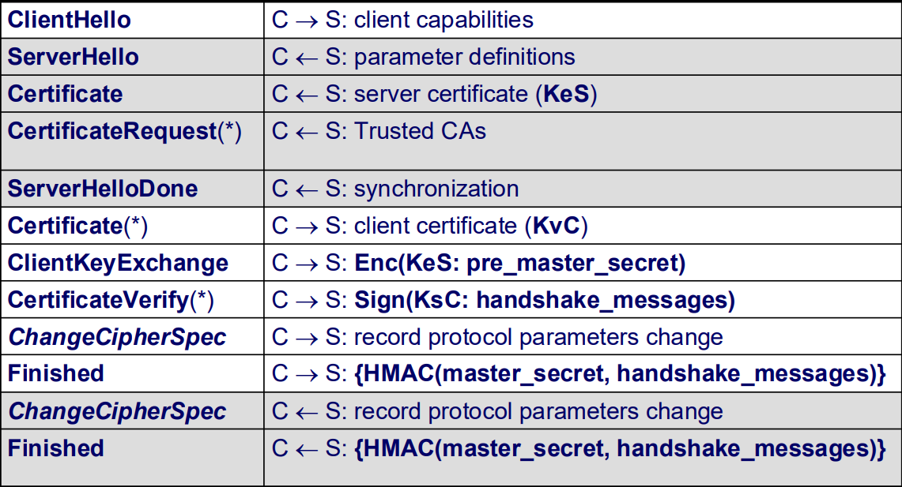
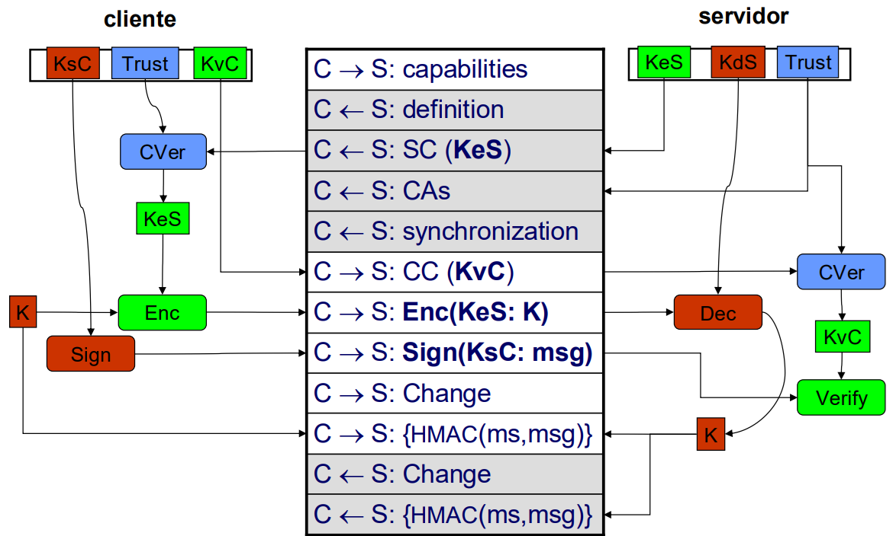
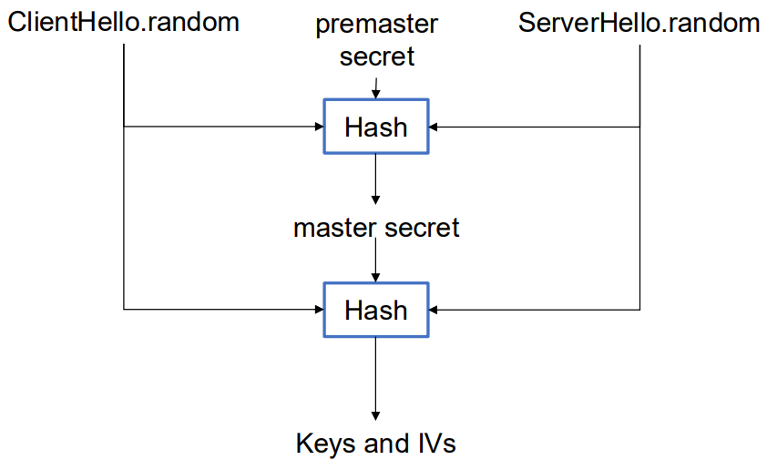
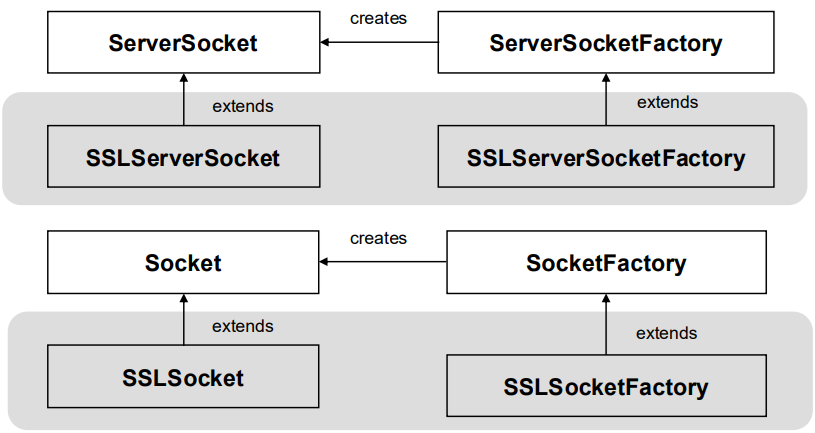

# __Transport Layer Security__

## __Objetivos__

> Fornecer um canal seguro entre 2 _endpoints_ garantindo __confidencialidade__, __integridade__ e __autenticação__.

## __Camada TLS__

> Fica entre a camada de __transporte__ e a camada de __aplicação__.

* Os dados não protegidos são fornecidos ao TLS pela camada de aplicação.

* O TLS cifra e autentica os dados que envia/recebe da camada de transporte.

* O TLS requer que a camada de transporte seja confiável (TCP).

## __Sub-protocolos__

<div align=center>



</div>

### ___Record Protocol___

> Fragmenta, comprime, autentica (MAC) e depois cifra os dados.

* A mesma ligação TCP, __2 direções independentes de dados__: Chaves, IVs e números de sequência diferentes.

<div align=center>



</div>

* __Repetição de mensagens__ deteta-se pelo __número de sequência__.

* __Reflexão de mensagens__ deteta-se pelas __chaves MAC__.

### ___Handshake Protocol___

> Lida com a criação e gestão da conexão segura (estabelecimento seguro dos paramêtros criptográficos do _record protocol_).

Responsável por:

* __Negociação__ dos parâmetros criptográficos.

* __Autenticação__ dos _endpoints_:
    * __Opcional__ em ambas as extremidades.

* __Estabelecimento__ de chaves seguras:
    * Transporte de chave (e.g. RSA).
    
    * Acordo de chaves (e.g. DH).

#### ___Handshake_ baseado em RSA__

<div align=center>





</div>

## __Esquemas Criptográficos__

* O _cipher suite_ e os algoritmos de compressão são negociados pelo protocolo de _handshake_.

### ___Cipher Suite___

Define:

* A função de _hash_ usada pelo MAC.

* O esquema simétrico de cifra (suporta modos de operação de bloco e de _stream_).

* Esquema de estabelecimento de chaves.

## __Protocolo HTTPS__

* HTTP sobre TLS.

* Porta 443 (por omissão).

* Verificação entre o URI e o certificado:

    * Extensão ``subjectAltName`` do tipo ``dNSName`` (se existir).

    * Campo ``Common Name`` no campo ``Subject Field``.

## __Derivação de Chaves__

<div align=center>



</div>

## __Problemas nas Mensagens no _Handshake___

### ___Alteração de Mensagens___

> Detetada com a mensagem __Finished__.

* A mensagem ___Finished___ garante que ambos os _endpoints_ recebem a mesma mensagem.

### ___Repetição de Mensagens___

* ``ClienteHello`` e ``ServerHello`` contém valores aleatórios, diferentes para cada _handshake_.

* Implica que a mensagem ___Finished___ seja diferente para cada _handshake_.

## ___Perfect Forward Secrecy___

> Propriedade do _handshake_ que garante que se a chave privada for comprometida, não é possível decifrar _master secret_ anteriores nem mensagens do _record protocol_.

## ___Sockets_ TLS em Java__

### ___Sockets_ e Fábricas de _Sockets___

<div align=center>



</div>

* ``SSLSocketFactory`` e ``SSLServerSocketFactory``:
    * Obtenção de _cipher suites_ suportados por omissão.

    * Criação de istâncias de _sockets_.

* ``SSLSocket`` e ``SSLServerSocket``:
    * Inicia o _handshake_ e recebe notificações da sua conclusão.

    * Define os protocolos e _cipher suites_ habilitados.

    * Aceita/requisita autenticação do cliente.

    * Obtém a sessão que foi negociada.

* ``SSLSession``:
    * Obtém o _cipher suite_ negociado.

    * Obtém a identidade do par autenticada e a cadeia de certificados.

### __Raízes de Confiança por Omissão em Java__

```java
public class SSLDemo {
    public static void main(String[] args) throws IOException {
        SSLContext sc = SSLContext.getInstance("TLSv1.2");

        sc.init(null, null, new java.security.SecureRandom());
        
        SSLSocketFactory sslFactory = sc.getSocketFactory();
        
        SSLSocket client = (SSLSocket)
        
        sslFactory.createSocket("docs.oracle.com", 443);
        client.startHandshake();
        
        SSLSession session = client.getSession();
        
        System.out.println(session.getCipherSuite());
        
        System.out.println(session.getPeerCertificates()[0]);
        client.close();
    }
}
```

### __Raízes de Confiança com ``TrustManager`` em Java__

```java
TrustManagerFactory tmf = TrustManagerFactory.getInstance(TrustManagerFactory.getDefaultAlgorithm());

KeyStore ks = KeyStore.getInstance("JKS");

ks.load(new FileInputStream("CA.jks"), "changeit".toCharArray());

tmf.init(ks);

SSLContext sc = SSLContext.getInstance("TLS");

sc.init(null, tmf.getTrustManagers(), null);

SSLSocketFactory sslFactory = sc.getSocketFactory();

SSLSocket cli = (SSLSocket) sslFactory.createSocket("docs.oracle.com", 443);
// Continue...
```