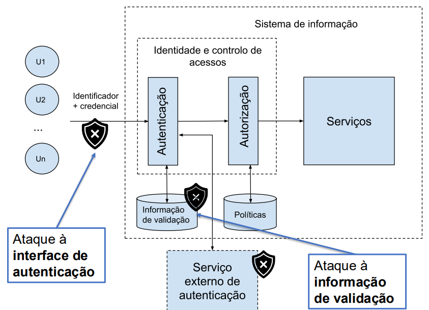

# __Autenticação Baseada em Passwords__

## __Autenticação e Controlos de Acessos__

<div align=center>



</div>

## __Identificação e Autenticação__

> Autenticação é o processo de verificação duma alegada identidade.

### __Usos__

* Parâmetro para as decisões de controlo de acessos.

* Parâmetro para as ações de personalização.

* Informação de auditoria.

### __Exemplo__

* ___user___: Identificação

* ___password___: Autenticação

#
#

## __Informação de Autenticação__

### __"Algo" que se conhece__

* Passwords.

* Passphrases.

### __"Algo" que se possui__

* _Tokens_ criptográficos.

* RSA SecurID.

### __"Algo" que se é__

* Características biométricas.

### __"Algo" que se faz__

* Assinaturas.

#
#

## __Sistema de Autenticação__

<div align=center>


</div>

* Conjunto __A__ de informação de autenticação.

* Conjunto __V__ de informação de validação.

* $ f: A \rightarrow V $.

* $ g: V, A \rightarrow \{true, false\} $.

#
#

## __Ataques de Dicionário à Password__

* Atacante usa uma __lista de palavras-passe conhecidas__, ou prováveis, e tenta exaustivamente as entradas da lista, em 1 ou mais utilizadores.

* _Alvo_: A __interface de autenticação__ dos sistemas ou o __local onde está guardada a informação de validação__.

### __Tipo 1__

* __Entrada__: $ V $.

* __Saída__: $ A $.

* Para cada $ a' $ pertencente ao __Dicionário__.

    * Se $ f(a') = V \Rightarrow $ retorna $ a' $.

    * Caso contrário, retorna __falha__.

### __Tipo 2__

* __Entrada__: $ g(V, A) $.

* __Saída__: $ A $.

* Para cada $ a' $ pertencente ao __Dicionário__.

    * Se $ g(V, a') = true \Rightarrow $ retorna $ a' $.

    * Caso contrário, retorna __falha__.

#
#

## __Proteção Contra Ataques de Dicionário__

* __Aumentar a incerteza__ da password.

* Controlar o acesso à informação de validação.

* __Aumentar o tempo__ de processamento de $ f $.

* Aumentar o tempo de processamento ou limitar o acesso a $ g $.

#
#

## __Proteção Contra Ataques do Tipo 2__

> Limitar a $ g $ após a detecção de tentativas de autenticação erradas.

* __Problema__: Garantir a disponibilidade do serviço.

### ___Backoof___

> O tempo de execução de $ g $ depende do número anterior de tentativas falhadas.

### __Terminação da Ligação__

> Terminação da ligação em caso de erro.

### __Bloqueamento__

> Bloqueamento de $ g $ após um número de tentativas erradas.

### ___Jailing___

> Acesso ao serviço com funcionalidade limitada.

#
#

## __Pré-Computação__

* Para todos $ a'_i $ pertencente a um __Dicionário__ e dado um array associativo $ M $.

    * Calcular e armazenar $ M[f(a'_i)] = a'_i $.

### __Ataques com Pré-Computação__

> Baseia-se no facto de $ f $ ser igual para todos os utilizadores.

* Usado para __obter a password de qualquer utilizador__.

* __Ataque__:

    * Se $ M[V] = a' \Rightarrow $ retorna $ a' $.

    * Caso contrário, retorna __falha__.

#
#

## __Proteção _Salt___

> Tornar a função $ f $ diferente para cada utilizador.

* $ f_u $ é a função asssociada ao utilizador $ u $.

* $ salt_u $ é uma sequência de _bytes_ gerada aleatoriamente para cada utilizador $ u $.

* $ f_u(a) = H(salt_u \ || \ a) $.

* A pré-computação agora depende de $ salt_u $ e __deixa de ser possível atacar todos os utilizadores__.

#
#

## __Sistema _Bcrypt___

> Algoritmo de _hash_ criptográfico para guardar passwords de forma segura.

* Algoritmo __mais lento e intensivo__ em termos computacionais o que __dificulta ataques de dicionário__.

### __Estrutura do _Hash___

* __Versão__: Versão do algoritmo.

* __Custos__: Número de iterações.

* ___Salt___: _Salt_ aleatório.

* ___Hash___: Resultado final do _hash_.

### __Exemplo - Node.js__

* Geração do _hash_:

```js
const bcrypt = require('bcrypt');
// Palavra-passe a proteger
const password = 'changeit';
const saltRounds = 12; // número de iterações

bcrypt.hash(password, saltRounds, (err, hash) => {
    if (err) {
        return console.error('Erro no cálculo:', err);
    }

    console.log('Hash gerado:', hash);

    // Exemplo:$2b$12$CMwjUMW.PbsaZ1OY2V5GpOY7P4hEH8IJVmBMGhXMhg7009Kwpguwa
});
```

#

* Verificação do _hash_:

```js
const storedHash =
'$2b$12$CMwjUMW.PbsaZ1OY2V5GpOY7P4hEH8IJVmBMGhXMhg7009Kwpguwa';
bcrypt.compare('changeit', storedHash, (err, result) => {
if (err) {
return console.error('Erro no cálculo:', err);
}
console.log('Palavra-passe correta:', result); // true ou false
});
```

#
#

## __Aumentar o Custo dos Pedidos__

* Diminuir o número de pedidos realizados.

* Necessita de computação do lado do cliente.

### __Exemplo__

* _CAPTCHA_: __Fácil para humanos__, __difícil para máquinas__.
