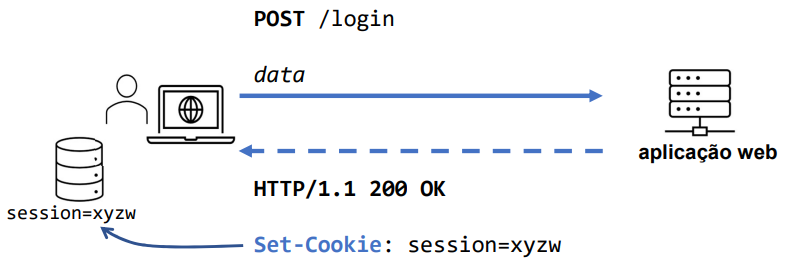
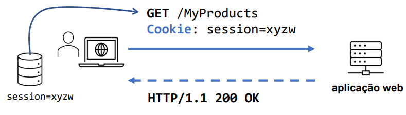
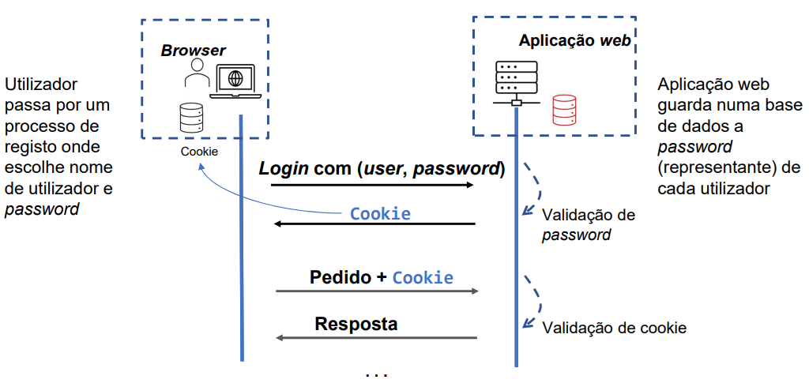
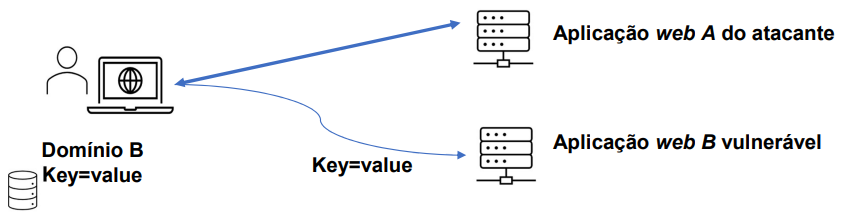
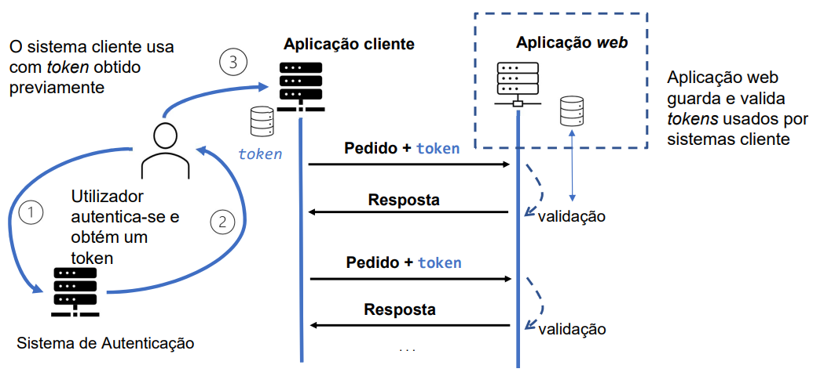
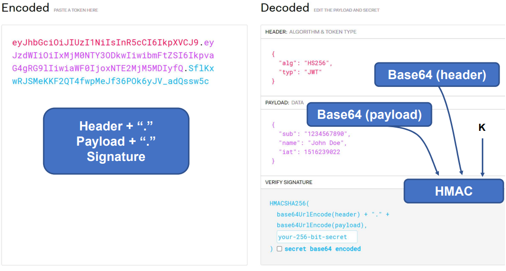

# __Autenticação em Aplicações Web__

## __Revisões HTTP__

### __HTTP__

> Protocolo de comunicação que permite a transferência de documentos em hiper-texto (HTML).

__Características__:

* _Stateless_.

* __Possibilidade__ de manter __sessões__.

#
#

## ___Cookies___

> Mecanismo que fornece a aplicações HTTP servidoras a capacidade de armazenar e obter informações do cliente.

* São usados através dos ___headers_ HTTP__ para manter uma __sessão ativa do cliente__.

* O browser envia __automaticamente os _cookies___ para o servidor sempre que é feito um pedido para o mesmo.

### ___Headers_ HTTP__

* ``Cookie`` (cliente $ \rightarrow $ servidor): ``Cookie: {<NAME>=<VALUE>};``.

* ``Set-Cookie`` (servidor $ \rightarrow $ cliente): ``Set-Cookie: {<NAME>=<VALUE>}; + [expires=<DATE>]; + [path=<PATH>]; + [domain=<DOMAIN_NAME>]; + [secure]; + [httpOnly];``.

### __Formato__

* Informação sobre o estado do cliente na forma de par __chave-valor__.

* _Range_ de URLs para o qual o estado é válido.

* Data de validade.
    * O cliente pode removê-lo antes do fim da validade.

    * Para o servidor __apagar o _cookie___, deve enviar um _cookie_ com o __mesmo nome e uma data de validade expirada__.

### __Exemplos de Utilização__

* Criar sessões.

* Evitar _login_ através de _login_ automático.

* Deixar registo de navegação (_third-party cookies_).

* Deixar registo de preferências do cliente.

__Não podem ser usados para__:

* Aceder ao disco rígido do cliente.

* Enviar vírus para o cliente.

## __Fases de Autenticação__

### __Fase 1__

* Apresentação das credenciais pelo utilizador (e.g., ``username`` e ``password``).

* Obtenção dum autenticador gerado pelo servidor.

### __Fase 2__

* Apresentação do autenticador automaticamente pelo ``user-agent``.

### __Objetivos do Atacante__

* __Falsificação existencial__: Obter um autenticador válido.

* __Falsificação seletiva__: Dado um utilizador, obter um autenticador válido para esse utilizador.

* Obtenção da chave usada na criação de autenticadores.

#
#

## __Autenticadores com _Cookies___

### __Implementação__

* __Identificador de sessão__:
    * Informação sobre a sessão presente no servidor.

    * ``Cookie`` contém o identificador para aceder a essa informação.

    * Número aleatório.

* ___Message Authentication Code_ (MAC)__:
    * Informação sobre a sessão presente no cookie.

    * ``Cookie`` protegido por um MAC.

    * Cifrar o conteúdo do _cookie_ caso seja necessário __confidencialidade__.

* ___Logout_/Revogação__:

    * Invalidar a sessão.

    * Colocar o _cookie_ numa lista de revogação (até expirar).

* __Proteção dos _Cookies___:
    * Proteção do transporte usando SSL.

    * Proteção no cliente (e.g., _httpOnly_).

### __Segurança__

* A falsificação de um pedido que mude o estado da aplicação pode ser feita usando pedidos ___cross-site___ (___Cross-Site Request Forgery___).

* Para evitar este problema, a opção ``SameSite=Strict`` garante que _cookies_ marcados com esta opção não sáo usados em pedidos ___cross-site___.

#
#

## __Autenticação com _Tokens___

#
#

## __Autenticação JWT__

