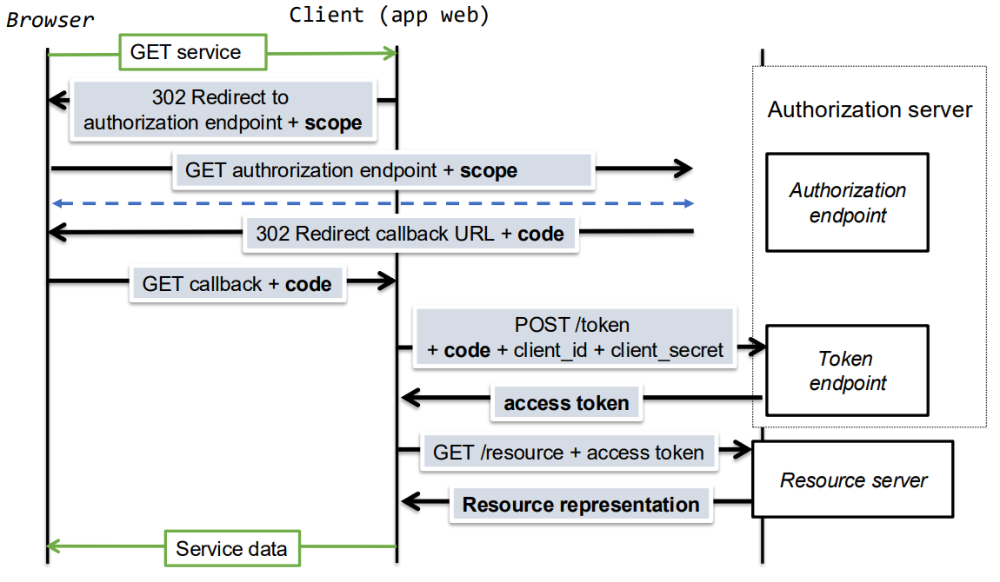

# Cheat Sheet

* __Confidencialidade__: Prevenir a __divulgação não autorizada__ da informação.

* __Integridade__: Garantir que a __informação não foi alterada__.

* __Autenticidade__: Garantir a identidade de __quem envia__ a informação.

## __Cifra Simétrica__

* __Cifra e Decifra__ com a mesma chave simétrica.

* Apenas garante __confidencialidade__.

* __Mensagem__ e __Cifra__ com dimensão __variável__.

* __Cifra em bloco__

    * __Dimensão grande do bloco__ para impossibilitar __ataques baseados na estatística do texto em claro__.

    * __Dimensão grande da chave__ para impossibilitar __ataques de pesquisa exaustiva__.

#

### __Modos de Operação em Bloco__

* __ECB__
    * Cifra independente de bloco para bloco.

    * Erros num bloco cifrado apenas afeta a decifra desse bloco.

    * Blocos de texto cifrado iguais para a mesma mensagem.

* __CBC__

    * Usa um __IV__ para o primeiro bloco.

    * Cifra de um bloco afeta a dos blocos seguintes.

    * Erros num bloco cifrado afeta a decifra do próprio bloco e dos seguintes.

    * Criptogramas iguais para a mesma mensagem.

* ___Padding___: __Adicionar bits__ à mensagem para que esta tenha um __tamanho múltiplo do bloco__.

#

### __Modos de Operação em Stream__

* __CTR__

    * Usa um __IV__ como __contador__.

    * Erros num bloco cifrado apenas afeta a decifra desse bloco.

#
#

## __MAC__

* __Autentica e Verifica__ a mensagem com a mesma chave simétrica.

* Apenas garante __autenticidade__.

* __Marca__ com dimensão __fixa__.

* Códigos detetores e corretores de erros não servem.

#
#

## __Cifra Autenticada__

* Combinação de __cifra simétrica__ e __MAC__.

* GCM, OCB, CCM.

#
#

## __Hash__

* __Segunda Pré-Imagem__: Dado uma mensagem, é difícil encontrar outra mensagem com o mesmo hash.

* __Colisão__: É difícil encontrar duas mensagens diferentes com o mesmo hash.

#
#

## __Cifra Assimétrica__

* __Chave Pública__ para cifrar e __chave privada__ para decifrar.

* __Mensagem e cifra__ com dimensão __variável__ e menor que o limite definido pelo esquema.

* Não garante a __integridade__.

#

### __Primitiva RSA__

* __Chave Pública__: Cifrar.

* __Chave Privada__: Decifrar.

#
#

## __Assinatura Digital__

* __Assinante__: Usa a chave privada para gerar a assinatura.

* __Verificador__: Usa a chave pública para verificar a assinatura.

* __Chave Pública__ divulgada através de certificados digitais.

* __Assinatura__ com dimensão fixa.

* __Mensagem__ com dimensão variável.

#
#

## __JCA__


### __Classe Mac__

* ``init()``
    * Chave.

    * Parâmetros específicos do algoritmo.

* __Métodos de Geração de Marca__

    * ```update()```: Continua a operação incremental.

    * ```doFinal()```: Finaliza a operação incremental, retornando a marca.

#

### __Representação de Chaves__

* __Opaca__

    * Chave sem acesso aos seus componentes.

    * Classe ``Key``.

* __Transparente__

    * Chave com acesso aos seus componentes.

    * Classe ``KeySpec``.

#

### __Classe Signature__

* ``init()``

    * Chave Privada.

    * Parâmetros específicos do algoritmo.

* __Métodos de Assinatura__

    * ```update()```

    * ```sign()```

* __Métodos de Verificação__

    * ```update()```

    * ```verify()```

#
#

## __Certificados X.509__

* __Composição__

    * Sujeito

    * Chave Pública

    * __Emissor__: Autoridade de Certificação (CA).

    * __Assinatura Digital__: Assinada pela __Chave Privada do Emissor__.

* __Raíz de Confiança__

    * Certificado auto-assinado.

    * Instalado explicitamente no sistema.

#
#

## __TLS__

### ___Record Protocol___

> Fragmenta, comprime, autentica (MAC) e depois cifra os dados.

* Repetição de mensagens deteta-se pelo número de sequência.

* Reflexão de mensagens deteta-se pelas chaves MAC.

#

### ___Handshake Protocol___

> Criação e gestão da conexão segura (estabelecimento seguro dos paramêtros criptográficos do record protocol).

#

### __Problemas nas Mensagens no Handshake__

* __Alteração de Mensagens__
    * Detetada com a mensagem Finished: A mensagem Finished garante que ambos os endpoints recebem a mesma mensagem.

* __Repetição de Mensagens__: ClienteHello e ServerHello contém valores aleatórios, diferentes para cada handshake o que implica que a mensagem Finished seja diferente para cada handshake.

#

### __Perfect Forward Secrecy__

Resolve ataques relacionados a:

* __Servidor__: Garantindo que não seja possível decifrar master secrets anteriores.

* __Canal de Comunicação__: Garantindo que não seja possível decifrar mensagens do record protocol.

#

#
#

## __Autenticação Baseada em _Passwords___

### __Ataques__

* __De Dicionário à _Password___: Testar uma lista de _passwords_ conhecidas ou comuns.

* __Com Pré-Computação__: Dada a função de _hash_ e a _password_ cifrada, testar várias _passwords_ até encontrar uma que dê o mesmo _hash_.

### __Proteção Salt__

* __Salt__: Valor aleatório adicionado à _password_ antes de ser cifrada, tornando o hash único para cada utilizador.

* $ f_u(a) = H(salt_u \ || \ a) $.

#
#

## __Autenticação em Apliações Web__

### __Cookies__

* Utilizador faz login (user, password) e a aplicação valida a password e retorna um cookie.

### __Problemas__

* ___Cross-Site Request Forgery___: Ataque que força o utilizador a executar ações não intencionais.
    * Solução: ___SameSite=Srict___.

#
#

## __OpenID Connect__

### __Participantes__

* ___End-User___ (Browser)

* ___Relying Party___ (Aplicação Web)

* ___Identity Provider___ (Google, GitHub, etc)

### __Obtenção do _Client ID_ e _Client Secret___

* __RP__ regista-se no ___IdP___ e obtém o _Client ID_ e _Client Secret_.

#
#

## __OAuth 2.0__

### __Participantes__

* ___Resource Owner___

* ___Resource Server___

* ___Client___

* ___Authorization Server___

### __Access Token__

> Representa uma credencial de acesso.

* Emitido pelo ___Authorization Server___ e validado pelo ___Resource Server___.

* Ambos os servidores precisam de saber a estrutura do token.

* Obtido através de um pedido POST para o token endpoint.

* Os clientes acedem aos recursos protegidos indicando um access token.

* O servidor de recursos usa-o para aplicar políticas de acesso.

* São strings opacas para os clientes.

#

### ___Client Credentials Grant Flow___

* Autorização é dada somente com base nas credenciais do cliente

#

### ___Authorization Code Grant Flow___

* Código de autorização é obtido pelo ___Resource Owner___ e entregue ao ___Client___ para que este obtenha o access_token.

#

### ___Resource Owner Password Credential Grant Flow___

* Autorização é dada com base na password do utilizador.

#

### __Scope__

* Representa o tipo de autorização que está a ser pedido a um determinado recurso.

* __Objetivo__: Limitar o acesso a recursos específicos, garantindo que o cliente apenas possa aceder aos recursos ou operações que foram explicitamente autorizados pelo ___Resource Owner___.

#

### __State__

* Serve para prevenir ataques CSRF (Cross-Site Request Forgery) e para garantir que o pedido de autorização é legítimo. 

* É gerado um valor e enviado para o ___Authorization Server___, que por sua vez devolve o mesmo valor no pedido de resposta.

#

### ___Front Channel___

* Designa o canal de comunicação Client <-> Authorization endpoint, via redirecção do user-agent.

* O client_secret não é exposto.

#

### ___Back Channel___

* Termo usado para designar o canal de comunicação Client <-> Token endpoint.

#

<div align=center>



</div>

#
#

## __Controlo de Acesso__

### ___Capabilities___

* Facilidade na obtenção das permissões associadas a um sujeito.

#

### ___ACLs___

* Facilidade na obtenção das permissões associadas a um objeto.

#

### ___Permissões para Grupos___

* Permite permissões negativas a um determinado sujeito dentro de um grupo.

#

### __RBAC__

* __RBAC_1__: Hierarquia de _roles_.

    * _Roles_ séniores herdam as permissões das _roles_ júniores ($ r1 \prec r0 \Rightarrow $ r1 $ $ herda as permissões de $ r0 $).

    * __Sessão__: Permite que o utilizador ative apenas as _roles_ necessárias para a tarefa em questão, reduzindo o risco de acesso excessivo. 

* __RBAC_2__: Restrições de _roles_.

#

### __Casbin__

* Biblioteca para integração de controlo de acessos em aplicações.