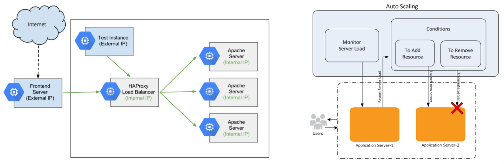
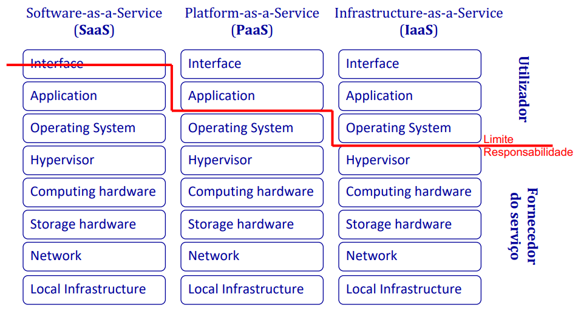

# __Introdução à Computação na Nuvem__

## __Definição__

Ato de __armazenar__, __processar__ e __usar dados__ em computadores localizados remotamente acedidos através da Internet.

* Computação e armazenamento distribuídos:
    * Hardware, middleware, plataformas, etc.;
    * Uso de hardware de forma otimizada através do uso de redes de computadores.

* Virtualização -> facilidade de mudança de requisitos de hardware.

#

## ___Cloud Computing___

Modelo que permite __acesso conveniente__ e __sob demanda__ a uma ___pool_ partilhada__ de __recursos de computação configuráveis__ (e.g., redes, servidores, aplicações, etc.). 

Estes recursos podem ser __rapidamente provisionados e libertados__ com um __esforço de gestão mínimo__ ou __interação do provedor de serviços__.

Para além das __bases de dados__, existem vários __ambientes de execução__, tais como:

* Máquinas virtuais;
* Contentores;
* Aplicações Web;
* _Serveless_.

#

## __Modelo Económico__

* __Ambientes de execução__
* __Métricas__:
    * Horas/minutos/segundos de utilização;
    * Pedidos por intervalo;
    * Etc.

#

## __Energia__

Custo relevante quer para o fornecedor, quer para o meio ambiente.

$ Power \ Usage \ Efficiency = \frac{Total \ Facility \ Energy}{IT \ Equipment \ Energy} $

#

## __Modelos/Tipos de ___Cloud_____

* ___Private Cloud___ -> Exclusiva a uma organização, eventualmente com múltiplas unidades de negócio.

* ___Community Cloud___ -> Exclusiva a uma comunidade de consumidores que partilham os mesmos objetivos.

* ___Public Cloud___ -> Pertence a um fornecedor (envolvendo múltiplos centros de processamenteo, em vários países). Os consumidores usam a _Cloud_ segundo modelos de _pay-per-use_, com diferentes níveis de serviço (SLA - _Service Level Agreement_)

* ___Hybrid Cloud___ -> Composição de infraestruturas de _Cloud_ distintas que interoperam através de modelos e tecnologias, que facilitam a portabilidade de aplicações ou dados.

#

## ___Cloud Computing Stack___

| __Tipo de Serviço__ | __Acesso e Ferramentas__ | __Contéudo do Serviço__ |
|-----------------------|--------------------------|------------------------|
| _Software as a Service_ (__SaaS__) | Navegador _Web_ | __Aplicações__ _Cloud_ (redes sociais, _Email_, etc.) |
| _Platform as a Service_ (__PaaS__) | Ambientes de execução | __Plataformas__ _Cloud_ (linguagens de programação, _frameworks_, _Web_ APIs, modelos de armazenamento de dados, etc.) |
| _Infrastructure as a Service_ (__IaaS__) | _Virtualization Manager_ | __Infraestruturas__ _Cloud_ (servidores, armazenamento de dados, _load balancer_, VPN, etc.) |

#

## ___Cloudnomics___

* __Custos totais__ (__TCO__ - _Total Cost of Ownership_):
    * __Custos de capital/investimento__ (__CAPEX__ - _Capital Expenditure_) -> Despesas que criam benefícios futuros, normalmente com um grande investimento inicial.
    * __Custos operacionais__ (__OPEX__ - _Operational Expenditure_) -> Custo contínuo e dinâmico para a execução de um produto, empresa ou sistema.

Como __antecipar/prever__ os custos mensais:
* Licenciamento	de software;
* Contratos de manutenção de hardware e software;
* Custo de recursos humanos em ações de manutenção;
* Custos energéticos;
* Etc.

#

## __Fatores na decisão de escolha de um Servidor__

* __Servidor Físico__:
    * Infraestrutura elétrica e ar condicionado;
    * Infraestrutura de rede de comunicações;
    * Proteção contra falha de energia (UPS);
    * Custo mensal de energia;
    * Custo de manutenção/instalação.

* __Servidor Virtual__:
    * Custo mensal ou anual fixo.

#

## __Elasticidade (Auto-Scaling)__

* __Escalabilidade__ (_scale up and scale down_) __automática__.
* __Algoritmos__ para __controlar e alocar recrusos__ com as cargas associadas (_workloads_).
* Requer a __capacidade de distribuir computações e dados__ por múltiplos nós.
* A __coordenação dos nós__ é um ponto crítico.

 

#

## __Potencialidades e Oportunidades__

* _Pay-per-use_ (possibilidade de pagar conforme a utilização);
* Recursos computacionais virtuais infinitos;
* Interfaces _self-service_;
* Evita a aquisição/instalação/manutenção de centros de processamento de dados.

#

## __Desafios na Cloud__

* __Problemas__ de __segurança/privacidade__ dos dados;
* __Evitar__ situações de __"Vendor Lock-in"__ (dependência de um fornecedor);
* __Incerteza__ sobre o __controlo físico de Hardware, Software e Dados__;
* __Incerteza__ sobre o __suporte__ para __investigar falhas__;
* __Incerteza__ sobre __leis aplicáveis__;
* __Dificuldade__ de __definir__ __SLAs__ (_Service Level Agreements_) __adequados__;
* __Ausência__ de _standards_ e de __interoperabilidade__ entre __fornecedores__;
* __Adaptar/migrar aplicações__ para Clouds públicas pode ser __complexo__;
* _Multi-tenat_ vs _multi-instance_ (__dificuldade__ de __garantir isolamento__ entre __clientes__);

#

## __Partilha de Responsabilidades__

#

## __Serviços na Cloud__

* __Armazenamento massivo de dados__ -> Amazon S3, Google Cloud Storage, etc.
* __Armazenamento de dados NoSQL__ -> Amazon DynamoDB, Firestore, etc.
* __Criação de VMs com múltiplas capacidades de processamento, memória RAM e de storage__ -> Amazon EC2, Google Compute Engine, etc.
* __Mensagens__ -> Amazon Simple Notification Service, Google Cloud Pub/Sub (Publising/Subscribe), etc.
* __Análise de Dados__ -> Amazon Elastic MapReduce, DataFlow, etc.

#

## __Ofertas Públicas de Cloud__

* Amazon Web Services (AWS);
* Google Cloud Platform (GCP);
* Microsoft Azure;