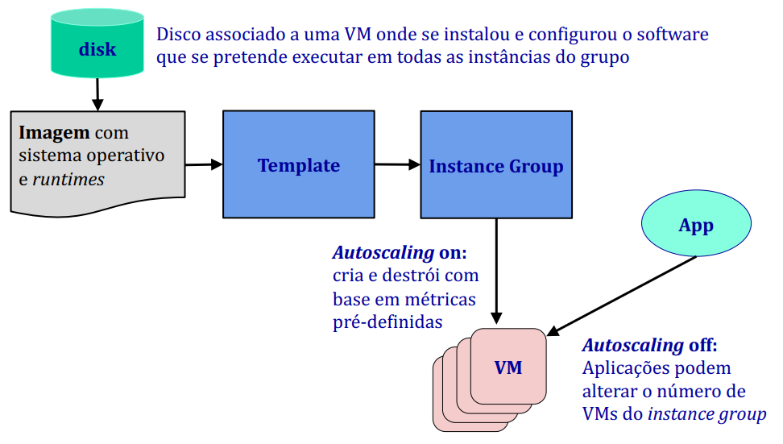

# __Serviço__ ___Compute Engine___

## __Gestão de Vms na GCP__

* ___Firewalls___;

* __Instâncias__:
    * Tipo -> Memória, CPU;
    * Rede;
    * Segurança;
    * Discos referem imagens.

* __Imagens__:
    * Pré-definidas no GCP;
    * Construídas a partir do disco de uma VM existente.

* ___Template___ -> Configuração pré-definida de uma instância;

* __Grupos de instâncias__:
    * Agrupamento de instâncias a partir de _templates_;
    * Aumento ou redução de instâncias (escalabilidade).

## __Criar uma VM base__

* Criar uma instância de uma VM;
    * Nome -> _my-vm_;
    * Série -> E2;
    * Tipo -> e2-small (2 vCPUs, 2GB de memória);
    * Em _boot disk_ -> escolher o sistema operativo (e.g. Debian);
    * Colocar as chaves SSH para acesso com o cliente SSH -> Bitvise.

* Após arranque da VM e utilizando o cliente SSH:
    * Instalar o _java_ -> `sudo apt-get install java-version-openjdk`;
    * Instalar software base -> servidores, aplicações, etc.

## __Controlo da Elasticidade de VMs__

<div align="center">



</div>


## __Grupos de Instâncias__

### ___Managed___

* VMs criadas a partir de um _template_, partilhando por isso um conjunto comum de configurações.

* Têm elasticidade, permitindo aumentar ou reduzir o número de VMs.

#### ___Stateless___

Processamento de pedidos obtendo o pedido a partir de filas de mensagens (e.g. _Pub/Sub_).

#### ___Stateful___

Aplicações _stateful_ com processamento de tarefas de longa duração que precisem de persistir estado intermédio.

### ___Unmanaged___

Grupos de VMs que não partilham o mesmo _template_.

## ___Scrips___ __de__ ___Startup e Shutdown___

Podem ser feitos:

* Através de _scripts_ configuradas no sistema operativo da VM, usando comandos específicos para a execução de tarefas;

* Através de _scripts_ associados ao _template_ que são executados pelo GCP no arranque e na desativação da VM.

## __API Java__

```java
/*
* Listagem de VMs numa zona
*/

static void listVMInstances(String project, String zone) throws IOException {
    System.out.println("==== Listing VM instances at zone: "+zone);
    try (InstancesClient client = InstancesClient.create()) {
        for (Instance instance : client.list(project, zone).iterateAll()) {
            System.out.println("Name: " + instance.getName() + " VMId:" + instance.getId());
            
            System.out.println(" Network interfaces:"+instance.getNetworkInterfacesCount());
            
            String ip = instance.getNetworkInterfaces(0).getAccessConfigs(0).getNatIP();
            
            System.out.println(" IP: " + ip);
            
            System.out.println(" Status: " + instance.getStatus() + " : Last Start time: " + instance.getLastStartTimestamp());
        }
    }
}

/*
* Start/Stop de uma VM
*/

static void startStoppedVM(String projectID, String zone, String instanceName) {
    try (InstancesClient client = InstancesClient.create()) {
        StartInstanceRequest request = StartInstanceRequest.newBuilder()
            .setProject(projectID)
            .setZone(zone)
            .setInstance(instanceName)
            .build();
        
        OperationFuture<Operation, Operation> fut = client.startAsync(request); // para parar fazer stopAsync
        while (!fut.isDone()) {
            System.out.println("waiting to start!");
            Thread.sleep(4 * 1000);
        }
    System.out.println("" + fut.get().getStatus().toString());
 }
}

/*
* Listagem de grupos de instâncias
*/

void listManagedInstanceGroups(String project, String zone) throws IOException {
    try (InstanceGroupManagersClient managersClient = InstanceGroupManagersClient.create()) {
        for (InstanceGroupManager manager : managersClient.list(project, zone).iterateAll()) {
            System.out.println("Name: " + manager.getName());
            System.out.println("Template: " + manager.getInstanceTemplate());
        }
    }
}

/*
* Listagem de VMs num grupo de instâncias
*/

static void listManagedInstanceGroupVMs(String projectId, String zone, String grpName) {
    InstanceGroupManagersClient managersClient = InstanceGroupManagersClient.create();
    ListManagedInstancesInstanceGroupManagersRequest request = ListManagedInstancesInstanceGroupManagersRequest.newBuilder()
    .setInstanceGroupManager(grpName)
    .setProject(projectId)
    .setReturnPartialSuccess(true)
    .setZone(zone)
    .build();
    
    System.out.println("Instances of instance group: " + grpName);
    for (ManagedInstance instance : managersClient.listManagedInstances(request).iterateAll()) {
        System.out.println(instance.getInstance()+"STATUS =" + instance.getInstanceStatus());
    }
}

/*
* Listagem do IP das VMs num grupo de instâncias
*/

void listIpInstancesFromGroup(String projectID, String zone, String groupName) {
    System.out.println("==== Listing IPs of running VM from na instance group: " + groupName);
    try (InstancesClient client = InstancesClient.create()) {
        for (Instance curInst : client.list(projectID, zone).iterateAll()) {
            if (curInst.getName().contains(groupName)) {
                System.out.println("Name: " + curInst.getName() + " VMId:" + curInst.getId());
                
                System.out.println("Network interfaces :"+curInst.getNetworkInterfacesCount());
                
                String ip = curInst.getNetworkInterfaces(0).getAccessConfigs(0).getNatIP();
                
                System.out.println("IP: " + ip);
                
                System.out.println("Status:"+curInst.getStatus()+ " : Last Start time:"+curInst.getLastStartTimestamp());
            }
        }
    }
}

/*
* Redimensionar o número de VMs num grupo de instâncias
*/

void resizeManagedInstanceGroup(String project, String zone, String groupName, int newSize) {
    System.out.println("================== Resizing instance group");
    InstanceGroupManagersClient managersClient = InstanceGroupManagersClient.create();
    
    OperationFuture<Operation, Operation> result = managersClient.resizeAsync(
        project,
        zone,
        groupName,
        newSize
    );
    
    Operation oper=result.get();
    System.out.println("Resizing with status " + oper.getStatus().toString());
}
```