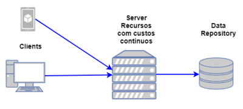
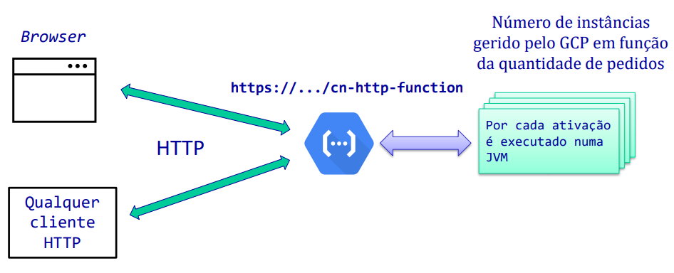

# ___Serverless Computing (FaaS)___

## ___Containers___

* Processos que correm no contexto do sistema operativo, geridos por um _runtime_;

* Fornecem um isolamento inferior ao das VMs mas superiror ao de processos regulares do sistema operativo, virtualizando o acesso ao sistema de ficheiros e utilizando os recursos (CPU, memória, etc.) de um sistema operativo _host_ com algumas restrições;

* Executam imagens binárias, previamente construídas, e comprometidas com uma ABI (_Application Binary Interface_) (e.g. linux).

## ___Event-driven serverless computing___

* Execução de código, em múltiplas linguanges, unicamente quando é necessário e com escalabilidade automática;

* O custo incorre unicamente durante a execução do código.

### __Computação Tradicional__

O servidor está ativo e a consumir recursos mesmo na ausência de eventos.

<div align="center">



</div>

### __Computação__ ___Serverless___

O servidor só está ativo e a consumir recursos durante o processamento de eventos.

<div align="center">


</div>

``É importante que o código a executar seja ___stateless___ porque o número de instâncias disponíveis e o seu tempo de vida é gerido pela infraestrutura.``

## ___Cloud Functions___

### __Invocação com__ ___Trigger HTTP___

Um pedido HTTP desencadeia a execução da função.

<div align="center">



</div>

* __E.g.__:

```java
public class Example implements HttpFunction {
    @Override
    public void service(HttpRequest request, HttpResponse response) throws Exception {
        BufferedWriter writer = response.getWriter();
        writer.write("Hello world!");
    }
}
```

### __Invocação com__ ___Trigger Pub/Sub___

Uma mensagem publicada no tópico desencadeia a execução da função.

<div align="center">


</div>

* __E.g.__:

```java
public class Example implements BackgroundFunction<Message> {
    private static final Logger logger = Logger.getLogger(Example.class.getName());
    
    @Override
    public void accept(Message msg, Context context) {
        String data = new String(Base64.getDecoder().decode(msg.data));
        logger.info(data);
    }
}

public class Message {
    String data;
    Map<String, String> attributes;
}
```

## ___Acknowledge___ __das Mensagens__

* É implicitamente assumido pelo retorno normal do método ``accept`` e em caso do método gerar uma falha, a mensagem não será repetida;

* A propriedade ``--retry`` (_retry on failure_) pode ser usada para garantir que a mensagem é repetida em caso de falha, no entanto, pode conduzir a comportamentos de repetição infinita/inesperados.

## __Vantagens__

* Programadores com foco no negócio e não em questões de infraestrutura;

* Adequadas para aplicações _event-driven_;

* Escalabilidade automática;

* Redução de custos.

## __Desvantagens__

* Não adequado para _long-term tasks_;

* O serem _stateless_ implica usar mecanismos externos para partilha de estado;

* Desadequadas para requisitos de baixa latência;

* Dificuldades de teste e _debugging_;

* _Vendor lock-in_.