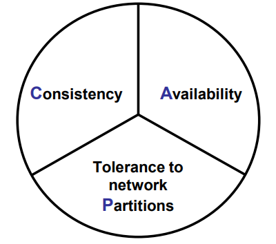
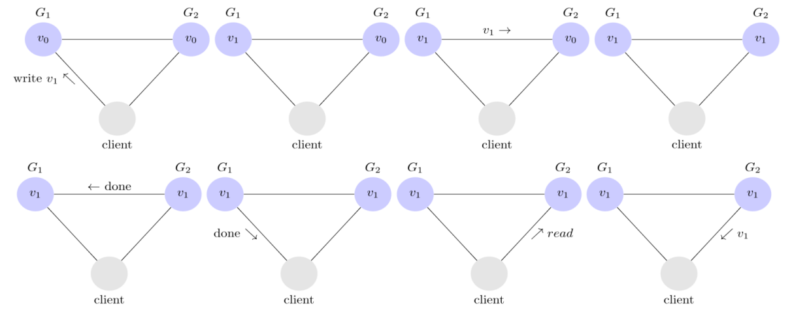
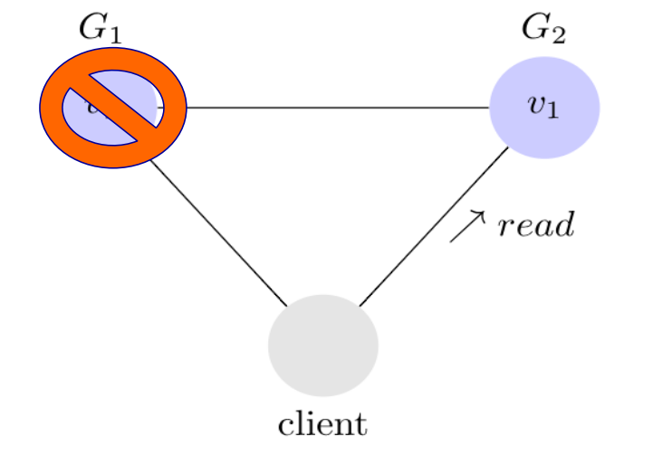
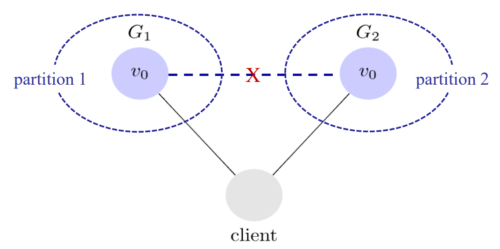

# __Características e Desafios da Computação Distribuída__

## __Heterogeneidade__

Capacidade de um sistema ser composto por __diferentes__ tipos de __hardware__ e __software__.

* Diferentes topologias de rede;
* Hardware de computadores;
* Sistemas operativos;
* Linguagens de programação;
* Bases de dados com diferentes paradigmas;
* Implementações em diferentes ambientes, usando diferentes middlewares.

E.g.: TCP/IP, HTTP, JSON, XML, etc.

#

## __Sistemas Abertos (_Openess_)__

Dada a heterogeneidade, a especificação e documentação das interfaces devem ser __públicas__, incluindo implementações de referência (e.g., Sockets, plataformas Java).

#

## __Segurança__

* __Privacidade__ -> Proteção contra acessos não autorizados;
* __Integridade__ -> proteção contra alterações e corrupção de dados;
* __Autenticação__ -> Garantia de que a entidade é quem diz ser;
* __Autorização__ -> Os utilizadores autenticados podem ter permissões diferentes para as diferentes actividades;
* __Dispoinibilidade__ -> Proteção contra interferências no acesso ao serviço.

* __Desafios__:
    * Proteção contra DDoS (Distributed Denial of Service);
    * Roubo de identidades;

#

## __Escalabilidade (_Scalability_)__

Capacidade de um sistema de __aumentar__ ou __diminuir__ a sua capacidade de processamento, armazenamento e comunicação, de acordo com as necessidades.

* __Desafios__:
    * Custo controlado de recursos físicos;
    * Avaliação e controle de desempenho;

* __Elasticidade__ -> escalabilidade automática.

* Condiçoes para a escalabilidade:
    * Aumento de utilização de CPU de VMs num determinado dia e hora;
    * Número de utilizadores concorrentes.

#

## __Tratamento de Falhas (_Fault Tolerance_)__

Capacidade de um sistema de __continuar a funcionar__ mesmo após a ocorrência de falhas, que num sistemda distribuído são __parciais__.

* __Técnicas__ para __lidar__ com __falhas__:
    * Redundância do hardware;
    * Retransmissão de mensagens;
    * Replicação de dados, recursos, servidores, etc em diferentes locais;
    * _Rollback_ -> Reposição de estados anteriores após uma falha.

#

## __Falhas Bizantinas__

Falhas arbitrárias usadas para descrever os piores cenários de falhas.

Um sistema distribuído é __tolerante a falhas bizantinas__ se ele continuar a funcionar corretamente, mesmo que alguns dos seus componentes falhem de forma arbitrária.

#

## __Concorrência__

Capacidade de um sistema de __executar__ várias __tarefas__ ao mesmo tempo.

* __Desafios__:
    * Controlo de acesso a recursos partilhados;
    * Coordenação e sincronização de tarefas.

#

## __Transparência__

Capacidade de um sistema de esconder a complexidade dos seus componentes e operações.

* __Acesso__ -> Acesso a recursos remotos como se fossem locais;
* __Localização__ -> Esconder onde estão os recursos;
* __Migração__ -> Permite a movimentação de recursos sem afetar o modo como são acedidos;
* __Concorrência__ -> Permite que múltiplos utilizadores acedam a recursos partilhados sem interferências;
* __Réplicas__ -> Permite que múltiplas cópias de recursos sejam usadas para aumentar a disponibilidade e desempenho.
* __Falhas__ -> Esconder a ocorrência de falhas e a sua recuperação.
* __Desempenho__ -> Permite a reconfiguração de recursos para melhorar o desempenho.
* __Escalabilidade__ -> Permite a escalabilidade de recursos sem alterar a estrutura do sistema.

#

## __Qualidade de Serviço (QoS)__

Capacidade de __garantir__ que os __utilizadores__ têm __acesso__ às funcionalidades de um __serviço__ dentro de limites definidos para determinados indicadores.

* __Características__:
    * Fiabilidade (_Reliability_);
    * Segurança;
    * Desempenho;
    * Capacidade de reconfigurar o sistema (_Adaptability_).

* __Metricas__:
    * Tempos de execução e de resposta;
    * Variações de carga (_workloads_) vs alocação dinâmica de recursos;
    * Possibilidade de monitorizar e definir restrições que garantam os níveis de serviços SLA (_Service Level Agreement_) adequados.

#

## __Teorema CAP__

Num sistema distribuído que partilhe dados só podemos ter 2 das 3 propriedades.

* __Consistência__ -> Cada leitura observa a última escrita.
    * E.g.:

* __Disponibilidade__ -> O sistema continua a funcionar na presença de falhas ou falha de conectividade de alguns nós.
    * $ \frac{Uptime}{Uptime + Downtime} $
    * ___Five Nines___ -> 99.999% de disponibilidade.
    * E.g.:

* __Tolerância a Partições__ -> O sistema continua a funcionar apesar de haver atraso ou falha na entrega de mensagens.
    * E.g.:

`Semântica BASE -> (Basically Available, Soft state, Eventual consistency)`

#

## __Falácias dos Sistemas Distribuídos__

* A __rede__ é __confiável__;
* A __latência__ é __zero__;
* A __largura de banda__ é __infinita__;
* A __rede__ é __segura__;
* A __topologia da rede não muda__;
* Existe um __único administrador__;
* O __custo de transporte__ é __zero__;
* A __rede__ é __homogénea__.

#

## __Largura de Banda vs Latência__

* __Largura de Banda__ -> Quantidade de dados que podem ser transmitidos por unidade de tempo.

* __Latência__ -> Tempo que demora a enviar um pacote de dados de um ponto a outro.