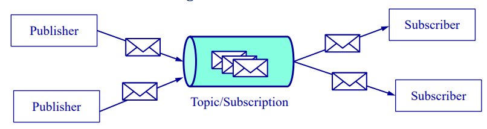
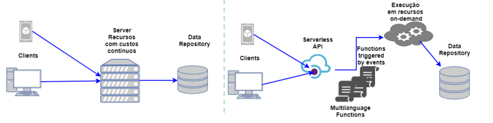

# ___Google Cloud Platform___

## __Armazenamento__

* __Disco__:
    * __Discos persistentes de bloco e SSD__ associados a instâncias de VM,
    * __Discos de rede__ -> _Filestore_ (_Network Attached Storage_).

* ___Cloud Storage___ -> armazenamento de __objetos binários__ (BLOBS).

* __Bases de dados não relacionais__ (_NoSQL_):
    * ___Firestore___;
    * ___Datastore___.

* __Bases de dados relacionais__:
    * ___SQL___;
    * ___Spanner___.

* __Bases de dados em memória__:
    * ___Memorystore___;
    * ___Redis___.

#

## __Serviço__ ___Pub/Sub___

Mantém estado sobre um conjunto de tópicos e de subscrições associada a cada tópico.

* ___Subscriber___ -> Recebe mensagens de uma subscrição.
* ___Publisher___ -> Envia mensagens para um tópico.

#

## __Computação__

* __Máquinas Virtuais__ (_Computer Engine_):
    * Diferentes dimensões (número de CPUs, memória, etc);
    * Regulares -> _start_/_stop_ controlado pelo utilizador;
    * Preemptivas -> _start_/_stop_ controlado pela _Google_;
    * Grupos de instâncias para escalabilidade horizontal e balanceamento de carga.

* ___Serverless computing___ -> _Cloud Functions_.

* __Contenedores__:
    * ___Kubernetes engine___;
    * ___Cloud Run___.

* ___App Engine___ -> Plataforma gerida para execução de aplicações web com suporte a várias frameworks.

#

#

## __Processamento de Dados (_Big Data_)__

* __Inteligência Artificial__:
    * _Vision_;
    * _Translation_.

* __Análise de Dados__:
    * _BigTable_;
    * _BigQuery_;
    * _Dataproc_;
    * _Genomics_.

#

## __Contas e Projetos__

* __Qualquer utilizador__ com uma __conta Google__ pode aceder aos __serviços GCP__.
* __1 utilizador__ de serviços GCP pode ter __N projetos__.
* __1 utilizador__ pode gerir __N contas de facturação__.
* __1 projeto__ consome recursos monetários de __1 conta de facturação__.
* __1 conta de facturação__ pode ser associada a __N projetos__.

#

## ___Virtual Desktop Infrastructure___ __(VDI)__

#

## __Porquê a Virtualização?__

* __Consolidação e sistemas legados__;

* __Isolamento__;

* __Ambientes de desenvolvimento/investigação__;

* __Rapidez de provisionamento e escalabilidade__;

* __Migração e balanceamento de carga__;

* ___Backups___ __e recuperação de desastres__;

#

## __Hipervisores__

* __Tipo 1__ -> Interage __diretamente com o hardware__ e não necessita de um sistema operativo, introduzindo menos ___overhead___;

* __Tipo 2__ -> Corre __sobre um sistema operativo__, tirando partido da transparência que o sistema tem a diferentes hardwares.