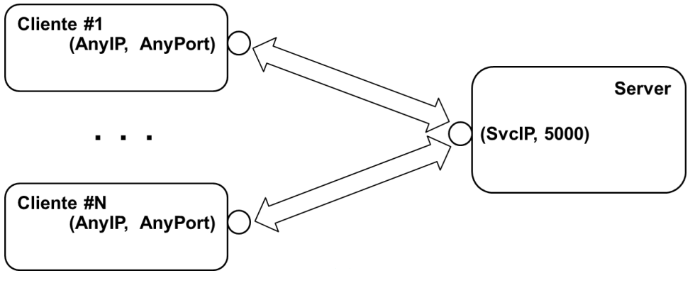

# __Evolução dos Mecanismos para Chamadas Remotas__

## ___Sockets TCP/IP___

* ___TCP___ -> Protoccolo "conection oriented" que permite __estabelecer conexões__ para __comunicar dados__ entre dois pontos, em que um ponto é o __cliente__ e o outro é o __servidor__.

* Para permitir a __existência de múltiplos conexões__ entre os __diferentes pontos__ são usadas __associações__ (___IP Addreess___, ___Port___).

#

## ___Sockets TCP/IP___ __em__ ___Java___

* __Classe__ ___ServerSocket___:
    * ``bind()`` -> Associação do _socket_ a um par (_IP_, porto _TCP_);
    * ``accept()`` -> Bloqueia até receber uma conexão.

* __Classe__ ___Socket___:
    * ``bind()`` -> Associação do _socket_ a um par (_IP_, porto _TCP_);
    * ``connect()`` -> Conecta o _socket_ a um _endpoint_ (_IP_, porto _TCP_);
    * ``getInputStream()`` -> Retorna um _InputStream_ para ler dados do __socket__;
    * ``getOutputStream()`` -> Retorna um _OutputStream_ para escrever dados no __socket__.
    * ``close()`` -> Fecha o _socket_.

* __Classes Úteis__:
    * ___InetSocketAddress___ -> Permite criar associações (_IP_, porto _TCP_);
    * ___BufferedReader___ -> Ler caracteres de uma _InputStream_;
    * ___InputStreamReader___ -> Uma ponte entre um _byte stream_ e um _char stream_;
    * ___PrintWriter___ -> Escreve objetos num output stream de texto.

<div align="center">



</div>

#

# ___Sockets TCP/IP___ __- Servidor__

```java

ServerSocket svcSocket = new ServerSocket(svcPort);
for (;;) {
    try {
        Socket cliSocket = svcSocket.accept();
        BufferedReader inStream = new BufferedReader(new InputStreamReader(cliSocket.getInputStream()));
        PrintWriter outStream = new PrintWriter(cliSocket.getOutputStream(), true);
        String request = inStream.readLine(); // recebe o request
        String response = processRequest(request);
        outStream.println(response); // envia a resposta
        cliSocket.close();
    } catch (IOException e) {
        System.out.println("Server crashed!");
        System.exit(-1);
    }
}
```

#

# ___Sockets TCP/IP___ __- Cliente__

```java
public static void main(String[] args) throws Exception {
    Socket client = new Socket(args[0], Integer.parseInt(args[1]));

    PrintWriter outSock = new PrintWriter(client.getOutputStream(), true);
    BufferedReader inSock = new BufferedReader(new InputStreamReader(client.getInputStream()));

    long start = System.currentTimeMillis();
    outScoke.println("Hello, world!");
    System.out.println("Received: " + inSock.readLine());
    long end = System.currentTimeMillis();

    System.out.println("Operation completed in " + (end - start) + "ms");
    client.close();
}
```

#

# ___Sockets TCP/IP___ __- Servidor concorrente__

<div align="center">


</div>


```java
public static void main(String[] args) throws Exception {
    System.out.println("Server concurrent on port 5000");
    ExecutorService executor = Executors.newFixedThreadPool(5);
    ServerSocket svcSocket = new ServerSocket(5000);
    int sessionId = 0;
    
    for (;;) {
        System.out.println("Accepting new connections... ");
        Socket client = svcSocket.accept();
        System.out.println("New connection with... " + client);
        Runnable worker = new Session(client, sessionId);
        executor.execute(worker);
    }
}
```

```java	
static class Session implements Runnable {
    Socket cliSocket = null; 
    int id; 
    BufferedReader inStream = null; 
    PrintWriter outStream = null;

    public Session(Socket cliSocket, int id) {
        this.cliSocket = cliSocket; this.id = id;
        try {
            inStream = new BufferedReader(new InputStreamReader(cliSocket.getInputStream()));
            outStream = new PrintWriter(cliSocket.getOutputStream(), true);
        } catch (IOException e) { e.printStackTrace(); }
    }

    @Override
    public void run() {
        try {
            String line = inStream.readLine();
            String[] tmp = line.split(" ");
            String bigWord = "";

            for (String s : tmp) { if (s.length() > bigWord.length()) { bigWord = s; } }
            Thread.sleep(10*1000); // simula tempo de processamento\
            
            outStream.println("biggest word: " + bigWord + " size = " + bigWord.length());
            cliSocket.close();
            System.out.println("Session " + id + " terminates");
        } catch (Exception ex) { 
            System.out.println("Server session " + id + " crashed!"); 
        }
    }
}
```