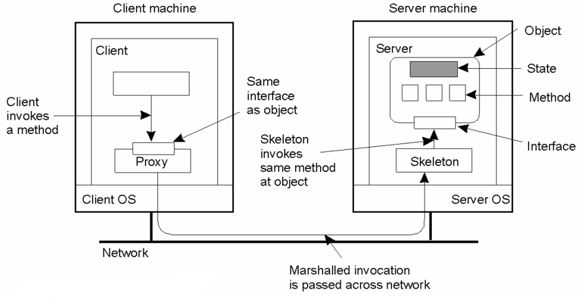
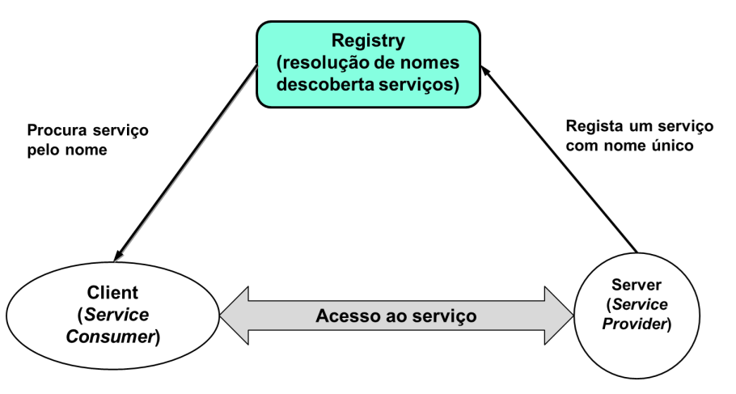
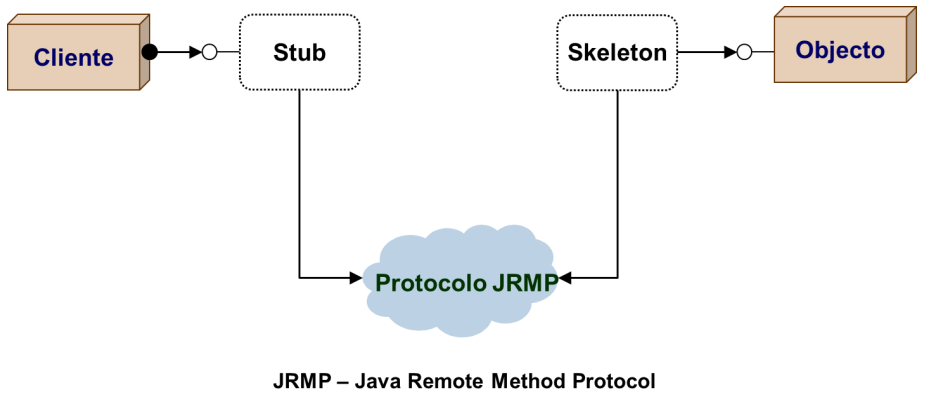
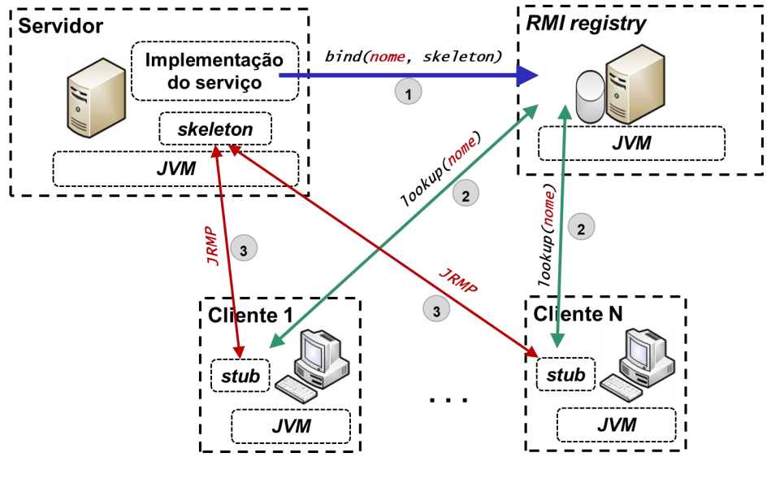
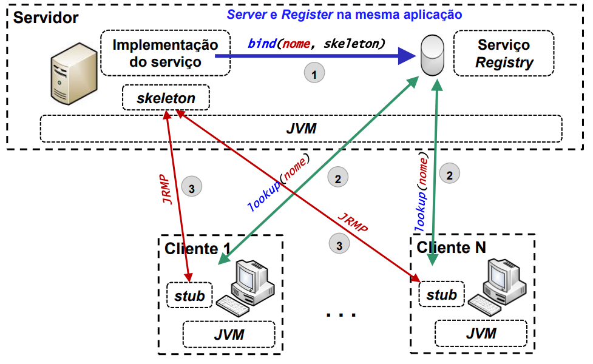
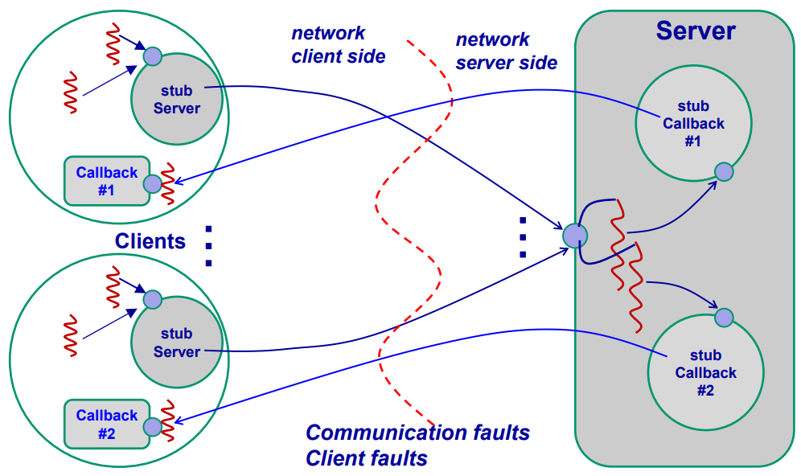

# __RMI__

## __Definição__

> Um objeto __distribuído/remoto__ é um objeto que disponibiliza uma __interface acessível__ através de protocolos de interação entre __objetos instanciados em computadores diferentes__, interligados por uma infraestrutura de rede.

## __Invocação Remota de Métodos__

<div align="center">



</div>

### __Cliente - Proxy__

Torna transparente a chamada de métodos no lado do cliente, comportando-se como um __objeto local__ em __representação do objeto remoto__.

Quando recebe uma invocação, redireciona-a através de uma mensagem para o objeto remoto, fazendo __marshalling do método e dos parâmetros__.

### __Servidor - Skeleton__

Conhece a interface do objeto remoto e é responsável por fazer o __unmarshalling__ da mensagem recebida, __invocar o método__ no objeto remoto e __devolver o resultado__ ao cliente.

## __Intermediação para Registo/Descoberta de Serviços__

> Analogia com __DNS__ para resolução de __nomes e IPs__.

<div align="center">



</div>

## __Chamadas Remotas vs Falhas__

### __Semântica Exactly-Once__

> Numa chamada, é garantido que o __target__ é __executado uma única vez__.

Em caso de falha, o __cliente__ pode reenviar a chamada, mas o __servidor__ deve ser capaz de __distinguir__ entre uma chamada __repetida__ e uma chamada __nova__.

### __Acoplamento Forte__

> Quando as partes são __altamente dependentes entre si__.

### __Acoplamento Fraco__

> Quando as partes __não têm dependências de implementação__, apenas de especificação de contratos (__interfaces__).

## __RMI em Java__

<div align="center">



</div>

## __Aplicação Cliente/Servidor em JVMs Diferentes__

<div align="center">



</div>

### __Especificação do Contrato - E.g__

```java
import java.rmi.Remote;
import java.rmi.RemoteException;

// Service Contract
public interface IPrimesService extends Remote {
    void findPrimes(IntervalNumbers interval, ICallback callback) throws RemoteException;
}

public interface ICallback extends Remote {
    void nextPrime(int prime) throws RemoteException;
}
```

```java
// Data contract
import java.io.Serializable;

public class IntervalNumbers implements Serializable {
    public IntervalNumbers(int start, int end) {
        this.start=start; this.end=end;
    }

    public int start;
    public int end;
}
```

## __Aplicação Cliente/Servidor na Mesma JVM__

<div align="center">



</div>

### __Servidor__

```java
public class Server implements IPrimesService {
    static String ServerRegisterIP="localhost";
    static int registerPort = 7000; static int svcPort = 7001;
    static Server svc = null;

    public static void main(String[] args) {
        try {
            Properties props = System.getProperties();
            props.put("java.rmi.server.hostname", ServerRegisterIP);
            svc = new Server();

            IContratoRMI stubSvc = (IContratoRMI)UnicastRemoteObject.
            exportObject(svc, svcPort);
            Registry registry = LocateRegistry.createRegistry(registerPort);
            registry.rebind("PrimesServer", stubSvc); //regista skeleton com nome lógico

            System.out.println("Server ready: Press any key to finish server");
            java.util.Scanner scanner = new java.util.Scanner(System.in);
            String line = scanner.nextLine(); System.exit(0);
        } catch (RemoteException e) {
            e.printStackTrace();
        } catch (Exception ex) {
            System.err.println("Server unhandled exception: " + ex.toString());
        }
}
```

```java
public class ConsoleCallback implements ICallback {
    @Override
    public void nextPrime(int prime) throws RemoteException {
        System.out.println("One more prime: " + prime);
    }
}
```

### __Cliente__

```java
public class Client {
    static String registerIP="localhost";
    static int registerPort = 7000;
    static String localIP="localhost";
    static ICallback callback=null;

    public static void main(String[] args) {
        try {
        // lookup RMI server in registry
        Registry registry = LocateRegistry.getRegistry(registerIP, registerPort);
        IPrimesService svc = (IPrimesService) registry.lookup("PrimesServer"); // obtém stub com nome lógico

        // invocação da operação com callback
        Properties props = System.getProperties();
        props.put("java.rmi.server.hostname", localIP);
        callback = new ConsoleCallback();
        ICallback callbackStub = (ICallback) UnicastRemoteObject.exportObject(callback, 0);
        
        // find primes between 1 and random number until 100
        IntervalNumbers interval=new IntervalNumbers(1, new Random().nextInt(50)+2);
        svc.findPrimes(interval, callbackStub);

        System.out.println("Press any key to finish client");
        java.util.Scanner scanner = new java.util.Scanner(System.in);
        String line = scanner.nextLine();
        System.exit(0);
        } catch (Exception ex) {
            ex.printStackTrace();
        }
    }
}
```

## __Comunicação Cliente/Servidor__

<div align="center">



</div>

## __Limitações da Abordagem Java RMI__

* __Dependente__ da plataforma __Java__;

* Protocolo de serialização de objetos díficil de partilhar com outras linguagens;

* Muito __dependente__ do __protocolo TCP/IP__ (endereços IP e portos TCP);

* __Sem suporte__ intrínseco para __operações assíncronas__;

* A __transparência à localização dos objetos RMI__ pode ser __mal usada__, e.g. fazer chamadas remotas com semântica de chamadas locais.