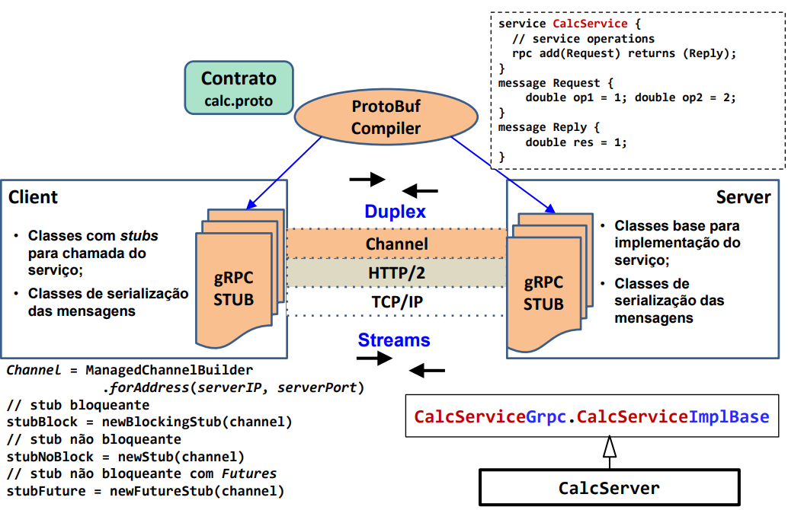
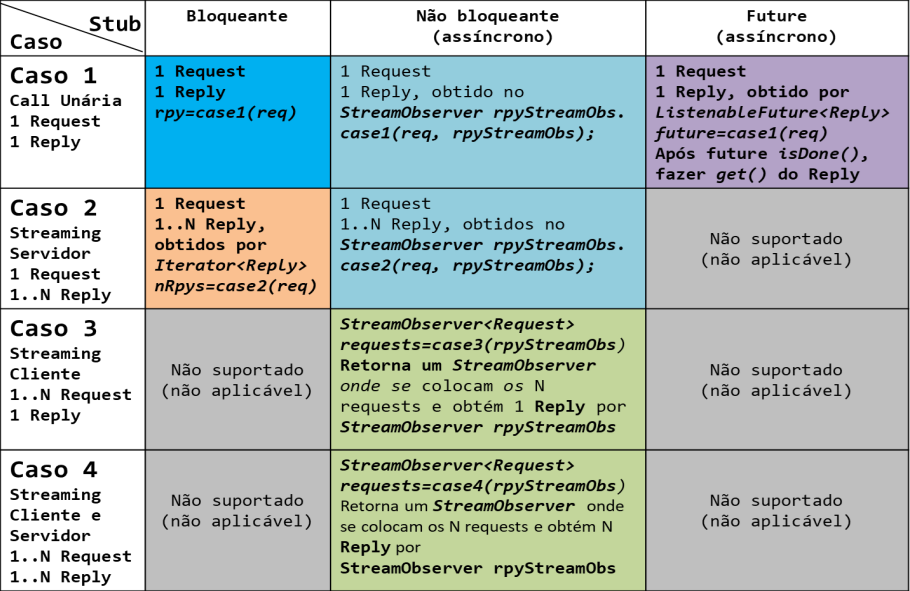
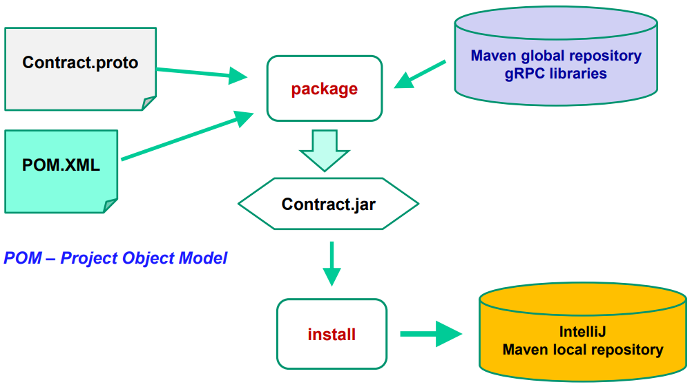
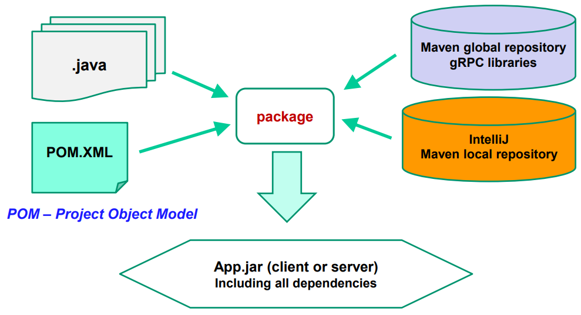

# __RPC__

## __Definição__
> __RPC__ (Remote Procedure Call) é um protocolo que permite a um programa executar um procedimento em outro endereço de memória num host diferente.

<div align="center">


</div>

* Suporte eficaz para o modelo cliente-servidor, mas com limitações para _callbacks_ e invocações assíncronas e _streaming_.

## __gRPC__

* Utilização do __protocolo HTTP/2__;

* Linguagem (___protobuf___) para definição de __contratos__ entre clientes e serviços;

* O compilador do contrato gera classes _Stub_ para __múltiplas linguagens de programação__;

* Existem ___plugins___ do compilador ___proto___ para __diferentes linguagens__.

### __Exemplo__

<div align="center">



</div>

### __Tipos de Chamadas__

* __Unária__
    > Semelhante à chamada de um método local.
    * ``rpc oper(Request) returns (Reply)``

* __Streaming__ __do servidor__
    > O cliente envia um pedido e obtém uma sequência de respostas em que é garantida a ordem.
    * ``rpc oper(Request) returns (stream Reply)``

* __Streaming__ __do cliente__
    > O cliente envia uma sequência de pedidos e obtém uma única resposta em que é garantida a ordem.
    * ``rpc oper(stream Request) returns (Reply)``

* __Streaming__ __do cliente e do servidor__
    > O cliente envia uma sequência de pedidos e obtém uma sequência de respostas em que é garantida a ordem para cada sequência.
    * ``rpc oper(stream Request) returns (stream Reply)``

<div align="center">



</div>

### ___Interface StreamObserver___

Nos casos em que se utilizam ___streams___ é necessário implementar a interface ___StreamObserver___.

```java
public interface StreamObserver<V> {
    void onNext(V value); // envio de mais uma mensagem na stream
    void onError(Throwable t); // envio de mensagem de erro (Throwable específico do gRPC)
    void onCompleted(); // fecho da stream
}
```

### ___Java Future___

Um ___Future___ representa um resultado de uma computação assíncrona, ou seja, uma computação que pode já ter terminado ou não.

```java
public interface Future<V> {
    boolean cancel(boolean mayInterruptIfRunning);
    boolean isCancelled();
    boolean isDone();
    T get();
    T get(long timeout, TimeUnit unit);
}

Future<SomeType> future = ... // get Future by starting async task

// do some other stuff

try {
    SomeType result = future.get(); // get the result
} catch (ExecutionException e) {
    // handle exception
}
```

## __gRPC com projetos Maven e IntelliJ__

### __Contrato__

<div align="center">



</div>

### __Cliente e Servidor__

<div align="center">



</div>

### __Contrato gRPC - Exemplo__

```protobuf
syntax = "proto3";

option java_multiple_files = true;
option java_package = "servicestubs";

package grpcservice; // package do proto

// Service contract operations
service Service {
    // ping server for testing service availability
    rpc isAlive(ProtoVoid) returns (TextMessage);

    // get first N even numbers 2,...,K
    rpc getEvenNumbers(IntNumber) returns (stream IntNumber);

    // add a sequence of numbers, ex: 1,2,10,5 = 18
    rpc addSeqOfNumbers (stream IntNumber) returns (IntNumber);

    // multiple add operations using a bidirectional stream
    rpc multipleAdd(stream AddOperands) returns (stream AddResult);
}

message ProtoVoid { }

message TextMessage {
    string txt = 1;
}

message IntNumber {
    int32 intnumber = 1;
}

message AddOperands {
    string addID = 1;
    int32 op1 = 2;
    int32 op2 = 3;
}

message AddResult {
    string addID = 1;
    int32 result = 2;
}
```

### __Implementação do Serviço - Exemplo__

```java
import io.grpc.Status;
import io.grpc.StatusException;
import io.grpc.stub.StreamObserver;
import servicestubs.*;

public class Service extends ServiceGrpc.ServiceImplBase {

public Service(int svcPort) {...}

@Override
public void isAlive(ProtoVoid request, StreamObserver<TextMessage> responseObserver) {...}

@Override
public void getEvenNumbers(IntNumber request, StreamObserver<IntNumber> responseObserver) {...}

@Override
public StreamObserver<IntNumber> addSeqOfNumbers(StreamObserver<IntNumber> responseObserver) {...}

@Override
public StreamObserver<AddOperands> multipleAdd(StreamObserver<AddResult> responseObserver) {...}
}
```

### __Servidor - Exemplo__

```java
public class GrpcServer { // generic ServerApp for hosting grpc Services
    private static int svcPort = 8000;

    public static void main(String[] args) {
        try {
            if (args.length > 0) svcPort = Integer.parseInt(args[0]);

            io.grpc.Server svc = ServerBuilder.forPort(svcPort)
                // Add one or more services.
                // The Server can host many services in the same TCP/IP port
                .addService(new Service(svcPort))
                .build();
            svc.start();

            System.out.println("Server started on port " + svcPort);

            // Java virtual machine shutdown hook
            // to capture normal or abnormal exits
            Runtime.getRuntime().addShutdownHook(new ShutdownHook(svc));

            // Waits for the server to become terminated
            svc.awaitTermination();
        } catch (Exception ex) {
            ex.printStackTrace();
        }
    }
}

public class ShutdownHook extends Thread {
    io.grpc.Server svc;

    public ShutdownHook(io.grpc.Server svc) { this.svc = svc; }

    @Override
    public void run() {
        System.err.println("*shutdown gRPC server, because JVM is shutting down");
        try {
            // Initiates an orderly shutdown in which preexisting calls continue
            // but new calls are rejected. So we can clean and finish work
            svc.shutdown();
            svc.awaitTermination();
        } catch (InterruptedException e) {
            e.printStackTrace(System.err);
        }
        System.err.println("*** server shut down");
    }
}
```

### __Cliente - Exemplo__

```java
import io.grpc.ManagedChannel;
import io.grpc.ManagedChannelBuilder;
import servicestubs.*;

public class Client { // generic ClientApp for Calling a grpc Service
    private static String svcIP = "localhost"; private static int svcPort = 8000;
    private static ManagedChannel channel;
    private static ServiceGrpc.ServiceBlockingStub blockingStub;
    private static ServiceGrpc.ServiceStub noBlockStub;

    public static void main(String[] args) {
        try {
            if (args.length == 2) { svcIP = args[0]; svcPort = Integer.parseInt(args[1]); }

            channel = ManagedChannelBuilder.forAddress(svcIP, svcPort)
                // Channels are secure by default (via SSL/TLS). Here we disable
                // TLS to avoid needing certificates.
                .usePlaintext()
                .build();

            blockingStub = ServiceGrpc.newBlockingStub(channel);
            noBlockStub = ServiceGrpc.newStub(channel);
            // Call service operations
            // . . .
        } catch (Exception ex) { 
            System.out.println("Unhandled exception"); 
        }
    }
}
```

```java
// caso 1 - bloqueante
TextMessage reply = blockingStub.isAlive(ProtoVoid.newBuilder().build());
System.out.println("Ping server:" + reply.getTxt());
```

```java
// caso 2 - bloqueante
try {
    int N = Integer.parseInt(read("How many even numbers?", new Scanner(System.in)));
    IntNumber intNumber=IntNumber.newBuilder().setIntnumber(N).build();
    Iterator<IntNumber> iterator = blockingStub.getEvenNumbers(intNumber);

    while (iterator.hasNext()) {
        System.out.println("more one even number: " + iterator.next().getIntnumber());
    }
} catch(Exception ex) {
    System.out.println("Synchronous call error: "+ex.getMessage());
}

// caso 2 - não bloqueante
int N = Integer.parseInt(read("How many even numbers?", new Scanner(System.in)));
EvenNumbersStream evenStream = new EvenNumbersStream();

noBlockStub.getEvenNumbers(IntNumber.newBuilder().setIntnumber(N).build(), evenStream);

while (!evenStream.isCompleted()) {
    System.out.println("Continue working until receive all even numbers");
    Thread.sleep(1000); // Simulate processing time (1 seg)
}

// caso 2 - StreamObserver
public class EvenNumbersStream implements StreamObserver<IntNumber> {
    boolean completed = false;

    @Override
    public void onNext(IntNumber reply) {
        System.out.println("More one even number:" + reply.getIntnumber());
    }

    @Override
    public void onError(Throwable throwable) {
        System.out.println("Completed with error:"  throwable.getMessage());
        completed = true;
    }

    @Override
    public void onCompleted() {
        System.out.println("Even numbers completed");
        completed = true;
    }

    public boolean isCompleted() {
        return completed;
    }
}
```

```java
// caso 3 - não bloqueante
int N = Integer.parseInt(read("How many even numbers?", new Scanner(System.in)));

StreamObserver<IntNumber> streamNumbers = noBlockStub.addSeqOfNumbers(
    new StreamObserver<IntNumber>() {
        @Override
        public void onNext(IntNumber intNumber) {
            System.out.println("Add total:" + intNumber.getIntnumber());
        }

        @Override
        public void onError(Throwable throwable) {
            System.out.println(throwable.getMessage());
        }

        @Override
        public void onCompleted() {
            System.out.println("Add sequence completed");
        }
    }
);

int N = Integer.parseInt(read("How many even numbers?", new Scanner(System.in)));
StreamObserver<IntNumber> streamNumbers = noBlockStub.addSeqOfNumbers();

for (int i = 1; i <= N; i++) // send N numbers using stream observer returned by service

streamNumbers.onNext(IntNumber.newBuilder().setIntnumber(i).build());
streamNumbers.onCompleted();

// caso 3 - StreamObserver
@Override
public StreamObserver<IntNumber> addSeqOfNumbers(StreamObserver<IntNumber> responseObserver) {
    return new StreamObserver<IntNumber>() {
        int soma = 0; // To accumulate values

        @Override
        public void onNext(IntNumber intNumber) {
            soma += intNumber.getIntnumber(); // Process request
        }

        @Override
        public void onError(Throwable throwable) { . . . }

        @Override
        public void onCompleted() {
            System.out.println("client completed requests -> server complete the response");
            responseObserver.onNext(IntNumber.newBuilder().setIntnumber(soma).build());
            responseObserver.onCompleted();
        }
    };
}
```

```java
// caso 4 - não bloqueante
StreamObserver<AddOperands> streamDoAddOperations = noBlockStub.multipleAdd(
    new StreamObserver<AddResult>() {
        @Override
        public void onNext(AddResult addResult) {
            System.out.println("Result ID("+addResult.getAddID()+")=" + addResult.getResult());
        }

        @Override
        public void onError(Throwable throwable) {
            System.out.println("onError:" + throwable.getMessage());
        }

        @Override
        public void onCompleted() { 
            System.out.println("Add operations requests completed"); 
        }
    }
);

for (int i = 0; i < 20; i++) { // Do a sequence of 20 add operations
    int x = new Random().nextInt(10) + 1; int y = new Random().nextInt(10) + 1;
    System.out.println("Call to operation:(" + "ID" + i + "," + x + "," + y + ")");
    
    AddOperands oper = AddOperands.newBuilder().setAddID("ID"+i).setOp1(x).setOp2(y).build();

    streamDoAddOperations.onNext(oper);
}
streamDoAddOperations.onCompleted();

// caso 4 - StreamObserver
@Override
public StreamObserver<AddOperands> multipleAdd(StreamObserver<AddResult> responseObserver) {
    return new StreamObserver<AddOperands>() {
        @Override
        public void onNext(AddOperands addOperands) {
            System.out.println("Operands of ID=" + addOperands.getAddID());
            AddResult result = AddResult.newBuilder()
                .setAddID(addOperands.getAddID())
                .setResult(addOperands.getOp1() + addOperands.getOp2())
                .build();
            simulateExecutionTime();
            responseObserver.onNext(result);
        }

        @Override
        public void onError(Throwable throwable) { }

        @Override
        public void onCompleted() {
            System.out.println("client completed requests the responses are completed ");
            responseObserver.onCompleted();
        }
    };
}
```