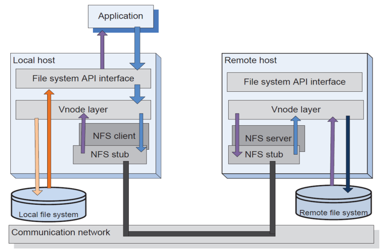
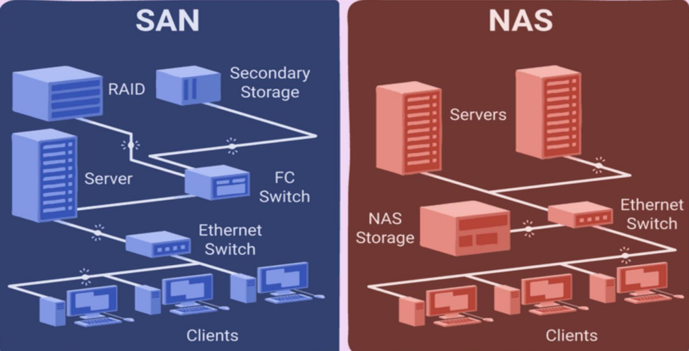
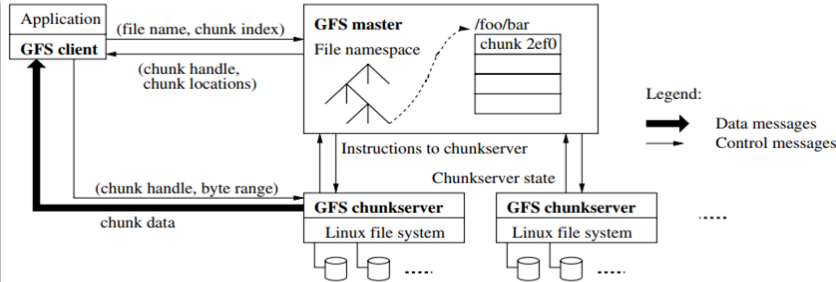

# __Armazenamento Distribuído de Ficheiros__

## ___Network File System (NFS)___

Um __utilizador__ na máquina ___Client___ através da __rede__ pode aceder a __ficheiros remotos__ como se fossem __ficheiros locais__.

## ___Storage Area Network (SAN) vs Network Attached Storage (NAS)___

### __SAN__

__Rede de alta velocidade__ que faz __conexões__ entre __dispositivos de armazenamento e servidores__.

### __NAS__

Partilha __ficheiros__ através da __rede__.

## __Dificuldades dos__ ___File Systems___ __Hierárquicos__

* __Múltiplos acessos a disco__ para localizar os blocos do ficheiro;

* __Tempos de acesso__ _read/write_ altos quando a __profundidade da árvore aumenta__;

* __Dificuldades__ de manter __réplicas consistentes__;

* __Dificuldades__ de manter __versões de ficheiros__ (uma versão é tipicamente uma __cópia integral do ficheiro__);

* NFS, SAN E NAS:
    * ___Bottlenecks___ no lado dos servidores de controlo do _storage_;
    * Utilização de __cache em memória__, com __perda de desempenho__ perante cenários de __escritas frequentes__.

## ___Big Data___

* __Grande__ capacidade de __processamento de dados__;

* __Grande diversidade__ de fontes e __tipos de dados__;

* __Grande dimensão de dados__;

* __Redução do tempo de acesso aos dados__, suportando distribuição de conteúdos em streaming;

* __Replicação em larga escala__ para aumentar disponibilidade e tolerância a falhas, assumindo cenários em que os updates não são frequentes e portanto não degrada o desempenho;

## ___Google File System (GFS)___

* __Escalabilidade__ e __tolerância a falhas__;

* __Ficheiros__ de __grandes dimensões__;

* A __leitura sequencial__ dos ficheiros é o mais __frequente__;

* __Escrita aleatória__ do conteúdo dos ficheiros é __rara__, quando muito é sempre __uma operação _append___;

* __Privilegiar o processamento de grande quantidade de dados__ sem preocupação do tempo de _read/write_ de ficheiros individuais;

* __Relaxar a consistência__, privilegiando a replicação para __aumentar disponibilidade__.

### __Arquitetura__

* Um __ficheiro__ é segmentado em ___chunks___;

* Só a __operação _append___ __no mesmo ficheiro é atómica__ suportando __concorrência__;

* __Eliminar cache do lado do cliente__ para facilitar a garantia de __consistência__;

* __Assegurar consistência__ de operações críticas (_write_, _delete_, etc.) através de um __componente centralizado__ (_master_) que controla todo o __sistema__;

* Suporte para ___checkpoints_, mecanismos de recuperação e _garbage collection___ eficientes;

* O ___master___ controla um conjunto de ___chunk servers___, mantendo de forma persistente a __metadata do ficheiro__ (nome, ACL; localização das réplicas dos _chunks_ de cada ficheiro, e estado de cada _chunk server_);

* Para __recuperar de falhas__ o _master_ mantém um ___Log_ com checkpoints e as operações__, podendo repetir as operações desde o checkpoint anterior;

* Os _chunk servers_ são ___Linux___ e cada um é um __ficheiro__ com um _handle_;

* Uma aplicação para fazer ___read/write___ acede ao ___master___ que lhe devolve um ___handle___ para o ___chunk___ e a __localização do mesmo num _chunk server___.