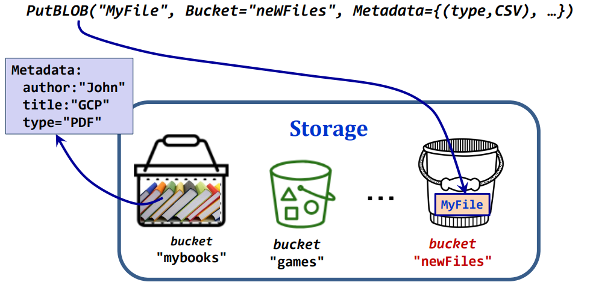
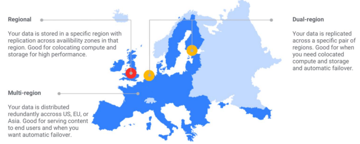
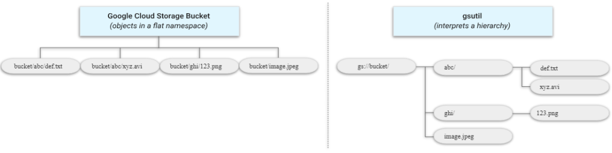
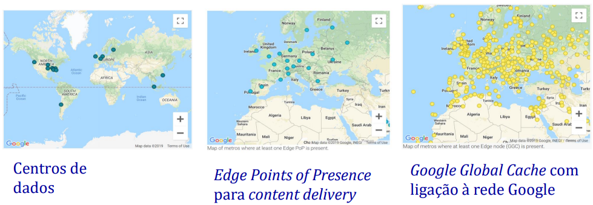

# __Serviço__ ___Google Cloud Storage___

## __Armazenamento de Objetos Binários__

O armazenamento na Cloud usa um modelo ___Flat___ ou ___data lake___, onde os dados são em ___BLOBS___.

### ___Binary Large Object (BLOB)___

Objetos imutáveis identificados por identificadores únicos e um conjunto de tags que definem os metadados sobre o ficheiro.

## __Armazenamento como Agrupamentos de Objetos__

### ___Strorage GCP___

Armazenamento baseado em __coleções/agrupamentos__ (___buckets___) de ___BLOBs___ de qualquer tipo de dados.

__E.g.:__

<div align="center">



</div>

## __Requesitos do Serviço GCS__

* Diferentes __tipos de localização__;

* __Classes de acesso aos dados__, desde alta frequência a menos frequente;

* __Alta disponibilidade__ (> 99 %) com __replicação distribuída__ geograficamente;

* __Tolerância a falhas__ (energia, hardware e humanas);

* __Tempos de resposa__ na ordem dos __milisegundos__;

* Um objeto pode ter __até 5 TB__;

* __Consistência__ ao nível do objeto ___BLOB___;

## __Tipos de Localização__

<div align="center">



</div>

### __Regional__

Dados armazenados numa __localização específica__, __sem ter redundância__ em largas áreas geográficas.

### __Dual-Regional__

Dados armazenados em __2 regiões__ com disponibilidade na __presença de falhas__ ou ___disaster recovery___.

### __Multi-Regional__

Dados armazenados com redundância em __várias regiões__ com disponibilidade na __presença de falhas__ ou ___disaster recovery___.

__Ideal__ para __dados acedidos frequentemente__ (jogos, _website_, etc.).

## __Tipos de Clase de Acesso__

<div align="center">


</div>

## __Criação e Acesso a__ ___Buckets e BLOBs___

Podem ser criados e acessados através de:

* __Consola web do GCP__;

* __URL__ de __BLOBs públicos__;

* Ferramenta ``gsutil`` (do _Google Cloud SDK_);

* __APIs gRPC e REST__ com clientes em __várias linguagens de programação__.

## __Como Funciona o Espaço de Nomes__

Não pode haver ___buckets___ com nomes iguais em diferentes projetos, visto que o nome do ___bucket___ é único e global.

Os nomes dos ___blobs___ podem conter "/" para criar uma hierarquia de diretórios (ilusória).

<div align="center">



</div>

## __Listas de Controlo de Acessos - Permissões__

### ___Uniform___

Lista de controlo de acessos __única para todos os objetos__ de um ___bucket___.

### ___Fine-Grained___

Lista de controlo de acessos __específica para cada objeto__ de um ___bucket___.

### __Grupos Especiais__

* ___allUsers___: __todos os utilizadores__ mesmo que não tenham conta GCP;

* ___allAuthenticatedUsers___: __todos os utilizadores__ autenticados com conta GCP.

## __Metadados__

Cada objeto tem __metadados__ associados na forma de __pares chave-valor__:

* ___Acesss control metadata___;

* ___Cache-Control___;

* ___Content-Disposition___;

* ___Content-Encoding___;

* ___Content-Language___;

* ___Content-Type___;

Acrescentar __novas chaves__ tem __custos extra no armazenamento e transporte__ (cada __caracter__ de __chave ou valor conta 1 byte__).

## ___Cache-Control___

Regula se os __objetos__ são mantidos em __cache__ nos __nós__ da Google mais __próximos do pedido__.

<div align="center">



</div>

## __Consistência__

### __Consistência Forte__

* ___Read-after-write___;

* ___Read-after-metadata-update___;

* ___Read-after-delete___;

* ___Bucket listing___ -> listagem do ___bucket___ após criação;

* ___Object listing___ -> listagem do objeto após criação.

### __Consistência Eventual__

* ___Granting or Revoking access from resources___ -> para acessos após dar ou revogar permissões;

* Objetos com cache ativa na metadata de ___cache-control___.

## __Boas Práticas__

* Não usar como __nome__ de ___bucket___ __dados sensíveis__;

* __Nomes diferentes__ podem ser gerados usando __GUIDs__;

* Perante __erros__, deve usar-se __técnicas__ de ___retry___ segundo uma abordagem ___exponential backoff___.

## __Limites__

* Por projeto, a __criação e destruição__ de ___buckets___ está __limitada__ por um número de __operações por segundo__;

* O __ritmo de escritas__ pode __variar ao longo do tempo__;

* Distribuição dos ___Blobs___ por múltiplos __servidores__.

## __API Java__

### __Autenticação no Acesso ao Serviço__

```java
/* Variável de ambiente com chave
* GOOGLE_APPLICATION_CREDENTIALS=<pathname do ficheiro json com chave>
*/

static void authWithEnvironmentalVariable() {
    StorageOptions options = StorageOptions.getDefaultInstance();

    String projID = options.getProjectId();
    Storage storage = options.getService();
    
    // operations with storage object
    // - create bucket
    // - create blob
    // ...
}
```

### __Classes e Localização de__ ___Storage___
    
```java
// classe StorageClass existente na API Java
StorageClass[] CLASSES =
    new StorageClass[]{
    StorageClass.STANDARD,
    StorageClass.NEARLINE,
    StorageClass.COLDLINE,
    StorageClass.ARCHIVE
};
```

### __Principais Classes__

````java
BucketInfo
    .newBuilder("bucket-name")
    .setStorageClass(StorageClass.STANDARD)
    .setLocation("EUROPE-WEST1")
    .build();

BlobId blobId = BlobId.of(bucketName, blobName);

String contentType = Files.probeContentType(pathnameFile);

BlobInfo blobInfo = BlobInfo
    .newBuilder(blobId)
    .setContentType(contentType)
    .build();
````

### __Interface__ ___Storage___

````java
Bucket create(BucketInfo bucketInfo)

Blob create(BlobInfo blobInfo, byte[] data)

Bucket get(String bucketName)

Blob get(BlobId blobId)

boolean delete(BlobId blobId)

// retorna a lista de buckets
Iterable<Bucket> list()

// retorna canal para download de um stream de bytes
ReadChannel reader(BlobId blobId)

// retorna canal para upload de um stream de bytes
WriteChannel writer(BlobInfo blobInfo)
````

### __Classe__ ___Blob___

````java
boolean delete()

void downloadTo(Path path)

// retorna canal para download de um stream de bytes
ReadChannel reader()

// atualiza o metadado cache-control para não ter cache
blob.toBuilder().setCacheControl("no-cahe").build().update()

// atualiza os metadados do blob com pares <key, value>
Map<String, String> newMetadata = new HashMap<String, String>()
    {{ put("key1", "value1"); put("key2", "value2"); }};

blob.toBuilder().setMetadata(newMetadata).build().update()

// atualiza a Access Control List (ACL) do blob
Acl createAcl(Acl acl)
````

### __Exemplos__

````java
public void listBuckets(String projID) {
    System.out.println("Buckets in Project=" + projID + ":");

    for (Bucket bucket : storage.list().iterateAll()) {
        System.out.println(" " + bucket.toString());
        for (Blob blob : bucket.list().iterateAll()) {
            System.out.println(" "+blob.toString());
        }
    }
}

public Bucket CreateBucket(String bucketName, StorageClass storageClass,
String location) {
    Bucket bucket = storage.create(
        BucketInfo
            .newBuilder(bucketName)
            .setStorageClass(storageClass)
            .setLocation(location)
        .build()
    );
    return bucket;
}

public void deleteBucket(String bucketName) {
    Bucket bucket = storage.get(bucketName);
    bucket.delete();
}

public BlobId uploadBlobToBucket(String bucketName, String blobName,
String absFileName) throws Exception {
    Path uploadFrom=Paths.get(absFileName);
    String contentType=Files.probeContentType(uploadFrom);

    BlobId blobId = BlobId.of(bucketName, blobName);
    BlobInfo blobInfo = BlobInfo
        .newBuilder(blobId)
        .setContentType(contentType)
        .build();

    if (Files.size(uploadFrom) < 1_000_000) {
        byte[] bytes = Files.readAllBytes(uploadFrom);
        storage.create(blobInfo, bytes);
    } else {
        try (WriteChannel writer = storage.writer(blobInfo)) {
            byte[] buffer = new byte[1024];
            try (InputStream input=Files.newInputStream(uploadFrom)) {
                int limit;
                while ((limit = input.read(buffer)) >= 0) {
                    try {
                        writer.write(ByteBuffer.wrap(buffer, 0, limit));
                    } catch (Exception ex) {
                        ex.printStackTrace();
                    }
                }
            }
        }
    }
    return blobId;
}

public void downloadBlobFromBucket(String bucketName, String blobName,
String absFileName) throws Exception {
Path downloadTo = Paths.get(absFileName);
    BlobId blobId = BlobId.of(bucketName, blobName);
    Blob blob = storage.get(blobId);

    PrintStream writeTo = new PrintStream(Files.newOutputStream(downloadTo));

    if (blob.getSize() < 1_000_000) {
        byte[] content = blob.getContent();
        writeTo.write(content);
    } else {
        try (ReadChannel reader = blob.reader()) {
            WritableByteChannel channel = Channels.newChannel(writeTo);
            ByteBuffer bytes = ByteBuffer.allocate(64 * 1024);
            while (reader.read(bytes) > 0) {
                bytes.flip();
                channel.write(bytes);
                bytes.clear();
            }
        }
    }
    writeTo.close(); 
}

// Alterar permissoes de um blob
BlobId blobId = BlobId.of(bucketName, blobName);
Blob blob = storage.get(blobId);

Acl.Entity aclEnt = Acl.User.ofAllUsers();
Acl.Role[] roles = Acl.Role.values();
Acl.Role role = Acl.Role.READER;
Acl acl = Acl.newBuilder(aclEnt, role).build();

blob.createAcl(acl);

// Operações em batch com notificação
StorageBatch batch = storage.batch();
for (Blob blob : bucket.list().iterateAll()) {
    final String blobName = blob.getName();

    batch.delete(blob.getBlobId()).notify(
        new BatchResult.Callback<Boolean, StorageException>() {
            @Override
            public void success(Boolean aBoolean) {
            System.out.println(blobName+" was deleted");
            }

            @Override
            public void error(StorageException e) {
                System.out.println(blobName+" Error!!!");
            }
        }
    );
}
batch.submit();
````