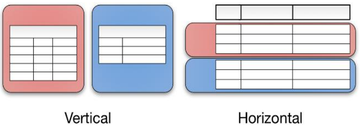
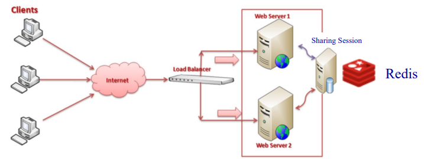
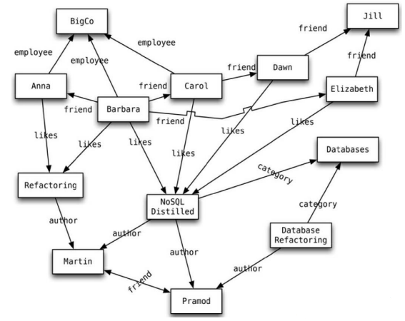
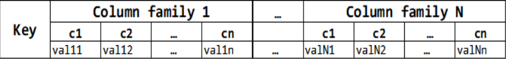

# __Armazenamento em Bases de dados NoSQL__

## __Modelo Relacional__

* __Persistência de dados__ -> Capacidade de __persistir grandes quantidades de dados__ incomportáveis de manter em memória;

* __Concorrência__ -> Permitir que __múltiplos utilizadores acedam e alterem os dados sem confiltos__;

* __Transações__ -> Permitir que uma __sequência de ações__, incluindo alterações de dados, sejam __executadas atomicamente__;

* __Integração__ -> Permitir que __aplicações em diferentes tecnologias__ possam partilhar (__aceder e alterar__) dados num __único repositório__;

* ___Standards___ -> Com a __álgebra relacional e a linguagem standard SQL__ é possível usar BDs relacionais em __múltiplos cenários aplicacionais__;

* __Impedance Mismatch__ -> __Limitações de representação__ no modelo relacional (_Relation, Tuple, Attributes_) de modelos de informação em memória onde podemos ter __representações agregadas, de dados, mais complexas e menos estruturadas face ao modelo relacional__.

    * Os ___frameworks___ _Object-relational mapping_ (ORM) resolvem parte do problema mas introduzem __perdas de desempenho__ e podem introduzir __falhas de consistência__ (má utilização: cache de dados nos objetos).

## ___Clusters___ __de Computadores__

O aparecimento de _clusters_ de computadores possibilita a __escalabilidade horizontal__ (_scale-out_).

Num cenário (_scale-up_) as maiores exigências de processamento e armazenamento de dados implicam __computadores de custo elevado__ existindo um __limite de crescimento__.

A alternativa é usar (_scale-out_) com uma __grande quantidade de pequenos computadores__ ligados em _cluster_, permitindo também __maior resiliência a falhas__.

• O __modelo relacional não é apropriado__ para trabalhar em clusters.

### __Vantagens__

* __Escalabilidade elevada__ -> Milhares de máquinas;

* __Custos reduzidos__ -> O custo de 10 máquinas de menor capacidade é inferior a uma máquina com capacidade idêntica;

* __Flexibilidade__ -> Os dados não têm de ser estruturados segundo um _schema_ como no modelo relacional, permitindo __formas flexíveis__ de agregar os dados (_key-value, document, column, graph_);

* __Disponibilidade__ -> __Replicação intensiva__ garantindo menores _bottlenecks_ e suporte para __tolerância a falhas__.

## __Distribuição de Dados__

### ___Sharding___

__Fragmentação de dados em múltiplos servidores__ de um _cluster_, em que __cada servidor contém um subconjunto dos dados__. 

### ___Replication___

__Cópias dos dados existem em múltiplos servidores__, permitindo múltiplos acessos aos mesmos dados em diferentes servidores.

* ___Master-slave___: Um nó ____master_ gere as escritas___, enquanto os nós ___slave_ só suportam leituras__ sincronizando-se com o _master_;

* ___Peer-to-peer___: __Escritas em qualquer nó__, necessitando de __coordenação para evitar conflitos__ na atualização das várias réplicas.

A replicação ___Master-slave_ reduz os conflitos de atualização dos dados__ mas,
por outro lado, a replicação ___peer-to-peer_ evita a sobrecarga de escritas num
único ponto de falha__.

## __Bases de Dados NoSQL__

* __Não__ usam o __modelo relacional__;

* Executam-se e suportam armazenamento de dados em _clusters_ de __múltiplos computadores__;

* __Múltiplas soluções__ _open-source_;

* ___Schemaless___ -> __Não existe um _schema_ rígido__ como no modelo relacional;

* __Flexibiliza__ a __persistência de dados__ (utilização híbrida de bases de dados consoante os requisitos da aplicação).

### ___BASE___

* __BA__ (___Basically Available___) -> __Podem existir falhas parciais__ nalgumas partes do sistema distribuído, __continuando o resto do sistema a funcionar__, principalmente na presença de réplicas;

* __S__ (___Soft state___): __Os dados podem estar desatualizados__ (expirados), sendo necessário __atualizá-los com processamento posterior__;

* __E__ (___Eventually consistent___) -> Os __dados podem estar inconsistentes durante alguns intervalos de tempo__.

## ___Tipos de Bases de Dados NoSQL___

__Todos partilham__ a noção que __existe uma key__ usada para obter (_lookup_) um agregado de dados.

### ___Key-value___

O agregado é opaco, permitindo unicamente obter o __total do agregado através de uma key__.

### ___Document___

Permite __queries baseadas na estrutura interna__ do agregado (documento)

### ___Graph___

Organizam os dados em grafos (nós e arcos) permitindo __associações complexas entre entidades__.

### ___Collumn - Family___

Permite estruturar o agregado em __famílias de colunas__ permitindo à base de dados usar __estratégias de _sharding___ das diferentes famílias de colunas.

## __Modelos de dados do__ ___Firestore___

* Uma base de dados é um __conjunto de coleções__;

* __Coleções contêm documentos__, os quais __têm identificadores únicos__ (_Document ID_) e representam agregados de campos (_fields_) de vários tipos:
    * inteiros, booleanos, _arrays_, pontos geográficos, maps, _reference_ para outros documentos;

* __Documentos da mesma coleção__ podem ter __número e tipo de campos diferentes__;

* __Um documento__ pode conter __novas coleções__ com até um __máximo de 100 níveis de profundidade__;

* __Documentos devem ser pequenos__ com máximo 1 MiB (mebibyte = 1024*1024 bytes).