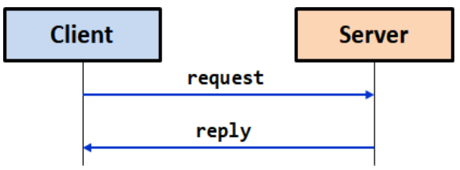
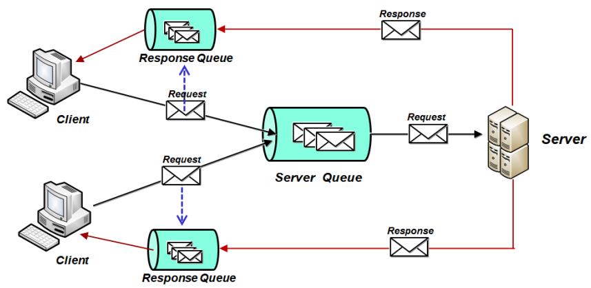
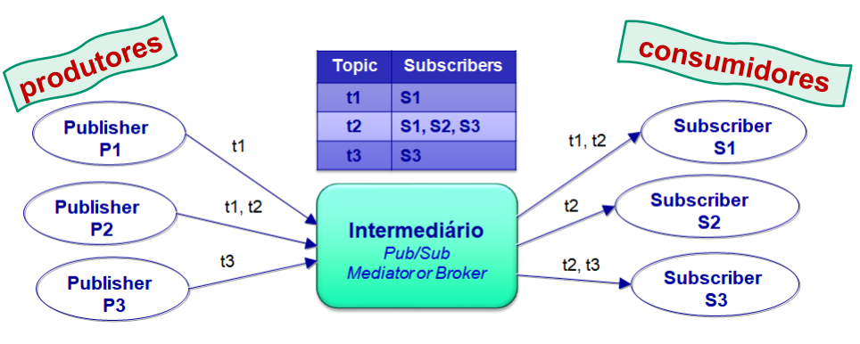

# __Pub/Sub__

## __Modelo Cliente-Servidor__

### __Desvantagens__

* Interação limitada a 2 participantes;

* Cada um tem de conhecer os endereços do outro;

* Os 2 participantes têm de estar presentes no mesmo tempo;

* A comunicação é unicamente _pull-based_ e nerentemente síncrona.

## __Modelo de Comunicação por Eventos/Mensagens__

* Desacoplamento entre produtores e consumidores de eventos/mensagens num sistema distribuído;

* Diferentes ritmos de produção/consumo de eventos/mensagens.

* Os produtores enviam mensagens para um intermediário (_broker_) que armazena as mensagens em filas até serem consumidas;

* Um único ou múltiplos consumidores podem registar-se no intermediário para receberem as mensagens.

### __Exemplo__

Cada cliente envia na mensagem de _request_ o nome da sua fila para respostas, podendo desconectar-se sem perder as respostas.

Vários servidores partilham uma fila global para processar pedidos, permitindo balanceamento de carga e tolerância a falhas.

## __Modelo__ ___Publish/Subscribe___

* Um intermédio mantêm estado sobre um conjunto de tópicos;

* Um tópico tem associado uma ou mais filas;

* Um conjunto de subscritores, recebem as mensagens de uma ou mais filas.

### __Exemplo__

