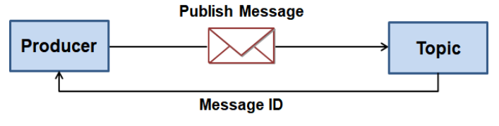
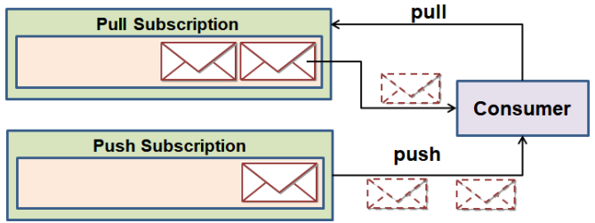
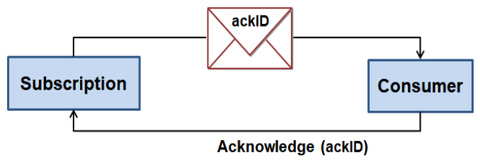
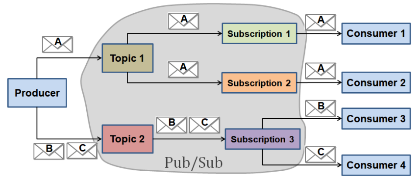
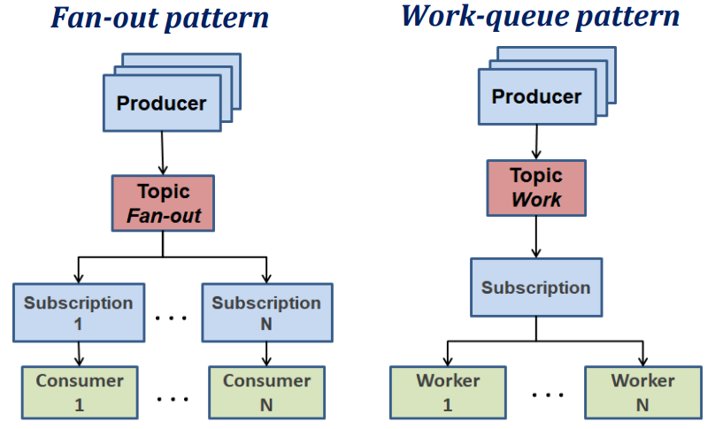

# __Serviço Google Pub/Sub__

## __Fluxo de uma Mensagem__

1. O produtor da mensagem escolhe um tópico (_Topic_) para onde pretende enviar a mensagem;

2. O produtor envia a mensagem (_Publish_) para o tópico escolhido;

3. A infraestrutura Pub/Sub recebe a mensagem, atribui-lhe um ID único no tópico e retorna-o para o produtor como confirmação da receção da mensagem;

<div align="center">



</div>

4. Um tópico pode ter uma ou mais subscrições (_Subscription_) associadas, pelo que as mensagens enviadas para o tópico são replicadas nas filas de cada subscrição;

5. Os consumidores (_Subscribers_) subscrevem subscrições que podem ser de dois tipos:

    * __Pull__: As mensagens são retidas na fila até os consumidores as irem retirar;
    
    * __Push__: A subscrição ativamente envia as mensagens para um _endpoint_ pertencente ao consumidor e que tem de ser pré-definido na subscrição.

<div align="center">



</div>

6. Independentemente da forma como a mensagem chegou ao consumidor é necessário enviar para a subscrição um ___Acknowledge___ da receção e processamento da mensagem.

    6.1. Se o _acknowledge_ não chegar no intervalo definido, a mensagem é reposta na fila como se ainda não tivesse sido entregue.

<div align="center">



</div>

## __Múltiplas Subscrições e Consumidores__

<div align="center">



</div>

## __Padrões Essenciais__

<div align="center">



</div>

## ___Topic___

Representam categorias de informação para organizar ou segmentar as mensagens.

* Recurso do _Google Cloud Platform_ definido com um nome único (_Topic ID_).

## ___Message Schema___

É a estrutura de uma mensagem, que é definida pelo produtor e consumidor.

## __Mensagem__

* Publicada num _Topic_;

* Composta por um campo (_body_) de dados arbitrários (_payload_) codificados em _encoded base-64_ de acordo com o _schema_ se este existir;

* Opcionalmente uma mensagem pode ter metadata através de um conjunto de atributos chave-valor.

## __Subscrição__

Representa uma intenção de receber mensagens de um determinado tópico.

* Tem associada uma fila de retenção de mensagens até as mesmas serem consumidas;

* Pode ser do tipo _Pull_ ou _Push_;

* Pode ter mútliplos consumidores associados e quando um deles consome uma mensagem, esta é removida da fila deixando de estar disponível para os restantes.

* Um tópico pode ter várias subscrições associadas e cada mensagem enviada para um tópico é replicada em todas as subscrições desse tópico;

* Um consumidor de mensagens recebe as mensagens das subscrições a que está associado;

* Mensagens que não obedeçam ao filtro de uma subscrição são descartadas;

* Permite marcar as mensagens com uma _key_ garantido a ordem das mensagens com que foram publicadas;

* Permite definir um número máximo de tentativas para reenviar as mensagens que não foram processadas com sucesso.

## __Subscrição__ ___Push___

A entrega da mensagem é realizada por um pedido ``HTTP POST`` para um único _endpoint_ (``URL``) indicado na configuração da subscrição.

````json
{
    "message": {
        "attributes": {
            "key": "value"
        },
        "data": "SGVsbG8gQ2xvdWQgUHViL1N1YiEgSGVyZSBpcyBteSBtZXNzYWdlIQ==",
        "messageId": "136969346945",
        "publishTime": "2021-02-26T19:13:55.749Z",
    },
    "subscription": "projects/myproject/subscriptions/mysubscription"
}
````

## __Vantagens__

* Desacoplamento entre produtores e consumidores de mensagens;

* Diferentes ritmos de produção e consumo de eventos/mensagens;

* Múltiplos ou 1 único consumidores podem receber as mensagens do tópico.

## __Desvantagens__

* ___Reliability___ -> Não garante a entrega de mensagens;

* ___Potencial bottleneck___ -> Se o consumidor não conseguir processar as mensagens ao ritmo que são enviadas, a fila de mensagens pode crescer indefinidamente.

* ___Security___ -> A subscrição de mensagens pode ser feita por qualquer consumidor que tenha acesso ao tópico.

## ___Java API___

````java
/*
* Criar um tópico
*/

TopicAdminClient topicAdmin = TopicAdminClient.create();
TopicName tName = TopicName.ofProjectTopicName(PROJECT_ID, topicID);
Topic topic = topicAdmin.createTopic(tName);

/*
* Listar um tópico
*/

TopicAdminClient.ListTopicsPagedResponse res = topicAdmin.listTopics(ProjectName.of(PROJECT_ID));
for (Topic top : res.iterateAll()) {
    System.out.println("Topic Name=" + top.getName());
}
topicAdmin.close();

/*
* Criar uma subscrição
*/

TopicName tName = TopicName.ofProjectTopicName(PROJECT_ID, topicID);

SubscriptionName subscriptionName = SubscriptionName.of(PROJECT_ID, subscriptionID);
SubscriptionAdminClient subscriptionAdminClient = SubscriptionAdminClient.create();

PushConfig pconfig = PushConfig.getDefaultInstance();
//PushConfig.newBuilder().setPushEndpoint(ConsumerURL).build();

Subscription subscription = subscriptionAdminClient.createSubscription(
subscriptionName, topicName, pconfig, 0);
subscriptionAdminClient.close();

/*
* Publicar mensagens num tópico
*/

TopicName tName = TopicName.ofProjectTopicName(PROJECT_ID, topicID);
Publisher publisher = Publisher.newBuilder(tName).build();

// Por cada mensagem
ByteString msgData = ByteString.copyFromUtf8(msgTxt);
PubsubMessage pubsubMessage = PubsubMessage.newBuilder()
    .setData(msgData)
    .putAttributes("key1", "value1")
    .build();

ApiFuture<String> future = publisher.publish(pubsubMessage);
String msgID = future.get();
System.out.println("Message Published with ID=" + msgID);

// No fim de enviar as mensagens
publisher.shutdown();

/*
* Criar um consumidor
*/

ProjectSubscriptionName subscriptionName = ProjectSubscriptionName.of(PROJECT_ID, subscriptionID);
ExecutorProvider executorProvider =InstantiatingExecutorProvider
    .newBuilder()
    .setExecutorThreadCount(1) // um só thread no handler
    .build();
Subscriber subscriber = Subscriber.newBuilder(subscriptionName, new MessageReceiveHandler())
    .setExecutorProvider(executorProvider)
    .build();
subscriber.startAsync().awaitRunning(); // subscriber.stopAsync(); para terminar a subscrição

/*
* Handler de receção de mensagens
*/

public class MessageReceiveHandler implements MessageReceiver {
    public void receiveMessage(PubsubMessage msg, AckReplyConsumer ackReply) {
        System.out.println("Message (Id:" + msg.getMessageId() + " Data:" + msg.getData().toStringUtf8() + ")");

        // dar acknoledge só após se ter processado a mensagem
        ackReply.ack(); // acknowledge positivo
    }
}

/*
* Exemplo para um acknoledge negativo
*/

BlockingQueue<PubsubMessage> queue = new ArrayBlockingQueue<PubsubMessage>(100);
MessageReceiver receiver = new MessageReceiver() {
    public void receiveMessage(PubsubMessage msg, AckReplyConsumer ackReply) {
        if (queue.offer(msg)) {
            ackReply.ack(); // acknowledge positive
        } else { // Queue is full
            ackReply.nack(); // acknowledge negative
        }
    }
}