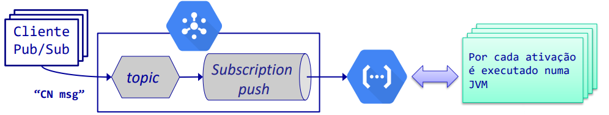

# 1
````
F -> O teorema CAP fala sobre a consistência, disponibilidade e tolerância a partições de um sistema distribuído.

V

V

F -> A latência é de facto um fator importante.
````

# 2
````
V

V

F -> Uma vez que a API Java permite o download/upload do conteúdo de um blob através de blocos.

F -> O nome de um bucket é único e global, portanto não é possível ter 2 buckets com o mesmo nome mesmo estando em projetos diferentes.
````

# 3
````
V

F -> Os documentos de uma coleção do Firestore não precisam de ter o mesmo número e tipo de campos.

F -> Uma interrogação simples não necessita de índices criados pelo utilizador, uma vez que o firestore cria automaticamente para interrogações simples.

V
````

# 4
````
F -> As mensagens são recebidas na ordem em que foram enviadas.

F -> O contrato define a interface e não o tipo de stub.

V

V
````

# 5
````
F -> Uma VM ligada tem custos independentemente se estiver a receber pedidos ou não.

V

V

F -> Uma vez que uma aplicação a correr em VMs pode ser mais difícil de escalar do que uma aplicação a correr em Cloud Functionsl; tem diferentes custos.
````

# 6
````
O serviço Compute Engine do GCP permite da seguinte forma a implementação de um servidor com propriedades de elasticidade:

1 - Criar uma instância de VM em que o disco associado contém a instalação e configuração do software necessário para o servidor.

2 - Criar uma imagem a partir do disco da instância de VM criada.

3 - Criar uma template de instância a partir da imagem criada.

4 - Criar um grupo de instâncias a partir da template criada.

5 - Configurar o grupo de instâncias com, e.g. "autoscalling on" de forma a que sejam criadas/destroídas instâncias de VM consoante uma métrica pré-definida (e.g. utilização de CPU).
````

# 7
<div align="center">




</div>

````
Padrão Fan-out (Distribuição de Mensagens):

- Cada mensagem publicada no tópico é entregue a todas as subscrições associadas.

- Útil para fazer broadcasting de mensagens.


Padrão Work-Queue (Distribuição de Trabalho):

- Cada mensagem publicada no tópico é entregue a uma única subscrição associada.

- Útil para balancear a carga de trabalho


Cloud Functions com trigger Pub/Sub:

- Cada mensagem publicada no tópico é entregue a uma única função Cloud Function associada.

- Útil para criar sistemas escaláveis e serverless.
````

# 8
````proto
syntax = "proto3";

package grpcservice;

service ExameService {
    rpc exame (stream Result) returns (stream Query);
}

message Result {
    bool isEven = 1;
}

message Query {
    int32 num = 1;
}
````