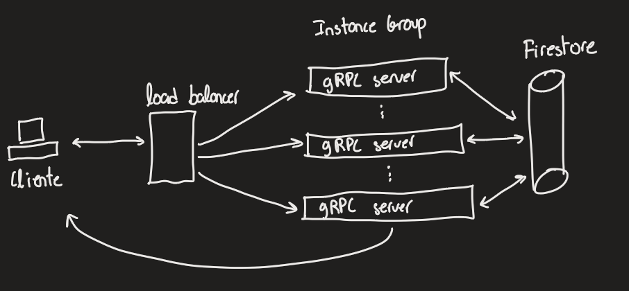
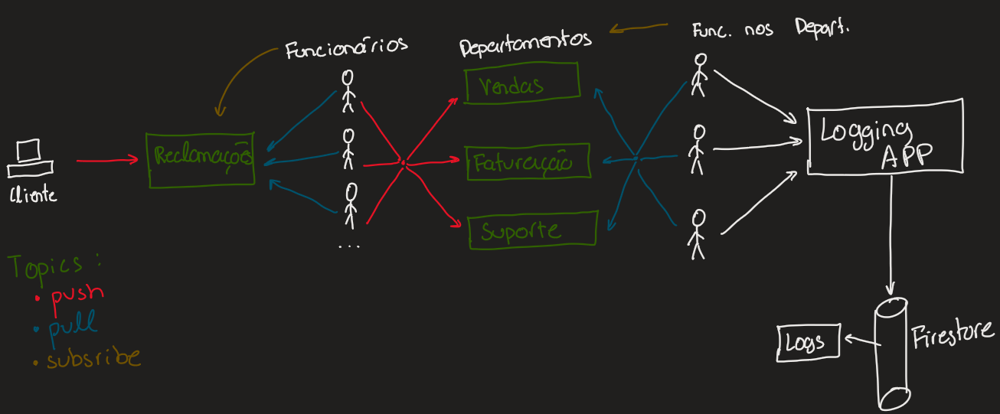

# 9

## a
````proto
syntax = "proto3";

// imports

package grpcservice;

service ForumService {
    rpc listTopics (ProtoVoid) returns (Topics);

    rpc publishMessage (Message) returns (Empty);

    rpc subscribeToTopic (Topic) returns (stream Message);
}

message ProtoVoid {}

message Topics {
    repeated string topicsNames = 1;
}

message Topic {
    string topicName = 1;
}

message Message {
    string userID = 1;
    string text = 2;
    string topicName = 3;
}
````


## b
````java
package grpcserverapp;

// imports

public class GrpcServer {

    private static int SERVER_PORT = 8000;

    public static void main(String[] args) {
        try {
            if (args.length > 0) SERVER_PORT = Integer.parseInt(args[0]);

            io.grpc.Server svc = ServerBuilder.forPort(SERVER_PORT)
                    .addService(new ForumProcessor())
                    .build();

            svc.start();
            System.out.println("Server started on port " + SERVER_PORT);

            Runtime.getRuntime().addShutdownHook(new ShutdownHook(svc));
            svc.awaitTermination();
        } catch (Exception ex) {
            System.err.println("An error occurred: " + ex.getMessage());
        }
    }
}
````

````java
package grpcserverapp;

// imports

public class ForumProcessor extends ForumServiceGrpc.ForumServiceImplBase {

    private List<Topic> topics = new ArrayList<>();
    private Map<Topic, List<StreamObserver<Message>>> subscribers = new HashMap<>();

    @Override
    public void listTopics (ProtoVoid request, StreamObserver<Topics> responseObserver) {
        // Topics.Builder topicsBuilder = Topics.newBuilder();
        // for (Topic topic : topics) {
        //     topicsBuilder.addTopics(topic.getTopicName());
        // }
        // responseObserver.onNext(topicsBuilder.build());
        // responseObserver.onCompleted();
    }

    @Override
    public void publishMessage (Message request, StreamObserver<ProtoVoid> responseObserver) {
        // List<StreamObserver<Message>> topicSubscribers = subscribers.get(request.getTopicName());
        // if (topicSubscribers != null) {
        //     for (StreamObserver<Message> subscriber : topicSubscribers) {
        //         subscriber.onNext(request);
        //     }
        // }
        // responseObserver.onNext(ProtoVoid.newBuilder().build());
        // responseObserver.onCompleted();
    }

    @Override void subscribeToTopic (Topic request, StreamObserver<Message> responseObserver) {
        List<StreamObserver<Message>> topicSubscribers = subscribers.get(request.getTopicName());
        if (topicSubscribers == null) {
            topicSubscribers = new ArrayList<>();
            subscribers.put(request.getTopicName(), topicSubscribers);
        }
        else if (topicSubscribers.contains(responseObserver)) {
            return;
        }
        topicSubscribers.add(responseObserver);
    }
}
````


## c
````java
public class NewPSapp {
    private static String svcIP = "localhost";
    private static int svcPort = 8000;
    private static ManagedChannel channel;
    private static ForumServiceGrpc.ForumServiceBlockingStub blockingStub;
    private static ForumServiceGrpc.ForumServiceStub noBlockStub;


    public static void main(String[] args) {
        try {
            if (args.length == 2) {
                svcIP = args[0];
                svcPort = Integer.parseInt(args[1]);
            }
            System.out.println("connect to " + svcIP + ":" + svcPort);
            channel = ManagedChannelBuilder.forAddress(svcIP, svcPort)
                    .usePlaintext()
                    .build();

            blockingStub = ForumServiceGrpc.newBlockingStub(channel);
            noBlockStub = ForumServiceGrpc.newStub(channel);

            String topicName = "Sports";
            String userID = "user1";
            String text = "Hello Topic!";
            
            subscribeToTopic(topicName);
            publishMessage(userID, text, topicName);

            Thread.sleep(10000); // 10 seconds

            channel.shutdown();
        } catch (Exception ex) {
            System.out.println("Unhandled exception");
            ex.printStackTrace();
        }
    }

    // static void listTopics() {
    //     noBlockStub.getAllTopics(ProtoVoid.newBuilder().build(), new StreamObserver<Topics>() {
    //         @Override
    //         public void onNext(Topics value) {
    //             System.out.println("Topics:");
    //             for (String topic : value.getTopicsNameList()) {
    //                 System.out.println(topic);
    //             }
    //         }

    //         @Override
    //         public void onError(Throwable t) {
    //             System.out.println("Error on listTopics");
    //         }

    //         @Override
    //         public void onCompleted() {
    //             System.out.println("Completed listTopics");
    //         }
    //     });
    // }

    static void subscribeToTopic(String topicName) {
        Topic request = Topic.newBuilder().setTopicName(topicName).build();

        StreamObserver<Message> messageStream = new StreamObserver<Message>() {
            @Override
            public void onNext(Message value) {
                System.out.println("Message received in topic " + value.getTopicName() + " from user " + value.getUserID() + ": " + value.getText());
            }

            @Override
            public void onError(Throwable t) {
                System.out.println("Error on subscribeToTopic");
            }

            @Override
            public void onCompleted() {
                System.out.println("Completed subscribeToTopic");
            }
        };

        noBlockStub.topicSubscribe(request, messageStream);
    }

    static void publishMessage(String userID, String text, String topicName) {
        Message request = Message.newBuilder()
                .setUserID(userID)
                .setText(text)
                .setTopicName(topicName)
                .build();

        noBlockStub.publishMessage(request, new StreamObserver<ProtoVoid>() {
            @Override
            public void onNext(ProtoVoid value) {
                System.out.println("Message published to topic " + topicName);
            }

            @Override
            public void onError(Throwable t) {
                System.out.println("Error on publishMessage");
            }

            @Override
            public void onCompleted() {
                System.out.println("Completed publishMessage");
            }
        });
    }
}
````

# 10
````
Servidores -> Usar o Google Compute Engine para criar grupos de instâncias de VMs de servidores gRPC, os quais seriam escalados automaticamente consoante a utilização de CPU.

Load Balancer -> Usar o Google Cloud Load Balancer para distribuir o tráfego entre as instâncias de VMs de servidores.

Base de Dados -> Usar o Google Cloud Firestore para armazenar os dados.
````

<div align="center">



</div>

# 11

````
Troca de mensagens entre funcionários e departamentos -> Usar o Google Cloud Pub/Sub.

Reclamações de clientes -> Criar um tópico "Reclamações" onde os clientes publicarão as reclamações e onde os funcionários poderão subscrever para receber as reclamações.

Departamentos -> Criar um tópico para cada departamento, onde serão publicadas as mensagens dos funcionários e onde os funcionários daqueles departamentos poderão subscrever para receber as mensagens e posteriormente darem solução através de contacto direto com o cliente.

Logging -> Criar uma aplicação java onde os funcionários que resolvem as reclamações possam registar a reclamação e a respetiva solução. Esta aplicação irá registar os logs numa única coleção no Google Cloud Firestore chamada "Logs".
````

<div align="center">



</div>
